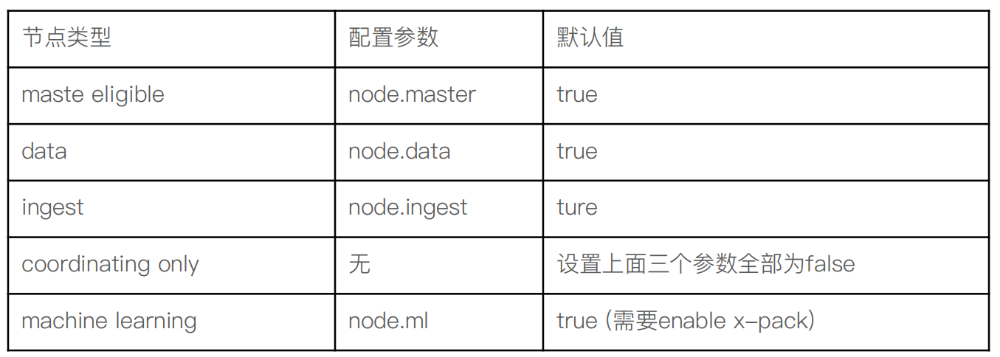

# 一、 简介

​	ElasticSearch的创始人最初是想为妻子写一个搜索菜谱的程序`Compass`，后来由于所在公司的业务需要用到一个分布式搜索的程序，于是它就决定重写 `Compass`并命名为`ElasticSearch`，ElasticSearch开源后受到了很多人的欢迎，于是基于ES就成立了一家公司elastic，现在这家公司也已经上市并与各大互联网公司，云平台都有合作，包括阿里云、腾讯云、Amazon。并且这家公司也推出了一个认证`elastic`。

​	与ES类似的开源全文搜索组件还有Apache solr，二者都是基于Lucene java类库来实现的，现在据统计使用ES的人已经远远多于solr。Elastic stack已经有了自己的一个技术栈，他的成员主要有 ElasticSearch、Logstash、kibana，也就是简称ELK。	

# 二、安装

## 1.ElasticSearch 安装

## 1.1 基本安装

1. 到官网下载压缩包到服务器，进行解压缩

2. 在7.0之前的版本需要指定JAVA_HOME环境变量，但在7.0之后已经内置了一个JDK环境不需要单独配置

3. 直接进入bin目录下执行elasticsearch指令，但是该指定默认不允许root用户运行，我们需要单独创建一个账号，然后让此账号拥有elasticsearch HOME目录的权限，接下来就可以使用此账号来启动ES了

   ```shell
   #elastic是自己创建的账号，-d代表后台启动
   sudo -u elastic ./elasticsearch -d
   #关闭只能使用kill
   ps aux|grep elastic
   kill pid
   ```

> elasticsearch默认配置只允许本机IP访问，jvm参数配置可以到`config/jvm.options`文件修改，推荐把xmx与xms大小配置一样，xmx大小不要超过本机内村的50%，最大不要超过30G.

## 1.2 ElasticSearch配置

ElasticSearch有两种启动模式，开发模式和生产模式，它的启动模式根据开放的IP和port来检测的，如果开放的ip端口非localhost地址启动则认为是生产模式启动，两种模式的区别是进行启动检测系统环境时当有不满足条件的情况发生开发者模式只是打印警告信息而不会影响服务启动，而生产模式会影响服务启动，也就是说生产模式必须要满足ES的启动检测条件才能启动服务成功，下面是启动服务的条件配置。

1. linux文件描述符

   ```shel
   #最少需要65535
   vi /etc/security/limits.conf
   * soft nofile 65536
   * hard nofile 65536
   ```

2. linux程序的最大线程数

   ```shell
   vi /etc/security/limits.conf
   * soft nproc 4096
   * hard nproc 4096
   ```

3. linux虚拟内存配置

   ```shell
   vi /etc/sysctl.conf
   #进入文件添加配置项
   vm.max_map_count=262144
   #配置完成后，执行使配置生效
   sysctl -p
   ```

4. ES自身配置

   ```yml
   vim /opt/elasticserch/config/elasticserch.yml
   #集群名称，集群中所有主机的集群名称都要相同
   cluster.name: my-application
   #每个ES实例的名字
   node.name: node-1
   #日志文件和数据文件的位置，每个实例都要单独对应一个文件路径
   path.data: /var/lib/elasticsearch
   path.logs: /var/log/elasticsearch
   #开放访问的ip和端口
   network.host: 0.0.0.0
   http.port: 9200
   #配置集群地址
   discovery.seed_hosts: ["192.168.3.43", "192.168.3.88"]
   cluster.initial_master_nodes: ["node-1"]
   ```

   > 必须至少配置 [discovery.seed_hosts，discovery.seed_providers，cluster.initial_master_nodes] 中的一个

## 2.Kibana 安装

1. 到官网下载压缩包到服务器，进行解压
2. 进入bin目录下执行./kibana指令，后面加&表示后台运行
3. 进入http://localhost:5601页面

> kibana默认只运行本地IP访问，可以到配置文件中修改server.host：“0.0.0.0”

## 3.Logstash 安装

1. 到官网下载压缩包到服务器，进行解压

2. 修改配置文件`logstash.conf`，导入测试数据

   ```shell
   input {
     file {
     	//这个路径是自己准备的数据文件
       path => "/opt/ElasticSearch/logstash-7.1.1/data/ml-latest-small/movies.csv"
       start_position => "beginning"
       sincedb_path => "/dev/null"
     }
   }
   filter {
     csv {
       separator => ","
       columns => ["id","content","genre"]
     }
   
     mutate {
       split => { "genre" => "|" }
       remove_field => ["path", "host","@timestamp","message"]
     }
   
     mutate {
   
       split => ["content", "("]
       add_field => { "title" => "%{[content][0]}"}
       add_field => { "year" => "%{[content][1]}"}
     }
   
     mutate {
       convert => {
         "year" => "integer"
       }
       strip => ["title"]
       remove_field => ["path", "host","@timestamp","message","content"]
     }
   
   }
   output {
      elasticsearch {
        hosts => "http://localhost:9200"
        index => "movies"
        document_id => "%{id}"
      }
     stdout {}
   }
   
   ```

   3.启动服务

   ```shell
   #-f 指定配置文件启动
   ./logstash -f ../config/logstash.conf
   ```

# 三、文档的CURD

## 1.索引、文档、属性

ES中的索引与关系数据库作对比

| ElasticSearch | 关系型数据库   |
| ------------- | -------------- |
| 索引          | 数据表         |
| 文档          | 表中的一条记录 |
| 属性          | 字段           |
| mapping       | schema         |
| DSL           | SQL            |

> 在7.0之前一个索引可以有多个type，但是在7.0之后一个索引只能有一个type，而且合法的type只有_doc

## 2. 新增文档

### 2.1 查看ES中所有索引

```json
GET _cat/indices
```

### 2.2 新增的三种方式

```json
#_create代表此次是新增文档，如果指定的ID已经存在则会报错
PUT website/_create/1
{
  "title":"1"
}
#_doc表示要索引一个文档进去，如果ID已存在，则把原先的删除再新文档，version+1
PUT website/_doc/1
{
  "title":"1"
}
#使用POST新增文档，可以不指定ID由ES自动生成，也可以手动指定ID
POST website/_doc
{
  "title":"1"
}
```

## 3.读取文档

```json
#定位一个文档需要三个要素，索引、类型、id
GET website/_doc/1
#response响应
{
  "_index" : "website",
  "_type" : "_doc",
  "_id" : "1",
  "_version" : 5,#用于并发控制
  "_seq_no" : 16,#新版本中用于做乐观锁的属性
  "_primary_term" : 8,#用于做乐观锁的属性
  "found" : true,#是否有查询到false表示为找到
  "_source" : {#source内部是读取文档的真正内容
    "title" : "1"
  }
}
```

## 4. 删除文档

```json
DELETE website/_doc/1
```

## 5. 更新文档

```json
#使用POST，请求体封装在doc属性中，其中的内容是要修改的文档内容，可以添加文档属性数量
#version+1
POST website/_doc/1
{
  "doc":{
    "title":"2",
    "content":"abc"
  }
}
```

## 6.Bulk API

它可以把很多对文档的API操作聚合在一起，一次性发送给ES来处理以减少网络开销

```json
#如果_bulk前面没有指定索引，下面的每个API都需要先单独指定索引以及ID，其中每个API都可以指定不同的索引
POST _bulk
{"index":{"_index":"website","_id":"1"}}
{"title":"es"}
{"delete":{"_index":"website","_id":"1"}}
{"create":{"_index":"website","_id":"1"}}
{"title":"log"}
{"update":{"_index":"website","_id":"1"}}
{"doc":{"title":"888"}}

#我们在bulk前缀加上索引，下面每条API都默认时在前缀索引中操作，除非明确指定了其他索引
POST website/_bulk
{"index":{}}
{"title":"es"}
{"index":{"_index":"test_index"}}
{"title":"es"}
```

> 这里把每一个子API都用换行来做分割，而没有把他们放在一个json数组中是因为在ES向不同节点转发API请求时要方便很多

## 7.mget

批量读取，可以一次把很多请求聚合在一起

```json
#docs数组属性中存储多条请求指令需要的三要素，索引、类型、id
GET /_mget
{
  "docs":[
      {
        "_index":"website",
        "_type":"_doc",
        "_id":1
      },
      {
        "_index":"website",
        "_type":"_doc",
        "_id":2
      }
    ]
}
#_source可以限制允许返回的属性
GET /_mget
{
  "docs":[
      {
        "_index":"website",
        "_type":"_doc",
        "_id":1,
        "_source":["title","date"]
      }
    ]
}
#在_mget前面可以指定索引前缀和类型，下面每条查询就都默认在该索引下进行获取文档
GET /website/blog/_mget
{
  "docs":[
      {
        "_id":1
      }
    ]
}
#也可以简写到ids属性中，来获取这个索引中的多条文档
GET /website/blog/_mget
{
  "ids":[1,2]
}
```

## 8. msearch

```json
#批量查询，不需要指定索引时第一个{}也要有，这时固定的格式否则ES解析这条指令会报错
POST website/_msearch
{}
{"query":{"match_all":{}}}
{"index":"blogs"}
{"query":{"match_all":{}}}
```

## 9.并发控制

当两个请求同时修改同一个文档时就会产生并发问题，并发问题的解决方式大致分为两种，悲观控制和乐观控制，ES中采用乐观控制的方式，在ES中提供了内部并发控制和外部并发控制两种。

### 9.1 内部并发控制

```json
#内部并发控制使用if_seq_no，if_primary_term
#这两个值在文档的元数据中
PUT products/_doc/1?if_seq_no=12&if_primary_term=4
{
  "title":"iphone",
  "count":101
}
```

### 9.2 外部并发控制

```json
#外部并发控制可以使用version，例如数据存储在数据库中时使用外部并发控制，version的值不是预期值而是要比当前值要大才能成功
PUT products/_doc/1?version=7&version_type=external
{
  "title":"iphone",
  "count":101
}
```

## 10.数据的关联关系

在现实世界中数据之间都有关联关系的，比如电影信息会与导演的信息有关联，在关系型数据库中可以通过主外键的方式把这种有关联的数据做关联查询展示，在ES中对数据的关联关系用以下几种方式来实现

### 10.1 对象类型

```json
#我们在定义索引时，可以把文档中的一个属性定义为对象类型
#properties在一个属性中使用这个关键字定义对象的属性
PUT my_movies
{
      "mappings" : {
      "properties" : {
        "actors" : {
          "properties" : {
            "first_name" : {
              "type" : "keyword"
            },
            "last_name" : {
              "type" : "keyword"
            }
          }
        },
        "title" : {
          "type" : "text",
          "fields" : {
            "keyword" : {
              "type" : "keyword"
            }
          }
        }
      }
    }
}
#使用这种方式会在查询的时候有些问题，比如下面索引的数据
POST my_movies/_doc/1
{
  "title":"Speed",
  "actors":[
    {
      "first_name":"Keanu",
      "last_name":"Reeves"
    },
    {
      "first_name":"Dennis",
      "last_name":"Hopper"
    }
  ]
}
#当我们想要以对象的属性查询文档时出现的结果不是我们预期的，因为ES没有单独对属性对象做处理，
#他门还是存在一个文档中的，所以speed标题的文档同时满足了下面的两个条件
POST my_movies/_search
{
  "query": {
    "bool": {
      "must": [
        {"match": {"actors.first_name": "Keanu"}},
        {"match": {"actors.last_name": "Hopper"}}
      ]
    }
  }
}
```

### 10.2 嵌套对象

使用嵌套对象可以解决上面的问题，ES会为属性中的对象数据做单独的存储

```json
#1.把属性类型设置为nested表示使用内嵌对象的方式存储
PUT my_movies
{
  "mappings" : {
    "properties" : {
      "actors" : {
        "type": "nested",
        "properties" : {
          "first_name" : {"type" : "keyword"},
          "last_name" : {"type" : "keyword"}
        }},
      "title" : {
        "type" : "text",
        "fields" : {
          "keyword":{
            "type":"keyword","ignore_above":256
          }
        }
      }
    }
  }
}
#2.内嵌对象查询
#nested上下文指定到内嵌对象属性中进行匹配，这样就会不出现上面的查询问题了
POST my_movies/_search
{
  "query": {
    "bool": {
      "must": [
        {"match": {"title": "Speed"}},
        {
          "nested": {
            "path": "actors",
            "query": {
              "bool": {
                "must": [
                  {"match": {
                    "actors.first_name": "Keanu"
                  }},
                  {"match": {
                    "actors.last_name": "Hopper"
                  }}
                ]
              }
            }
          }
        }
      ]
    }
  }
}

#3.内嵌对象聚合
#通过nested上下文指定聚合是根据指定的内嵌对象属性做聚合
POST my_movies/_search
{
  "size": 0,
  "aggs": {
    "actors": {
      "nested": {
        "path": "actors"
      },
      "aggs": {
        "actor_name": {
          "terms": {
            "field": "actors.first_name",
            "size": 10
          }
        }
      }
    }
  }
}
```

### 10.3 父子文档

对象类型与嵌套对象都有同一个缺点就是当修改数据的时候就会同时影响到根对象和子对象，ES中提供了父子文档的关系使其两个文档完全分离，类似与SQL中的join

1. 定义父子文档

```json
#1.设定 Parent/Child Mapping
#属性type为join是定义子文档的信息
#relations中定义了父子文档的名字，其中blog是父文档，comment是子文档
PUT my_blogs
{
  "settings": {
    "number_of_shards": 2
  },
  "mappings": {
    "properties": {
      "blog_comments_relation": {
        "type": "join",
        "relations": {
          "blog": "comment"
        }
      },
      "content": {
        "type": "text"
      },
      "title": {
        "type": "keyword"
      }
    }
  }
}

#2.索引父文档
#索引是指定关联关系，name：blog说明索引的是父文档
PUT my_blogs/_doc/blog2
{
  	"title":"Learning Hadoop",
  	"content":"learning Hadoop",
    "blog_comments_relation":{
    	"name":"blog"
  	}
}


#3.索引子文档
#parent指定是那个父文档
PUT my_blogs/_doc/comment1?routing=blog1
{
  "comment":"I am learning ELK",
  "username":"Jack",
  "blog_comments_relation":{
    "name":"comment",
    "parent":"blog1"
  }
}
```

2. 查询与更新

```json
# 查询所有文档,父子文档都会返回，但是他门不是嵌套在一起返回的而是单独返回的
POST my_blogs/_search
{
}

#根据父文档ID查看，查看到的值是父文档信息
GET my_blogs/_doc/blog2

# 使用Parent Id查询，父文档中的所有子文档信息
POST my_blogs/_search
{
  "query": {
    "parent_id": {
      "type": "comment",
      "id": "blog2"
    }
  }
}

# Has Child 查询,根据子文档内容做查询,返回父文档
POST my_blogs/_search
{
  "query": {
    "has_child": {
      "type": "comment",
      "query" : {
                "match": {
                    "username" : "Jack"
                }
            }
    }
  }
}


# Has Parent 查询，返回相关的子文档
POST my_blogs/_search
{
  "query": {
    "has_parent": {
      "parent_type": "blog",
      "query" : {
                "match": {
                    "title" : "Learning Hadoop"
                }
            }
    }
  }
}

#通过ID和routing ，访问子文档
GET my_blogs/_doc/comment3?routing=blog2

#更新子文档
PUT my_blogs/_doc/comment3?routing=blog2
{
    "comment": "Hello Hadoop??",
    "blog_comments_relation": {
      "name": "comment",
      "parent": "blog2"
    }
}
```

## 11. Pipeline & Processor  

在ES5以后有了Ingest node，默认每个节点都是Ingest Node，都有使用pipeline和processor对数据进行预处理的能力

```json
#1.定义一个pipeline，名字为blog_pipeline
#2.split做分割
#3.set为处理的文档添加新字段
PUT _ingest/pipeline/blog_pipeline
{
  "description": "a blog pipeline",
  "processors": [
      {
        "split": {
          "field": "tags",
          "separator": ","
        }
      },
      {
        "set":{
          "field": "views",
          "value": 0
        }
      }
    ]
}

#查看Pipleline
GET _ingest/pipeline/blog_pipeline

#测试pipeline，_ingest API专门用来做测试使用
POST _ingest/pipeline/blog_pipeline/_simulate
{
  "docs": [
    {
      "_source": {
        "title": "Introducing cloud computering",
        "tags": "openstack,k8s",
        "content": "You konw, for cloud"
      }
    }
  ]
}

#使用pipeline更新数据，要指定pipeline的名字
PUT tech_blogs/_doc/2?pipeline=blog_pipeline
{
  "title": "Introducing cloud computering",
  "tags": "openstack,k8s",
  "content": "You konw, for cloud"
}

#update_by_query 会导致错误,其中有的文档已经被pipeline处理过，内容不满足pipeline需求
POST tech_blogs/_update_by_query?pipeline=blog_pipeline
{
}

#增加update_by_query的条件，让没被处理过的内容再做update by query
POST tech_blogs/_update_by_query?pipeline=blog_pipeline
{
    "query": {
        "bool": {
            "must_not": {
                "exists": {
                    "field": "views"
                }
            }
        }
    }
}
```

## 12. painless script

在ES高版本中，已经不支持其他脚本语言了，只支持自己基于java语言扩展出来的painless脚本

1. 三种环境下的上文取值方式

```json
#增加一个 Script Prcessor，在新增上下文中用ctx.view取值
#下例中 ctx.content_length表示所有有这个属性则取值，没有则新增这个属性
POST ingest/pipeline/simulate
{
  "pipeline": {
    "description": "to split blog tags",
    "processors": [
      {
        "split": {
          "field": "tags",
          "separator": ","
        }
      },
      {
        "script": {
          "source": """
          if(ctx.containsKey("content")){
            ctx.content_length = ctx.content.length();
          }else{
            ctx.content_length=0;
          }
          """
        }
      },
      {
        "set":{
          "field": "views",
          "value": 0
        }
      }
    ]
  },
  "docs": [
    {
      "index":"index",
      "id":"id",
      "_source":{
        "title":"Introducing big data......",
  "tags":"hadoop,elasticsearch,spark",
  "content":"You konw, for big data"
      }
    },
    {
      "_index":"index",
      "_id":"idxx",
      "_source":{
        "title":"Introducing cloud computering",
  "tags":"openstack,k8s",
  "content":"You konw, for cloud"
      }
    }
    ]
}

DELETE tech_blogs
PUT tech_blogs/_doc/1
{
  "title":"Introducing big data......",
  "tags":"hadoop,elasticsearch,spark",
  "content":"You konw, for big data",
  "views":0
}

#在更新上下文中，用ctx.source.views取值
POST tech_blogs/_update/1
{
  "script": {
    "source": "ctx._source.views += params.new_views",
    "params": {
      "new_views":100
    }
  }
}
#查看文档更新后的views
GET tech_blogs/_search

#再查询上下文中脚本取值用doc['views']
GET tech_blogs/_search
{
  "script_fields": {
    "rnd_views": {
      "script": {
        "lang": "painless",
        "source": """
          java.util.Random rnd = new Random();
          doc['views'].value+rnd.nextInt(1000);
        """
      }
    }
  },
  "query": {
    "match_all": {}
  }
}

#保存脚本在 Cluster State
POST scripts/update_views
{
  "script":{
    "lang": "painless",
    "source": "ctx.source.views += params.new_views"
  }
}

POST tech_blogs/_update/1
{
  "script": {
    "id": "update_views",
    "params": {
      "new_views":1000
    }
  }
}
```


# 四、搜索 API

搜索文档的API分为两大类，一个是URL搜索，一个是request body搜索 

## 1.URL Search

### 1.1 URL中指定索引的几种方式

```json
#1.查询集群中所有索引中的文档
GET /_search
#2.查询指定索引中的文档
GET website/_search
#3.多个索引用，分割
GET website,blogs/_search
#4.使用通配符的方式匹配索引
GET web*/_search
```

### 1.2 常用查询参数

```json
#URL中使用q参数指定查询条件，key:value的方式
GET website/_search?q=title:ELK
#如果使用profile参数的话可以看到，返回的值是怎么被查询到的
GET website/_search?q=title:ELK
{
  "profile": "true"
}
#q参数指定查询内容，df指定默认要查询的属性名称，这条语句等价第一条语句
GET website/_search?q=ELK&df=title
#泛查询，q直接指定值，他会到每个字段中去匹配查询条件
GET website/_search?q=ELK
#sort指定排序字段与方式，from、size用来分页，timeout超时时间
GET /movies/_search?q=2012&df=title&sort=year:desc&from=0&size=10&timeout=1s

#使用url做phrase(短语)查询，需要把短语用""包起来
GET /movies/_search?q=title:"Beautiful Mind"
#TermQuery()的部分只要满足其中一个term就可以，如果没有加()则会对第二个词做泛查询
GET website/_search?q=title:(Spring data)
```

### 1.3 表达式查询

1. boolean操作

   * AND/OR/NOT 

   * &&/||/！

   * +表示必须有 -表示必须没有， 例如title:(+value1 -value2)

2. 范围查询

   * [] 闭区间，{}开区间 例如year：{2019 TO 2020]

3. 算数符号
   * year:>2019
   * year:(>2019 && <=2020)

4. 通配符
   * ？代表一个字符，*表示多个 例如mi?d能匹配到mind

5. 正则表达式
   * title:[bt]oy
6. 模糊查询与近似查询
   * title:befutifl~1
   * title:"lord rings"~2

```json
#boolean表达式查询
#AND这种关键字必须大写，表示两个关键字必须同时满足，与之同意的符号是&&
GET /movies/_search?q=title:(Beautiful AND Mind)
#NOT，有Beautiful的时候必须没有mind
GET /movies/_search?q=title:(Beautiful NOT Mind)
#%2B代表+,+Mind表示必须有mind,get请求参数中不能有特殊符号，需要用encoding
GET /movies/_search?q=title:(Beautiful %2BMind)
#表示year字段必须大于等于1900
GET /movies/_search?q=year:>=1900
#通配符匹配，只要字段中有一项(单词)是b开头就可以
GET /movies/_search?q=title:b*

#近似查询，关键字少一个字也能匹配到beautiful
GET /movies/_search?q=title:beautifu~1
{
  "profile":"true"
}
#~2能够让PhraseQuery中的查询条件两个单词不挨着匹配
GET /movies/_search?q=title:"Lord Rings"~2
{
  "profile":"true"
}
```

## 2.Request Body

### 2.1 基础API

```json
#match_all查询所有文档
POST /movies/_search
{
  "query": {
    "match_all": {}
  }
}
#分页from，size
POST /movies/_search
{
  "query": {
    "match_all": {}
  },
  "from": 0,
  "size":10
}
#排序
POST /movies/_search
{
  "query": {
    "match_all": {}
  },
  "sort":[{"year":"desc"}]
}
#_source指定返回的字段
POST /movies/_search
{
  "query": {
    "match_all": {}
  },
  "_source": ["title","id"]
}
#script_fields使用脚本语言做计算，生成新的字段返回new_file
POST /movies/_search
{
  "query": {
    "match_all": {}
  },
  "script_fields": {
    "new_file":{
      "script":{
        "lang":"painless",
        "source":"1*2+'hello'"
      }
    }
  }
}
```

### 2.2 全文本查询

#### 2.2.1 match

```json
#match匹配根据你要搜索的字段类型来决定是否对你输入的文本进行分词，如果你要搜索的字段是text会分词，keyword不会分词
POST /movies/_search
{
  "query": {
    "match": {
      "title":"Rob Roy"
    }
  }
}
#可以使用operator指定两个词都必须存在
POST /movies/_search
{
  "query": {
    "match": {
      "title":{
        "query": "Rob Roy",
        "operator": "and"
      }
    }
  }
}
#minimum_should_match：表示查询文本中的term必须匹配指定个数才会返回，例如：值为2则表示KDKE与A必须同时在一个字段里出现才能返回，为负数表示分出的词项数做减法，百分比和负数百分比也一样
POST /products/_search
{
  "query": {
      "match": {
        "productID": {
          "query": "KDKE-A",
          "minimum_should_match" :-1
        }
      }
    }
}
```

#### 2.2.2 phraseQuery

```json
#短语方式进行匹配，只有匹配上Rob Roy这个短语的才会返回
POST /movies/_search
{
  "query": {
    "match_phrase": {
      "title":"Rob Roy"
    }
  }
}
#slop表示这个短语中间可以参杂一个其他单词，比如Rob a Roy，如果slop是2的话，则运行单词出现的顺序改变
POST /movies/_search
{
  "query": {
    "match_phrase": {
      "title":{
        "query": "Rob Roy",
        "slop": 1
      }
    }
  }
}
```

#### 2.2.3 query_string

```json
#类似URL Query，指定默认字段查询
POST /movies/_search
{
  "query": {
    "query_string": {
      "default_field": "title",
      "query": "Rob AND roy"
    }
  }
}
#fields指定多个字段查询
POST /movies/_search
{
  "query": {
    "query_string": {
      "fields": ["title","genre"],
      "query": "Rob AND roy"
    }
  }
}
```

#### 2.2.4 simple_query_string

> 比query_string支持的语法要少，他不支持default_field，stringQuery中不支持AND、OR、NOT只能使用+、|、-替代，default_operator只支持AND 或OR 默认是OR

```json
#OR时代表只要满足短语中有Rob，或者短语中没有Roy的就可以，两者不用同时满足，比如Rob Roy它也可以匹配出来，因为满足了Rob这块的需求
POST /movies/_search
{
  "query": {
    "simple_query_string": {
      "fields": ["title"],
      "query": "Rob -Roy",
      "default_operator": "AND"
    }
  }
}
#查询短语中如果出现了AND会当作字符串处理
POST /movies/_search
{
  "query": {
    "simple_query_string": {
      "fields": ["title"],
      "query": "Rob AND Roy"
    }
  }
}
```

#### 2.2.5 multi_match

他跟match相比的区别是，它可以用一个查询文本去多个字段中进行匹配，最后通过各种方式来计算出综合评分

1. 基础API

```json
#type=best_fields 是默认值可以不用指定
GET /titles/_search
{
   "query": {
        "multi_match": {
            "query":  "barking dogs",
            "type":   "best_fields",
            "fields": [ "title", "title.std" ]
        }
    }
}
```

type部分参数值

| 名称         | 说明                                                         |
| ------------ | ------------------------------------------------------------ |
| best_fields  | 返回最佳匹配的字段的评分                                     |
| most_fields  | 匹配到的所有字段的评分做了一个整合，整合后的评分就是综合评分 |
| cross_fields | 他用同一个分词器处理字段，他会把所有的字段整合成一个大字段做处理来寻找关键字 |

2. 使用most_fields来解决精度降低的问题

```json
#场景：由于title使用了english分词器会提取词干时态，导致查询精度降低，当我们使用match做title查询时会发现文档id=1比文档id=2的评分要高，但是id=2的title内容严格匹配上了搜索条件，应该是id2的评分高才对
PUT /titles
{
    "settings": { "number_of_shards": 1 },
    "mappings": {
            "properties": {
                "title": {
                    "type":     "text",
                    "analyzer": "english",
                    "fields": {
                        "std":   {
                            "type":     "text",
                            "analyzer": "standard"
                        }
                    }
                }
            }
        }
}

POST titles/_bulk
{ "index": { "_id": 1 }}
{ "title": "My dog barks" }
{ "index": { "_id": 2 }}
{ "title": "I see a lot of barking dogs on the road " }

POST titles/_search
{
  "query": {
    "match": {
      "title": "barking dogs"
    }
  }
}
#使用most_fields解决，std子字段使用的分词器不会提取词干时态，所以能匹配上std字段的只有id2，所以id2匹配上了俩个字段，而id1只匹配上了title字段，最终id2的评分高于id1
GET /titles/_search
{
   "query": {
        "multi_match": {
            "query":  "barking dogs",
            "type":   "most_fields",
            "fields": [ "title", "title.std" ]
        }
    }
}
```

3.  跨字段搜索

```json
#当我们需要指定的字段必须都匹配上搜索文本中的信息时，可以使用cross_fields，结合operator，他会把指定的两个字段都匹配上Will Smith其中任意一个单词的文档返回
GET tt/_search
{
  "query": {
    "multi_match" : {
      "query":      "Will Smith",
      "type":       "cross_fields",
      "fields":     [ "first_name", "last_name" ],
      "operator": "and"
    }
  }
}
```

> 我们使用copy_to让"first_name", "last_name"这两个字段内容都映射到一个新字段中，然后对新字段做匹配也可以实现，但是要额外耗费空间

### 2.3 term-level

 #### 2.3.1 term

```json
#term查询是不会走分词器的，如果查询的字段是text类型则匹配不到
POST /products/_search
{
  "query": {
      "term":{
        "productID.keyword":"KDKE-B-9947-#kL5"
      }
    }
}
```

#### 2.3.2 range

* gt： 大于
* lt：小于
* gte：大于等于
* lte：小于等于

```json
#数字范围查询
POST /order/_search
{
  "query": {
    "constant_score": {
      "filter": {
            "range": {
              "price":{
                "gte":10,
                "lte":100
              }
            }
      }
    }
  }
}
#日期范围查询
POST /order/_search
{
  "query": {
    "constant_score": {
      "filter": {
            "range": {
              "date":{
                "gte":"now-6M"
              }
            }
      }
    }
  }
}
```

| 名字 | 说明     |
| ---- | -------- |
| now  | 当前日期 |
| y    | 年       |
| M    | 月       |
| w    | 周       |
| d    | 天       |
| H/h  | 小时     |
| m    | 分钟     |
| s    | 秒       |

#### 2.3.3 exists

```json
#exists:查询指定属性存在的文档
POST /order/_search
{
  "query": {
    "constant_score": {
      "filter": {
            "exists": {
              "field":"date"
            }
      }
    }
  }
}
#must_not.exists:查询指定属性不存在的文档
POST /order/_search
{
  "query": {
    "constant_score": {
      "filter": {
        "bool":{
          "must_not":{
            "exists":{
              "field":"date"
            }
          }
        }
      }
    }
  }
}
```

#### 2.3.4 terms

```json
#terms：多个精确值匹配，满足其中一个就返回
POST /order/_search
{
  "query": {
    "constant_score": {
      "filter": {
          "terms": {
            "price":[
              20,
              100
            ]
          }
      }
    }
  }
}
```

包含而不相等问题解决方案：

```json
#问题场景：当我们的索引中包含这两个文档时
POST /order/_doc
{
  "title":["js"],
  "price":223
}
POST /order/_doc
{
  "title":["js","css"],
  "price":223
}
#当我们使用terms查询时就会出现，包含而不相等的问题
POST /order/_search
{
  "query": {
    "constant_score": {
      "filter": {
          "terms": {
            "title":[
              "js"
            ]
          }
      }
    }
  }
}
#解决方案：加入count字段用来统计title数组的长度，然后通过以下查询来精确匹配
POST /order/_search
{
  "query": {
    "bool": {
      "filter": [
          {"terms": {"title": ["js"]}},
          {"term": {"count": 1}}
      ]
    }
  }
}
```


### 2.4 复合查询

#### 2.4.1 Constant score

```json
#1.constant_score:能够把query查询变成filter的上下文查询，他不会提供相关性算分，并会充分利用缓存可以提高查询的效率
#2.filter：一种不会提供相关性算分的上下文
#3.boost：影响相关性算法分的一个参数，他会用此值*相关性评分来得到最终评分
POST /products/_search
{
  "query": {
      "constant_score": {
        "filter": {
          "term":{
            "productID.keyword":"KDKE-B-9947-#kL5"
          }
        },
        "boost": 1.2
      }
    }
}
```

#### 2.4.2 Boosting

```json
#1.相关性评分，会受到boosting影响，boost值在0~1之间是一个float类型
#2.把查询上下文分为两大块positive，negative我们可以给negative块设置boost值来减少他的相关性评分，下面就是让全文中有pie的排在最后
POST news/_search
{
  "query": {
    "boosting": {
      "positive": {
        "match": {
          "content": "apple"
        }
      },
      "negative": {
        "match": {
          "content": "pie"
        }
      },
      "negative_boost": 0.1
    }
  }
}
```

#### 2.4.3 bool

当我们需要通过多个属性来过滤我们的查询内容时就需要bool查询，他内部提供了四种子句

| 名字     | 描述                                   |
| -------- | -------------------------------------- |
| must     | 必须满足其中所有条件，会提供算分       |
| should   | 只需要满足其中的一部分条件，会提供算分 |
| filter   | 必须满足其中所有条件，不提供算分       |
| must_not | 必须不满足其中的条件，不提供算分       |

1. 基础API

```json
#1.bool上下分中分别可以写上表中的四种子句，每个子句中都可以写多个查询子句，就是term-level和全文查询中的@那些查询子句都可以使用
#2.should子句配合minimum_should_match属性使用
#3.每个子句得到的评分会合并到最后的总评分当中去
POST /products/_search
{
  "query": {
    "bool" : {
      "must" : {
        "term" : { "price" : "30" }
      },
      "filter": {
        "term" : { "avaliable" : "true" }
      },
      "must_not" : {
        "range" : {
          "price" : { "lte" : 10 }
        }
      },
      "should" : [
        { "term" : { "productID.keyword" : "JODL-X-1937-#pV7" } },
        { "term" : { "productID.keyword" : "XHDK-A-1293-#fJ3" } }
      ],
      //保证至少匹配should中的一个
      "minimum_should_match" :1
    }
  }
}
```

2. bool嵌套

```json
#should中嵌套了一个bool，表示只要标题没有匹配其中任意一个内容则可匹配
POST /movies/_search
{
  "query": {
    "bool": {
      "should":[
        {
          "bool": {
            "must_not": {
              "term":{
                "title.keyword":"Iris"        
              }
            }
          }
        }
      ],
      "minimum_should_match":1
    }
  }
}
```

> 通过嵌套bool语句可以对相关度算分产生影响，同级别的子句的权重时相同的，某子句中的嵌套子句相关度权重会有所减少

3. 利用boost影响相关性评分

```json
#我们可以为每个搜索条件都设置不同的boost数值，boost数值高的则在最后的总相关度评分占比越大(权重越大)，我们可以利用boost来对我们更重视的一些字段条件上数值分配的高一些
POST blogs/_search
{
	"query": {
		"bool": {
			"should": [
			  {
					"match": {
						"title": {
							"query": "apple,ipad",
							"boost": 0.1
						}
					}
				},
				{
					"match": {
						"content": {
							"query": "apple,ipad",
							"boost": 1.0
						}
					}
				}
			]
		}
	}
}
```

#### 2.4.4 Dis_max

他与bool对最后总评分的计算不同，bool是对每个匹配到的子句评分做一个求和作为总评分，而dis_max会把匹配到的多个子句评分中选出一个最大的作为最后的总评分

1. 基础API

```json
#dis_max下的上下文只有queries一个，他表示返回的总评分会从子语句中选举出一个评分最大的做总评分
POST blogs/_search
{
	"query": {
		"dis_max": {
			"queries": [
			  {
					"match": {
						"title": {
							"query": "apple iPad"
						}
					}
				},
				{
					"match": {
						"content": {
							"query": "apple iPad"
						}
					}
				}
			]
        }
	}
}
```

2. 最佳字段查询调优

   有的时候只看其中一个子句的最大评分，选举出的总评分是有问题的,例如下面这个数据情况

```json
#如果我们要查询的是 apple ipad
#由于title中只有一个Apple单词的评分最高，所以id2会排在id1的前面
#但是id1中，title和content字段都命中了这个查询，按理说id1应该是评分最高的
POST /blogs/_bulk
{ "index": { "_id": 1 }}
{"title":"I like ipad", "content":"Apple like pie" }
{ "index": { "_id": 2 }}
{"title":"Apple", "content":"I like app" }

#解决方法是使用tie_breaker，他会让除了最佳匹配子句参与到评分外，还会让其他匹配到的子句也参与到评分来
#综合评分=tie_breaker*other子句评分+最佳匹配子句的评分
POST blogs/_search
{
	"query": {
		"dis_max": {
			"queries": [
			  {
					"match": {
						"title": {
							"query": "apple iPad"
						}
					}
				},
				{
					"match": {
						"content": {
							"query": "apple iPad"
						}
					}
				}
			],
			"tie_breaker": 0.5
		}
	}
}
```

#### 2.4.5 function_score

function_score它会重新计算相关性评分，可以让我们针对某一个字段的值来影响相关性评分的计算,例如我们想要通过点赞数高的博客评分更高，他提供了几种影响相关性评分的属性，下面时其中两种

| 名称               | 说明                                                  |
| ------------------ | :---------------------------------------------------- |
| field_value_factor | 使用指定的字段值作为因子与原始score值相乘，得出新评分 |
| random_score       | 为每一个用户提供一个不同的随机算分结果                |

1. 基本API

```json
#1.function_score上下文中，query作为查询内容
#2.field_value_factor指定影响算分的方式，使用votes字段值来更改算分结果
POST /blogs/_search
{
  "query": {
    "function_score": {
      "query": {
        "multi_match": {
          "query":    "popularity",
          "fields": [ "title", "content" ]
        }
      },
      "field_value_factor": {
        "field": "votes"
      }
    }
  }
}
#上面例子带来的问题是当votes值过大时，相关性评分也会非常大，下面我们使用一些配置使其评分变化曲线变平划
#modifier=log1p表示对评分做log处理使其评分变小，新评分=原始评分*log(1+votes)
POST /blogs/_search
{
  "query": {
    "function_score": {
      "query": {
        "multi_match": {
          "query":    "popularity",
          "fields": [ "title", "content" ]
        }
      },
      "field_value_factor": {
        "field": "votes",
        "modifier": "log1p"
      }
    }
  }
}
#factor代表 新评分=原始评分*log(1+factor*votes)
POST /blogs/_search
{
  "query": {
    "function_score": {
      "query": {
        "multi_match": {
          "query":    "popularity",
          "fields": [ "title", "content" ]
        }
      },
      "field_value_factor": {
        "field": "votes",
        "modifier": "log1p",
        "factor": 1.2
      }
    }
  }
}

#1.max_boost可以控制评分再指定值附近
#2.boost_mode计算评分的方式，sum=查询评分加函数值，max，min，avg，multiply：乘积
POST /blogs/_search
{
  "query": {
    "function_score": {
      "query": {
        "multi_match": {
          "query":    "popularity",
          "fields": [ "title", "content" ]
        }
      },
      "field_value_factor": {
        "field": "votes",
        "modifier": "log1p",
        "factor": 1.2
      },
      "boost_mode": "sum", 
      "max_boost": 2
    }
  }
}
```

2. 一致性随机函数

```json
#如果我们希望为每一个用户都随机生成一个商品排名，但是这个用户每次访问网站得到的随机商品排名都时一样的
#做随机排名，seed值相同就会生成相同排名
POST /blogs/_search
{
  "query": {
    "function_score": {
      "random_score": {
        "seed": 91119
      }
    }
  }
}
```


## 3.相关性评分

在早先版本中相关性评分算法使用的时`TF-IDF`,但是在ES5以后改为了`BM25`，他俩主要的区别就是当相关性趋势越来越大的话`TF-IDF`算出的评分值也会越来越大，而`BM25`在到达一定阈值的时候则算出来的评分值会趋于平缓，下面是相关性评分的两个关键要素：

* TF：词频，表示一个词项在一个文档中出现的次数
* IDF：逆文档频率，表示一个要检索的词项在所有文档中出现的频率

### 3.1 Explain API

```json
#能够查询算分的过程
POST /order/_search
{
  "explain": true, 
  "query": {
    "match": {
      "FIELD": "TEXT"
    }
  }
}
#2.我们也可以使用boosting符合查询来影响相关性算分
```

## 4. 搜索模板

搜索模板可以让我们把前端程序和ES搜索API进行解耦

```json
#测试数据
POST blogs/_doc
{
  "title":"elastic search",
  "content":"search",
  "date":"2019-01-03"
}
#1._scripts定义搜索模板，blogs时模板名字
#2._source定义要返回值的字段
#3.query：指定查询内容，{{q}}代表要接收的参数
POST _scripts/blogs
{
  "script": {
    "lang": "mustache",
    "source": {
      "_source": [
        "title","date"
      ],
      "size": 20,
      "query": {
        "multi_match": {
          "query": "{{q}}",
          "fields": ["title","content"]
        }
      }
    }
  }
}
#1.template代表调用的时搜索模板
#2.id时模板的名字
#3.q：传递的参数
POST blogs/_search/template
{
    "id":"blogs",
    "params": {
        "q": "elastic"
    }
}
```

## 5.Suggest API

在搜索引擎中都支持对输入的单词如果拼写错误，为其推荐出相关的一些正确单词的功能，或者在搜索文本框中输入内容时，实时的推荐出以文本框中的内容做前缀的一些信息，在ES中这些功能是使用Suggest API来实现的。每个返回的推荐结果都有一个相关性评分，这个评分是根据一个单词需要改动多少字符能与另一个单词一致而来的，suggest API分为了以下四种类型：

### 5.1 term suggest

#### 5.1.1 基础API

```json
#1.suggest上下文中YOUR_SUGGESTION是给当前suggest起的名字
#2.text：是要搜索的文本
#3.field：要查询的字段
#4.这里acout 可以匹配出about，他会把text内容分词后拿每个token分别做suggest
POST /blogs/_search
{
  "query": {
    "match": {
      "title": "acout popularity"
    }
  },
  "suggest": {
    "YOUR_SUGGESTION": {
      "text": "acout popularity",
      "term": {
        "field": "title"
      }
    }
  }
}
```

#### 5.1.2 suggest_mode

* missing：当要所搜的内容没有匹配上索引时才会返回推荐信息，它是默认值
* popular：会返回词频更高的相似值的推荐信息，例如你搜索about已经命中了索引，但是有一个与他类似的词也在索引中，而且词频要比你命中的about高那么，这个词也会返回在推荐信息中
* always：不管所搜的文本命没命中索引都会返回相似信息推荐

```json
POST /blogs/_search
{
  "query": {
    "match": {
      "title": "acout popularity"
    }
  },
  "suggest": {
    "YOUR_SUGGESTION": {
      "text": "acout popularity",
      "term": {
        "suggest_mode":"missing",
        "field": "title"
      }
    }
  }
}
```

#### 5.1.3 sort & prefix_length

```json
#1.sort=frequency，表示根据词频做返回结果的排序，返回结果除了包含相似度外还包含了词频信息
#2.默认情况下两个单词首字母相同才会对其做相似度匹配，如果prefix_length=0，则首字母不同也可以匹配
POST /blogs/_search
{
  "query": {
    "match": {
      "title": "acout popularity"
    }
  },
  "suggest": {
    "YOUR_SUGGESTION": {
      "text": "acout popularity",
      "term": {
        "field": "title",
        "prefix_length":0,
        "sort":"frequency"
      }
    }
  }
}
```

### 5.2 phrase suggest

```json
#1.以整个短语作为单位进行匹配，它里面还提供了一些其他参数
#2.max_errors:容许出现错误的最大term数，最多高亮标记max_errors设定的单词数
#3.confidence：限制给出的提示数量，只有评分高于它作为因子计算出的阈值才会显示，例如confidence值为1，那么他计算出的阈值就是(输入短语的score*1)，输入短语就是你要去做推荐的语句，它本身就是有一个阈值的，我们在给confidence设置为0的时候就会返回输入短语本身的score，默认confidence值为1就代表，如果有索引匹配到了输入短语本身就会不把匹配到的索引返回到推荐列表中，只有高于他本身的score才会返回在推荐列表。
#4.highlight：高标标记关键字
POST /blogs/_search
{
  "size":1,
  "query": {
    "match": {
      "title": "acout popularity"
    }
  },
  "suggest": {
    "YOUR_SUGGESTION": {
      "text": "acout popularity",
      "phrase": {
        "field": "title",
        "max_errors":1,
        "confidence":1,
        "highlight":{
          "pre_tag":"<em>",
          "post_tag":"</em>"
        }
      }
    }
  }
}
#它还支持使用direct_generator候选生成器，它可以指定多个字段进行匹配，最后把所有的结果进行一个综合评分的计算
POST /articles/_search
{
  "suggest": {
    "my-suggestion": {
      "text": "lucne and elasticsear rock hello world ",
      "phrase": {
        "field": "body",
        "max_errors":2,
        "confidence":1,
        "direct_generator":[{
          "field":"body",
          "suggest_mode":"always"
        }],
        "highlight": {
          "pre_tag": "<em>",
          "post_tag": "</em>"
        }
      }
    }
  }
}
```

### 5.3 completion suggest

由于这种自动补全的实现是，根据搜索框输入的内容实时进行前缀匹配查询，所以对效率要求比较高，所以ES并没有使用倒排索引的方式，而是使用FST这种数据结构，并把它加入到内存。

```json
#使用completion进行自动补全需要经过以下三步来实现
#1.索引字段的数据类型设置为completion
PUT articles
{
  "mappings": {
    "properties": {
      "title":{
        "type": "completion"
      }
    }
  }
}
#2.索引数据
POST articles/_bulk
{ "index" : { } }
{ "title": "lucene is very cool"}
{ "index" : { } }
{ "title": "Elasticsearch builds on top of lucene"}
{ "index" : { } }
{ "title": "Elasticsearch rocks"}
{ "index" : { } }
{ "title": "elastic is the company behind ELK stack"}
{ "index" : { } }
{ "title": "Elk stack rocks"}
{ "index" : {} }
#3.使用completion做前缀匹配
POST articles/_search?pretty
{
  "size": 0,
  "suggest": {
    "article-suggester": {
      "prefix": "elk ",
      "completion": {
        "field": "title"
      }
    }
  }
}
```

### 5.4 context suggest

当我们输入了一个文本后，需要根据不同的上下文进行搜索出不同的内容时就可以使用此API。

```json
#1.创建索引时设置字段类型completion，并指定一个上下文属性名comment_category
PUT comments
PUT comments/_mapping
{
  "properties": {
    "comment_autocomplete":{
      "type": "completion",
      "contexts":[{
        "type":"category",
        "name":"comment_category"
      }]
    }
  }
}
#2.索引数据
#input:用户输入的内容要与input指定的值进行前缀匹配
#contexts.comment_category指定上下文名称，这个文档属于电影上下文的
POST comments/_doc
{
  "comment":"I love the star war movies",
  "comment_autocomplete":{
    "input":["star wars"],
    "contexts":{
      "comment_category":"movies"
    }
  }
}
#这个文档属于咖啡上下文的
POST comments/_doc
{
  "comment":"Where can I find a Starbucks",
  "comment_autocomplete":{
    "input":["starbucks"],
    "contexts":{
      "comment_category":"coffee"
    }
  }
}

#3.使用context进行搜索建议
#输入的内容时sta,如果上下文名字使用的是movies则查询出来的建议是第一条文档，如果是coffee则是第二条文档
POST comments/_search?pretty
{
  "suggest": {
    "a-suggester": {
      "prefix": "sta",
      "completion":{
        "field":"comment_autocomplete",
        "contexts":{
          "comment_category":"movies"
        }
      }
    }
  }
}
```

## 6. 跨集群搜索

我们可以使用_cluster/settings API来实现跨集群的搜索，关于集群的配置可以由以下三种方式来指定，他们的优先级顺序依次是：

1. transient cluster settings
2. persistent cluster settings
3. settings in the `elasticsearch.yml` configuration file.

推荐使用settings API来设置集群信息，它能够保证所有集群节点的配置信息都是相同的。_cluster/settings API下面有两个上下文，分别是1.transient 和2.persistent ，他们的区别是1是临时的2是持久化的

```json
#为每个集群设置下面的配置
#1.persistent:持久化的配置
#2.cluster0这种是定义的集群名字
#3.seeds数组指定集群种所有节点的地址
#4.transport.ping_schedule：是transport模块下的配置，指定没30S发送一次ping来检测节点的状态
#5.transport.compress：节点间通信启动压缩，默认是true
#6.cluster.remote.cluster2.skip_unavailable：跨集群搜索时跳过cluster2集群,如果有的集群连接不上可以跳过，防止某一个集群不可用而导致搜索失败，默认情况下只有有一个集群不可用则搜索失败
PUT _cluster/settings
{
  "persistent": {
    "cluster": {
      "remote": {
        "cluster0": {
          "seeds": [
            "127.0.0.1:9300"
          ],
          "transport.ping_schedule": "30s"
        },
        "cluster1": {
          "seeds": [
            "127.0.0.1:9301"
          ],
          "transport.compress": true,
          "cluster.remote.cluster2.skip_unavailable": true
        },
        "cluster2": {
          "seeds": [
            "127.0.0.1:9302"
          ]
        }
      }
    }
  }
}

#/users表示在当前集群种的users索引中搜索文档
#cluster1:users表示到cluster1集群中的users索引内搜索文档
GET /users,cluster1:users,cluster2:users/_search
{
  "query": {
    "range": {
      "age": {
        "gte": 20,
        "lte": 40
      }
    }
  }
}
```

## 7.分布式搜索的运行机制

### 7.1 运行机制

分布式搜索分为以下两步

* query阶段：用户发送一个请求到集群中的一个节点S，节点会把请求分发到不同的分片中，接收到请求的所有分片都会执行查询，并返回from+size个文档的ID和排序值给节点S。
* fetch阶段：节点s接收到所有分片的返回的from+size个文档的ID和排序值后进行重新排序，然后拿重新排序后的form+size个文档ID去对应分片中获取详细的文档信息，返回给用户。	

### 7.2 分布式搜索的问题

* 性能方面
  * 每个分片要查询的文档个数=(from+size)个
  * 最终协调的节点需要处理的文档数=(from+size)*分片数
  * 存在深度分页

* 相关性评分
  * 由于每个分片只会针对自己分片上的数据做相关性评分，当数据量少而分片数多的时候相关性评分不准

### 7.3 解决方案

* 如果数据量少的时候可以只设置一个主分片，这样就解决了上述的分布式问题
* 还可以使用`_search?search_type=dfs_query_then_fetch`API来解决，它会把所有分片的文档信息中与评分相关的一些信息收集到协调节点上做统一的算分，这样做会非常消耗性能一般不建议使用

## 8.排序

### 8.1 排序实现

ES默认使用相关性评分进行排序，我们也可以使用sort字段指定要排序的内容，如果sort指定的字段中没有_score则不会返回相关性算分，由于倒排索引不能用于排序，排序需要使用正排索引，通过ID快速定位到文档内容，所以在ES中需要为排序对文档做单独的一份存储，ES中为排序提供以下两种存储方式

.jpg)

其中Doc Values是默认开启的不过不支持Text类型，如果需要使Text类型字段也能排序需要开启`fielddata`

### 8.2 排序API

```json
#sort中指定要排序的字段
POST blogs/_search
{
  "query": {
    "match_all": {}
  },
  "sort": [
    {"title": {"order": "desc"}},
    {"_score": {"order": "desc"}}
  ]
}
#1.开启fielddata
#2.关闭doc_values，在明确不许要排序和聚合操作时可以关闭doc_values来提高效率
PUT blogs/_mappings
{
  "properties" : {
    "title" : {
      "fielddata":true,
      "doc_values":false，
      "type" : "text",
      "fields" : {
        "keyword" : {
          "type" : "keyword",
          "ignore_above" : 256
        }
      }
    }
  }
}
```

## 9.分页与遍历

由于ES中使用from+size的方式进行分页，存在深度分页的问题，所以它支持了两个替代from+size的方案

### 9.1 search_after

使用这个api能够避免深度分页，实现思路是需要为其指定一个唯一建属性作为排序字段，然后每次向下分页查询的时候提供本次分页最后一个文档的排序值，他的局限性就是只能向下分页不支持向上分页，由于使用了唯一建排序，我们可以知道from+size的唯一值然后通过唯一值查询到需要的size条文档返回，避免了每个分片都返回from+size条文档的问题。

```json
#1.search_after中指定排序的属性值，他会查询出下一页数据，然后下次传入本页最后一个age值
POST users/_search
{
  "size":1,
  "query":{
    "match_all": {}
  },
  "search_after":[11],
  "sort": [
    {"age": {"order": "desc"}}
  ]
}
```

### 9.2 scroll 

scroll使用快照的方式进行遍历数据，他会保存当前时刻的数据快照，并返回一个scroll_id，我们使用scroll API的时候就可以通过此id查询下一个值

```json
#生成快照保存时间5分钟，会返回一个scroll_id
POST /users/_search?scroll=5m
{
  "size":1,
  "query": {
    "match_all": {}
  }
}
#使用scroll API遍历
POST /_search/scroll
{
  "scroll":"1m",
  "scroll_id":"DXF1ZXJ5QW5kRmV0Y2gBAAAAAAAACskWYjNxLTF2OXhTQjZvSmFkbkdCOTUzZw=="
}
```

## 10.聚合

### 10.1 Metric

metric聚合主要用来做数值计算的，比如做最大值最小值的统计

```json
#1.聚合操作一般都会把size设置为0不让其搜索内容只返回聚合结果
#2.aggs关键字时聚合API的上下文
#3.min_salary这一级别是一个聚合操作的名字
#4.min与max是聚合操作API，其中指定要使用的字段名字
POST employees/_search
{
  "size": 0,
  "aggs": {
    "min_salary": {
      "min": {
        "field":"salary"
      }
    },
    "max_salary": {
      "max": {
        "field":"salary"
      }
    }
  }
}

#聚合API分为单值输出和多值输出两种，下面演示一个多指输出的API
#stats会获取到filed字段的avg、count、max、min等多个统计信息
POST employees/_search
{
  "size": 0,
  "aggs": {
    "min_salary": {
      "stats": {
        "field":"salary"
      }
    }
  }
}
```

### 10.2 Bucket

bucket类于SQL中的`group by`子句，可以根据某一字段进行分组，它支持嵌套使用，默认text类型不支持bucket聚合，需要把text类型的字段fileddata开启才可以支持。bucket下支持以下几种子句

#### 10.2.1 terms

```json
#terms聚合，根据一个类型做分组统计，默认text需要开启fileddata后才支持
POST employees/_search
{
  "size": 0,
  "aggs": {
    "by_job": {
      "terms": {
        "field":"job.keyword"
      }
    }
  }
}

#使用size指定分组返回的组数
POST employees/_search
{
  "size": 0,
  "aggs": {
    "ages_5": {
      "terms": {
        "field":"age",
        "size":3
      }
    }
  }
}
```

#### 10.2.2 cardinality

```json
#使用cardinality对分组后的组数量做统计
POST employees/_search
{
  "size": 0,
  "aggs": {
    "by_job": {
      "cardinality": {
        "field":"job.keyword"
      }
    }
  }
}
```

#### 10.2.3 range与histogram

```json
#使用range数值范围做分组条件，key如果没指定会自动生成，例如：to：10000它的key默认是*-10000
POST employees/_search
{
  "size": 0,
  "aggs": {
    "salary_range": {
      "range": {
        "field":"salary",
        "ranges":[
          {
            "to":10000
          },
          {
            "from":10000,
            "to":20000
          },
          {
            "key":">20000",
            "from":20000
          }
        ]
      }
    }
  }
}

#使用histogram指定一个数值做分割区间统计,下面是以5000为一个区间做统计
POST employees/_search
{
  "size": 0,
  "aggs": {
    "salary_histrogram": {
      "histogram": {
        "field":"salary",
        "interval":5000,
        "extended_bounds":{
          "min":0,
          "max":100000
        }
      }
    }
  }
}
```

#### 10.2.4 嵌套聚合

```json
#aggregation聚合嵌套，根据职业分组，取每种职业年龄最大的三个员工
POST employees/_search
{
  "size": 0,
  "aggs": {
    "jobs": {
      "terms": {
        "field":"job.keyword"
      },
      "aggs":{
        "old_employee":{
          "top_hits":{
            "size":3,
            "sort":[
              {
                "age":{
                  "order":"desc"
                }
              }
            ]
          }
        }
      }
    }
  }
}

#多次嵌套。根据工作类型分桶，然后按照性别分桶，计算工资的统计信息
POST employees/_search
{
  "size": 0,
  "aggs": {
    "Job_gender_stats": {
      "terms": {
        "field": "job.keyword"
      },
      "aggs": {
        "gender_stats": {
          "terms": {
            "field": "gender"
          },
          "aggs": {
            "salary_stats": {
              "stats": {
                "field": "salary"
              }
            }
          }
        }
      }
    }
  }
}

```

### 10.3 pipeline

管道可以对其他聚合的结果进行再次聚合分析，根据API使用位置的不同分为两种

#### 10.3.1 sibling

sibling这种pipeline聚合，与其他的聚合子句是平级的，输出的结果也是平级的

```json
#1.min_bucket:根据这个上下文中的内容，求最小的一个分组
#2.buckets_path：指定使用那个聚合后的结果做pipeline分析，jobs>avg_salary代表jobs下的一个子聚合
POST employees/_search
{
  "size": 0,
  "aggs": {
    "jobs": {
      "terms": {
        "field": "job.keyword",
        "size": 10
      },
      "aggs": {
        "avg_salary": {
          "avg": {
            "field": "salary"
          }
        }
      }
    },
    "min_salary_by_job":{
      "min_bucket": {
        "buckets_path": "jobs>avg_salary"
      }
    }
  }
}
#1.stats_bucket：对其他的每个分组的统计结果在做一个综合的统计分析，包含avg max min等
POST employees/_search
{
  "size": 0,
  "aggs": {
    "jobs": {
      "terms": {
        "field": "job.keyword",
        "size": 10
      },
      "aggs": {
        "avg_salary": {
          "avg": {
            "field": "salary"
          }
        }
      }
    },
    "stats_salary_by_job":{
      "stats_bucket": {
        "buckets_path": "jobs>avg_salary"
      }
    }
  }
}
#1.percentiles_bucket：求每个分组在所有分组中的数据内容所占百分比
POST employees/_search
{
  "size": 0,
  "aggs": {
    "jobs": {
      "terms": {
        "field": "job.keyword",
        "size": 10
      },
      "aggs": {
        "avg_salary": {
          "avg": {
            "field": "salary"
          }
        }
      }
    },
    "percentiles_salary_by_job":{
      "percentiles_bucket": {
        "buckets_path": "jobs>avg_salary"
      }
    }
  }
}
```

#### 10.3.2 parent

parent的pipeline聚合是用于在其他聚合中做子聚合出现的，聚合后的结果也是在其他聚合每一个结果的内部出现

```json
#derivative:求导，每个分组减去上一个分组结果的差
POST employees/_search
{
  "size": 0,
  "aggs": {
    "age": {
      "histogram": {
        "field": "age",
        "min_doc_count": 1,
        "interval": 1
      },
      "aggs": {
        "avg_salary": {
          "avg": {
            "field": "salary"
          }
        },
        "derivative_avg_salary":{
          "derivative": {
            "buckets_path": "avg_salary"
          }
        }
      }
    }
  }
}

#cumulative_sum：累计求和，每个分组结果会累计加上排名在它之前的分组结果
POST employees/_search
{
  "size": 0,
  "aggs": {
    "age": {
      "histogram": {
        "field": "age",
        "min_doc_count": 1,
        "interval": 1
      },
      "aggs": {
        "avg_salary": {
          "avg": {
            "field": "salary"
          }
        },
        "cumulative_salary":{
          "cumulative_sum": {
            "buckets_path": "avg_salary"
          }
        }
      }
    }
  }
}
#moving_fn：定义10为窗口，拿每10个聚合出来的平均值求出其中最小值
POST employees/_search
{
  "size": 0,
  "aggs": {
    "age": {
      "histogram": {
        "field": "age",
        "min_doc_count": 1,
        "interval": 1
      },
      "aggs": {
        "avg_salary": {
          "avg": {
            "field": "salary"
          }
        },
        "moving_avg_salary":{
          "moving_fn": {
            "buckets_path": "avg_salary",
            "window":10,
            "script": "MovingFunctions.min(values)"
          }
        }
      }
    }
  }
}
```

### 10.4 聚合作用域

1. 默认聚合是根据query作用域查出的内容进行统计的

```json
#1.query中如果只查询了年龄大于30的文档，那么聚合就只对查出来的这些文档做聚合
POST employees/_search
{
  "size": 0,
  "query": {
    "range": {
      "age": {
        "gte": 30
      }
    }
  },
  "aggs": {
    "jobs": {
      "terms": {
        "field":"job.keyword"
      }
    }
  }
}
```

2. 我们也可以在聚合内部，定义一个filter来指定要对那些内容做聚合

```json
#1.filter，在某一个aggs中设置，并只对它生效
#最终效果就是older_person>jobs聚合是对年龄大于35的数据做聚合
#all_jobs对所有数据做的聚合
POST employees/_search
{
  "size": 0,
  "aggs": {
    "older_person": {
      "filter":{
        "range":{
          "age":{
            "from":35
          }
        }
      },
      "aggs":{
         "jobs":{
           "terms": {
           "field":"job.keyword"
         }
       }
    }},
    "all_jobs": {
      "terms": {
        "field":"job.keyword"
      }
    }
  }
}
```

3. 还可以使用post_filter对聚合后的结果做过滤

```json
#1.post_filter能够把符合条件的分组信息返回
#最后结果是只会返回Dev Manager这一组的详细信息，其他的分组只会返回一些基础统计信息例如count
POST employees/_search
{
  "aggs": {
    "jobs": {
      "terms": {
        "field": "job.keyword"
      }
    }
  },
  "post_filter": {
    "match": {
      "job.keyword": "Dev Manager"
    }
  }
}
```

4. 可以使用global指定对所有文档做聚合，消除所有过滤条件

```json
#all会忽略query的条件对所有数据做聚合
#global对所有数据做聚合
#最后结果是jobs聚合只会对年龄大于等于40的做统计，而all聚合会对所有文档做统计
POST employees/_search
{
  "size": 0,
  "query": {
    "range": {
      "age": {
        "gte": 40
      }
    }
  },
  "aggs": {
    "jobs": {
      "terms": {
        "field":"job.keyword"
      }
    },
    "all":{
      "global":{},
      "aggs":{
        "salary_avg":{
          "avg":{
            "field":"salary"
          }
        }
      }
    }
  }
}
```

### 10.5 聚合排序

1. 默认聚合出来的结果是根据count做desc排序的，我们可以通过order字段改变

```json
#order根据聚合后的count值做排序,count相同时则按照_key进行排序，key就是我们分组的组名
POST employees/_search
{
  "size": 0,
  "aggs": {
    "jobs": {
      "terms": {
        "field":"job.keyword",
        "order":[
          {"_count":"desc"},
          {"_key":"desc"}
        ]
      }
    }
  }
}
```

2. 我们还可以使用聚合中的子聚合值做排序

```json
#order中指定使用avg_salary子聚合的结果值做排序内容
POST employees/_search
{
  "size": 0,
  "aggs": {
    "jobs": {
      "terms": {
        "field":"job.keyword",
        "order":[  {
            "avg_salary":"desc"
          }]
      },
      "aggs": {
        "avg_salary": {
          "avg": {
            "field":"salary"
          }
        }
      }
    }
  }
}

#如果子聚合返回的结果时多值我们可以用stats_salary.min这种方式指定其中一个值做排序
POST employees/_search
{
  "size": 0,
  "aggs": {
    "jobs": {
      "terms": {
        "field":"job.keyword",
        "order":[  {
            "stats_salary.min":"desc"
          }]
      },
      "aggs": {
        "stats_salary": {
          "stats": {
            "field":"salary"
          }
        }
      }
    }
  }
}

```

### 10.6 聚合精准度问题

1. 问题现象

由于ES中的数据存储在不同的分片中，每个分配都会单独取出符合条件的size个数据给处理用户请求的协调节点，然后协调节点在对所有分片返回的数据做一个过滤返回最终的聚合结果，下面是一个例图：

.jpg)

* 聚合要取前三个最大值元素
* 每个分片把满足条件的结果返回给协调节点
* 协调节点处理后得到最终结果是A B C，但是这显然是不准确的结果，准确的结果应该是A B D

2. 解决方案

   就是在每个分片返回的文档数进行额外的增加，ES默认额外增加返回的文档数计算方式=符合条件文档数*1.5+10

```json
#，show_term_doc_count_error属性用来显示有可能遗漏的最大文档数，shard_size用来控制在每个分配中返回数量在原来的四则上+指定数量，来达到聚合精准的目的
GET my_flights/_search
{
  "size": 0,
  "aggs": {
    "weather": {
      "terms": {
        "field":"OriginWeather",
        "size":1,
        "shard_size":10,
        "show_term_doc_count_error":true
      }
    }
  }
}
```


# 五、索引管理

索引是一类文档的容器，类似数据库中的表，索引的定义主要分为了三个属性内容

* mappings: 类似数据库表的schema，用来定义字段名、字段类型等
* settings: 用来定义分片设置，分词器等
* aliases：索引别名，用来解耦API与索引之间的关联关系

```json
{
  "in" : {
    "aliases" : { },
    "mappings" : {
   		......	
    },
    "settings" : {
        ......
    }
  }
}
```

## 1.Mapping

### 1.1 什么是mapping

 mapping类似于数据库中schema定义，主要用来定义索引的字段类型，字段名称，以及字段索引相关的一些设置

### 1.2  字段类型

* 简单类型
  * Text / keyword
  * Date
  * integer / Floating
  * Boolean
  * IPv4 & IPv6

* 复杂类型 - 对象和嵌套对象
  * 对象类型 / 嵌套类型

* 特殊类型
  * geo_point & geo_shape / percolator 地理位置类型

## 2.Dynamic mapping

### 2.1 介绍

​	当我们索引一个文档时，如果该索引不存在，ES会为我们自动创建这个索引，并根据文档信息自动为我们设置索引的mapping信息，mapping中的字段类型是由ES来进行自动映射的，有的时候自动映射的字段类型可能不是我们需要的，这个时候就需要自己设置mapping。

​	GET /movies/_mapping，使用这个API可以查看索引的mapping信息，如果想要自己设置mapping的话一般可以使用一个测试数据让他自动创建这个mapping，然后我们把自动创建的mapping拿来做修改然后reindex。

### 2.2 dynamic属性

设置Mapping的dynamic属性，用来控制在索引创建后，是否允许有新的字段加入索引，默认是true

```json

#dynamic=false的话不会被索引，也不会加入mapping，但是会存入到文档中
#dynamic=true会被索引，也会加入mapping，会存入到文档中
#dynamic=strict(严格) 不允许mapping定义后再添加新字段，直接报错
PUT mapping_test/_mapping
{
  "dynamic":false
}
#DSL使用doc属性可以向索引添加新字段，使用它来验证dynamic
POST mapping_test/_doc
{
    "doc":{
        "filed1":"value1",
        "filed2":"value2"
    }
}
```

## 3.手动定义Mapping

### 3.1 API语法

```json
#1.使用PUT直接定义索引名称
#2.使用mappings API定义mapping设置
#3.使用properties定义mapping下所有属性的相关信息
#4.title这种是定义的属性名字，在内部json中可以定义数据类型和是否被索引等属性配置
PUT test_index
{
  "mappings":{
    "properties":{
      "title":{
        "type":"text"
      },
      "content":{
        "type":"text"
      },
      "price":{
        "type":"integer",
        "index":false
      }
    }
  }
}
```

### 3.2 index_options

用来控制倒排索引存储的内容，总共有四种属性值

* docs: 记录doc id
* freqs：记录doc id和词频
* positions：记录doc id和词频、term位置
* offsets：记录doc id和词频、term位置、偏移量

```json
#默认text类型是positions，其他类型只存储doc id
PUT in
{
  "mappings":{
      "content":{
        "type":"text",
        "index_options": "positions"
      }
    }
}
```

### 3.3 null_value

默认null值是不被支持的，需要我们为字段设置null_value属性，但是这个属性只支持keyword字段类型

```json
#创建一个mappings定义，让content字段支持null值
PUT in
{
  "mappings":{
    "properties": {
        "content":{
          "type":"keyword",
          "null_value": "null"
        }
      }
    }
}
#在新增文档事就可以存入null值了
POST in/_doc
{
  "title":"ES",
  "content":null,
  "price":100
}
#然后我们在查询时就可以使用null_value定义的内容做null值查询，区分字段大小写"NULL"与"null"不一样
#null_value的值可以时任意自定义的字符串，在查询时只有匹配到这个字符串就当作null值查询
POST in/_search
{
  "query": {
    "match": {
      "content": "null"
    }
  }
}
```

### 3.4 copy_to

​	在ElasticSearch 7.0以后使用copy_to替换老版本的_all属性，它可以把已有的字段内容映射到一个新字段中，但这个字段并不是真是存在的在Mapping中看不到这个字段并且在查询返回的结果score中也是不存在的，但是确可以使用这个字段查询，有点类似文件系统中的软链接。

```json
#在字段定义中使用copy_to来把content字段映射到def_cont中，可以把多个字段映射到同一个copy_to字段下
PUT in
{
  "mappings":{
    "properties": {
        "content":{
          "type":"keyword",
          "copy_to": "def_cont"
        },
        "title":{
          "type":"text",
           "copy_to": "def_cont"
        }
      }
    }
}
#使用copy_to映射的字段来查询，他会同时去title、content两个字段中匹配
POST in/_search
{
  "query": {
    "match": {
      "def_cont": "ES"
    }
  }
}
```

### 3.5数组类型

在ES中没有专门设定数组类型，但是任意一个字段都可以存储多个相同类型的值

```json
#如果我们把price的值存储多个那么他就是一个integer类型的数组
POST in/_doc
{
  "title":"ES",
  "content":"ES guide",
  "price":[100,101]
}
```

### 3.6多字段类型

​	多字段类型是指，可以为每个字段都定义多个子字段，每个子字段都可以像其他的正常字段一样做类型设置与分词器设置等，通过这种方式能够把一个字段当成多个字段类型使用，来完成字段设置的多元化

```json
#把content字段设置成text类型，然后为他定义了一个子字段keyword(名字可以自定义)为keyword类型
#子字段可以设置多个
PUT in
{
  "mappings":{
    "properties": {
        "content":{
          "type":"text",
          "fields": {
            "keyword":{
              "type":"keyword"
            }
          }
        }
      }
    }
}
#索引了两个文档，一个content为ES guide另一个ES token
POST in/_doc
{
  "title":"ES",
  "content":"ES guide",
  "price":[100,101]
}
POST in/_doc
{
  "title":"kibana",
  "content":"ES token",
  "price":100
}

#使用content字段进行搜索，用ES关键字能够匹配出上面两个文档
POST in/_search
{
  "query": {
    "match": {
      "content": "ES"
    }
  }
}
#使用子字段查询ES则匹配不到任何文档，因为keyword子字段类型是keyword不会进行分词所以必须要满足"ES guide"这样的数据内容才会匹配到，而content字段是text可以被分词，所以使用ES可以匹配到
POST in/_search
{
  "query": {
    "match": {
      "content.keyword": "ES guide"
    }
  }
}
```

### 3.7精确值和全文本

字符串类型分为了text(全文本)、keyword(精确值)两种，他们的区别是，精确值不会被分词处理而是作为一个term单位来进行匹配搜索，而全文被会被分词器进行处理，分割成多个term来进行匹配。

## 4.Settings

settings用来定义分片信息、分词器等，使用`GET index/_settings` API查询settings设置

### 4.1 分词器

我们可以在settings中定义分词器，在使用分词器前要先了解一下分词器基础

####  4.1.1 分词器基础

分词器是用来对文本进行过滤与分词的，可以把输入的一句话根据不同规则分割成多个词项，它是由以下三个组件组成的。

* char_filter：对文本做分词前的字符处理，例如：去除掉HTML标签等工作
* tokenizer：按照一定规则对语句进行分词的
* filter：对分词后的词项做过滤，例如：过滤掉停用词 the、this、a这种单独使用并无意义的词项，后者添加同义词等工作。

> 在ElasticeSearch中当我们没有手动指定使用的分词器时默认使用`standard`分词器

#### 4.1.2 内置分词器

* Char_filter
  * HTML strip：去除HTML标签
  * Mapping：做字符串映射的
  * Pattern replace：使用正则表达式替换字符

* Tokenizer
  * Standard: 基于Unicode编码来标识单词进行分词，如果单词中参杂有#~的符号会被去除掉
  * whitespace：基于空格进行分词的
  * uax_url_email：基于email url格式来分割
  * pattern：基于正则表达式分割
  * keyword：不进行分词，原样输出
  * path_hierarchy：基于文件路径进行分割，例如/opt/niginx 他会分割为/opt、/opt/nginx

* filter
  * Lowercase: 为单词做大小写转换
  * stop：做停用词过滤
  * synonym：添加近义词
  * snowball：提取词干，例如：复数变单数 cases->case

####  4.1.3 _analyze API

使用这个API可以测试分词器效果

```json
#1.analyzer用来指定使用的分词器(一套组合好的分词器)
POST _analyze
{
  "analyzer": "english",
  "text":"apps in box"
}
#2.tokenizer用来指定使用的分词组件
POST _analyze
{
  "tokenizer": "whitespace",
  "text":"aa#~· @in box"
}
#3.char_filter指定字符过滤器，他必须配置tokenizer使用否则报错，它可以配置多个一起组合使用
POST _analyze
{
  "tokenizer":"keyword",
  "char_filter":["html_strip"],
  "text": "<b>hello world</b>"
}
#3.filter指定词项过滤器，他必须配置tokenizer使用否则报错，它可以配置多个一起组合使用
POST _analyze
{
  "tokenizer": "standard", 
  "filter": ["snowball"],
  "text": "box is cases"
}
#char filter 替换表情符号，使用=>来映射要转换的字符
POST _analyze
{
  "tokenizer": "standard",
  "char_filter": [
      {
        "type" : "mapping",
        "mappings" : [ ":) => happy", ":( => sad"]
      }
    ],
    "text": ["I am felling :)", "Feeling :( today"]
}
```

#### 4.1.4 自定义分词器

```json
#1.analuysis设置分词器的上下文，内部可以定义多个分词器
#2.analyzer定义一个分词器
#3.my_analyzer为自定义分词器 起个名字
#4.type使用的分词器类型
#5.stem_exclusion需要阻止提取词干的配置
#6.stopwords设置停用词
#7.设置完分词器后可以在mappings中定义那些字段使用这个分词器
PUT in
{
    "mappings":{...},
    "settings": {
        "analysis": {
            "analyzer": {
                "my_analyzer": {
                    "type":"english",
                    "stem_exclusion":["case","cases"],
                    "stopwords":["the","a","and"]
                }
            }
        }
    }
}
#测试这个自定义分词器，_analyze前加上索引代表使用该索引下定义的某个分词器
POST in/_analyze
{
  "analyzer": "my_analyzer",
  "text":"cases and box"
}
```

#### 4.1.5 中文分词器

常用的中文分词器有两个`hanLP`与`IK`，还有一个拼音分词器`pinyin`

1. 安装

```json
三个分词器的地址都在github上，每个里面的readme都有详细的安装介绍，常用的两种安装方式
1.使用ES指令在线安装
2.使用离线压缩包的方式自己解压安装

https://github.com/medcl/elasticsearch-analysis-pinyin

https://github.com/KennFalcon/elasticsearch-analysis-hanlp

https://github.com/medcl/elasticsearch-analysis-ik

```

2. 测试使用

```json
#hanlp
POST _analyze
{
  "analyzer": "hanlp",
  "text": ["我爱玩诛仙游戏"]
}
#ik
POST _analyze
{
  "analyzer": "ik_smart",
  "text": ["我爱玩诛仙游戏"]
}
#pinyin，需要在某个索引下自定义分词器
PUT /medcl1/ 
{
    "settings" : {
        "analysis" : {
            "analyzer" : {
                "user_name_analyzer" : {
                    "tokenizer" : "whitespace",
                    "filter" : "pinyin_first_letter_and_full_pinyin_filter"
                }
            },
            "filter" : {
                "pinyin_first_letter_and_full_pinyin_filter" : {
                    "type" : "pinyin",
                    "keep_first_letter" : true,
                    "keep_full_pinyin" : false,
                    "keep_none_chinese" : true,
                    "keep_original" : false,
                    "limit_first_letter_length" : 16,
                    "lowercase" : true,
                    "trim_whitespace" : true,
                    "keep_none_chinese_in_first_letter" : true
                }
            }
        }
    }
}

GET /medcl1/_analyze
{
  "text": ["刘德华 张学友 郭富城 黎明 四大天王"],
  "analyzer": "user_name_analyzer"
}
```

3. 扩展词典、同义词典、停用词典

   这三种词典都可以自定义扩展的，可以在对应插件的home路径下找到对应的词典文件或者远程词典的配置地址，例如IK分词器的扩展词典就在插件的home/config/main.dic文件

4. 中文分词与pinyin分词联合使用

```json
#在定义索引的时候分词使用ik，filter使用pinyin来组合一个分词器，在需要分词的字段中使用
PUT /goods
{
   "settings": {
        "analysis": {
            "analyzer": {
                "ik_smart_pinyin": {
                    "type": "custom",
                    "tokenizer": "ik_smart",
                    "filter": ["my_pinyin", "word_delimiter"]
                },
                "ik_max_word_pinyin": {
                    "type": "custom",
                    "tokenizer": "ik_max_word",
                    "filter": ["my_pinyin", "word_delimiter"]
                }
            },
            "filter": {
                "my_pinyin": {
                    "type" : "pinyin",
                    "keep_separate_first_letter" : true,
                    "keep_full_pinyin" : true,
                    "keep_original" : true,
                    "limit_first_letter_length" : 16,
                    "lowercase" : true,
                    "remove_duplicated_term" : true 
                }
            }
        }
  }
  
}
```


## 5.索引模板

### 5.1 基本概念

我们可以为索引定制模板，在新建索引时就会把匹配到的模板定义拿过来应用到这个索引上，模板索引分为两类，一类是直接定义在全局下的index templet，一类是应用有某一个索引下的dynamic_template，索引的匹配规则如下：

1. 应用ElasticSearch自动探测出来的settings与mappings
2. 应用index template，order 低的模板
3. 应用index template，order 高的模板
4. 应用索引创建时用户指定的mapping定义，dynamic_template也属于这一级别

> 上面的模板应用顺序，后面的模板会覆盖前面的模板内容
>

### 5.2 index template

```json
#_template API来定义索引模板
#1.index_patterns：指定索引名字的匹配规则，*代表所有索引创建都会匹配到
#2.order：排序顺序
#3.settings与mappings：是具体的模板内容定义
PUT _template/template_default
{
  "index_patterns":["*"],
  "order":0,
  "version":1,
  "settings":{
    "number_of_shards":1,
    "number_of_replicas":1
  }
}

PUT _template/template_test
{
  "index_patterns":["test*"],
  "order":1,
  "version":1,
  "settings":{
    "number_of_shards":1,
    "number_of_replicas":2
  },
  "mappings":{
    "date_detection":false,
    "numeric_detection":true
  }
}
```

### 5.3 dynamic template

```json
#1.dynamic_templates：定义动态模板，full_name：指定的名字
#2.path_match：字段名称匹配到模板的规则
#3.path_unmatch：匹配到的字段不走模板定义
#4.mapping：对匹配到的字段做配置
PUT test_2
{
  "mappings":{
    "dynamic_templates":[
      {
        "full_name":{
          "path_match":"num*",
          "path_unmatch":"*.middle",
          "mapping":{
            "type":"text",
            "copy_to":"full_name"
          }
        }
      }
    ]
  }
}
#1.match_mapping_type：更具自动推测的类型做匹配
#下面例子含义：如果自动推测的类型是string并且名字是is开头，则把他的字段类型设置为boolean
PUT my_index
{
  "mappings": {
    "dynamic_templates": [
     {
        "strings_as_boolean": {
          "match_mapping_type":   "string",
          "match":"is*",
          "mapping": {
            "type": "boolean"
          }
        }
      }
    ]
  }
}
```

> copy_to的字段也会去模板规则中匹配，按照相应的模板设置做定义

## 6.索引别名

索引别名可以让我们的程序对索引做解耦，由于ES中为索引中的字段创建倒排索引，一但索引结构定义完成后就不允许修改了,我们此时可以使用索引别名的方式来实现reindex的无缝替换

1. 基本API

```json
#创建索引别名，指向movies-2019
POST _aliases
{
  "actions": [
    {
      "add": {
        "index": "movies-2019",
        "alias": "movies-latest"
      }
    }
  ]
}
#使用索引别名做搜索
POST movies-latest/_search
{
  "query": {
    "match_all": {}
  }
}
```

2. 使用别名实现无缝替换索引

```json
#当我们要reindex的时候，分为三步

#1.创建一个新的我们想要的index
#2.把别名指向新的index
#3.删除原先旧的index
```

3. 别名过滤

```json
#新建的别名只指向rating>=4的文档
POST _aliases
{
  "actions": [
    {
      "add": {
        "index": "movies-2019",
        "alias": "movies-lastest-highrate",
        "filter": {
          "range": {
            "rating": {
              "gte": 4
            }
          }
        }
      }
    }
  ]
}
```

## 7.重新索引

在需要重新定义mappings，例如要更改字段类型，更新分词器等，或者需要更改settings定义如修改主分片数量时，我们需要做reindex，ES提供以下两种方式来实现

### 7.1 update by query

它只能更新mappings中新添加的定义，如果想要修改已有字段的类型是做不到的

```json
# Update所有文档,当我们对文档的mappings添加了新定义时可以使用这个API来刷新支持
POST blogs/_update_by_query
{

}
```

### 7.2 reindex

它只是把数据从一个索引中导入到另外一个索引中

```json
# Reindx API,当我们希望把source索引中的数据导入到dest中时
POST  _reindex
{
  "source": {
    "index": "blogs"
  },
  "dest": {
    "index": "blogs_fix"
  }
}
#version_type:external,源索引只会覆盖掉目标索引中没有的或者版本号低的文档，如果有版本号相同的会产生版本冲突的报错，默认终止reindex
POST  _reindex
{
  "source": {
    "index": "blogs"
  },
  "dest": {
    "index": "blogs_fix",
    "version_type": "external"
  }
}

# conflicts：proceed，发生版本冲突错误时不会终止reindex，默认值为abort
POST  _reindex
{
  "source": {
    "index": "blogs"
  },
  "dest": {
    "index": "blogs_fix",
    "version_type": "external"
  },
  "conflicts": "proceed"
}

# op_type:create,只覆盖那些没有的文档
POST  _reindex
{
  "source": {
    "index": "blogs"
  },
  "dest": {
    "index": "blogs_fix",
    "op_type": "create"
  }
}
```

## 8. 禁用动态创建索引

生产环境中防止过多的创建索引，或者由于客户端请求错误而创建出错误的索引，我们需要把动态从创建索引的功能禁止，这样新增文档时，如果索引不存在就不会动态创建索引了

```json
#禁止索引的动态创建
PUT _cluster/settings
{
  "persistent": {
    "action.auto_create_index":false
  }
}
#也可以设置一个模板，匹配上的索引名称才能动态创建
PUT _cluster/settings
{
  "persistent": {
    "action.auto_create_index":"test*,kibana*"
  }
}
```

## 9.开启关闭索引

当我们不需要使用某个索引的时候可以使用API关闭这个索引来减少性能消耗，在需要使用的时候在打开

```json
#关闭索引,关闭后索引存在但是不能查询
POST /test/_close
#打开索引
POST /test/_open
```

## 10.调整分片数量

### 10.1 _shrink

这个API可以让我们把一个索引数据移动到另外一个配置相同仅仅`主分片`数变少的索引上，他使用硬链接的方式来更改数据所在的索引，要比reindex速度更快，要使用它需要以下几步

```json
#1.要保证你索引分片在一个节点上
#2.源索引要设置成只读的
PUT /my_source_index/_settings
{
  "settings": {
    "index.blocks.write": true
  }
}
#3.做shrink时，源索引分片数要能够被目标索引分片数整除，或者目标索引分片数为1
#下面的例如中源索引分片数要能够被2整除，否则API执行 报错
POST my_source_index/_shrink/my_target_index
{
  "settings": {
    "index.number_of_replicas": 0,
    "index.number_of_shards": 2,
    "index.codec": "best_compression"
  },
  "aliases": {
    "my_search_indices": {}
  }
}
#做shrink后的目标索引也是只读的，如果要向写入则需要开启写功能
PUT /my_target_index/_settings
{
  "settings": {
    "index.blocks.write": false
  }
}
```

### 10.2 Split 

这个API与_shrink相反，它能够把一个索引的分片数调大，不同的是源索引分片可以不再同一节点上

```json
#1.源索引设置为只读
PUT /my_source_index/_settings
{
  "settings": {
    "index.blocks.write": true
  }
}
#2.目标索引分片数必须是源索引分片数的倍数
POST my_source_index/_split/my_target
{
  "settings": {
    "index.number_of_shards": 8
  }
}
#3.目标索引需要写入功能的话要开启写能力

```

## 11. Rollover API

这个API可以实现类似日志文件滚动的功能，当出发了一些条件后，它可以为原先的索引创建出新索引文件，一个索引文件的大小不应该太大，如果是以搜索为目的的索引大小因该超过20G，如果是以日志分析为目的的索引不能超过50G，否则会减低性能。

```json
#第一种使用方式
#1.创建的索引名字符合命名规范，后面要以-数字结尾，方便ES新建索引时命名，他会给数据+1
#并指向了别名
PUT /nginx-logs-000001
{
  "aliases": {
    "nginx_logs_write": {}
  }
}

#2.nginx_logs_write别名，这里我们对索引别名做了rollover，当文档数大于5的时候
#他会动态创建一个新的索引，并把别名指向新索引，同时API也会在返回信息中告诉旧索引名字
POST /nginx_logs_write/_rollover
{
  "conditions": {
    "max_age":   "1d",
    "max_docs":  5,
    "max_size":  "5gb"
  }
}

#第二种使用方式
#1.创建索引指向别名，并设置只读模式
PUT apache-logs1
{
  "aliases": {
    "apache_logs": {
      "is_write_index":true
    }
  }
}
#1.需要指定 target 的名字，当满足其中一个条件就会把文档存储新的索引中
#它与第一种方式区别：1.可以自己指定目标索引名字 2.通过别名我们可以看到所有文档信息，而不是只能看到新索引中的文档信息
POST /apache_logs/_rollover/apache-logs8xxxx
{
  "conditions": {
    "max_age":   "1d",
    "max_docs":  1,
    "max_size":  "5gb"
  }
}

```

> ES6以后支持的新功能

## 12.创建索引时的优化建议

1. 在定义属性字段类型的时候，要使用符合需求的最小数据类型，选择合适的数据类型

2. 如果字段不需要搜索的话index设置为false，如果不需要排序和聚合也可以把doc_values禁用

   ```json
   #新增 Content字段。数据量很大。选择将Source 关闭,在查询的时候source不会有值
   #store 可以禁止一些字段存储
   PUT books
   {
         "mappings" : {
         "_source": {"enabled": false},
         "properties" : {
           "author" : {"type" : "keyword","store": true},
           "cover_url" : {"type" : "keyword","index": false,"store": true},
           "description" : {"type" : "text","store": true},
            "content" : {"type" : "text","store": true},
           "public_date" : {"type" : "date","store": true},
           "title" : {
             "type" : "text",
             "fields" : {
               "keyword" : {
                 "type" : "keyword",
                 "ignore_above" : 100
               }
             },
             "store": true
           }
         }
       }
   }
   #查询的时候_source指定需要的字段
   POST books/_search
   {
     "query": {
       "match_all":{}
     },
     "_source": "author"
   }
   ```

3. mapping信息膨胀会对集群性能有影响，因为mapping信息存储在集群数据文件中，要减少mapping中字段数量，可以使用内嵌对象的方式，定义一个通用的name key方式来存储

4. 在Mapping中加入元信息，便于管理

   PUT softwares/
   {
     "mappings": {
       "_meta": {
         "software_version_mapping": "1.0"
       }
     }
   }

5. 对null值做处理，如果不对null值做处理在聚合时会导致平均值不准等情况
   PUT ratings
   {
     "mappings": {
         "properties": {
           "rating": {
             "type": "float",
             "null_value": 1.0
           }
         }
       }
   }

6. 禁用动态创建索引

7. 进制使用通配符删除索引

```json
#这个配置在7版本已经默认为true，低版本ES需要检查是否需要优化这个配置项
PUT _cluster/settings  
{
  "transient":{
    "action.destructive_requires_name":true
  }
}
#这个时候使用通配符删除就会报错，只能使用索引全程进行删除
DELETE boo*

```

8. 节点作用要单一

```yml
#在elasticsearch.yml中配置
#master节点只做集群管理，不存储数据，然后把集群监控工具安装到master节点进行监控
node.master: true
node.data: false
#data节点只存储数据,关闭http功能
node.master: false
node.data: true
http.enable: false
```

9. 适当延长集群发现超时时间，避免由于短时间的网络波动导致的频繁分片转移带来的性能影响

```yml
# 节点间存活检测间隔
discovery.zen.fd.ping_interval: 10s
# 存活超时时间
discovery.zen.fd.ping_timeout: 120s
# 存活超时重试次数
discovery.zen.fd.ping_retries: 3
```


# 六、集群管理

## 1. ES集群基础知识

### 1.1 集群节点种类

1. **Coordinating node**：处理请求的节点就是Coordinating node，每个节点都是一个Coordinating node，如果想让一个节点只做Coordinating node角色可以把所有其他节点类型设置为false，这种节点可以把请求路由给正确的节点进行处理。
2. **Data node**：每个节点启动时默认就是一个Data node，这种节点能够存储数据，可以添加这种节点的数量来对集群做扩展。
3. **Master node**：这种节点的职责是能够分配分片的存储、创建删除索引、维护集群状态等。由于master节点非常重要，所以一般再集群中要配置多个master节点解决单点问题，并且master节点应该职责单一，只负责master节点要做的事，要把其他节点的角色禁止掉
4. **Master Eligible node**：marster候选节点，默认每个节点启动时都是候选节点，只有成为`Master Eligible node`才能够参与master选举，当集群中第一个候选节点启动时，它会将自己选举出master
5. **Ingest node**：在实际的文档索引发生之前，使用ingest节点对文档进行预处理，它会预处理bulk api和index请求，默认每个节点都是`Ingest node`，所以可以在所有节点中做拦截处理



### 1.2 Master 选举

* 互相ping对象，选举node id低的做master
* 一旦发现master节点丢失，则会选举出新的master

### 1.3 集群脑裂问题

1. 问题原因：脑裂是分布式经典问题，当出现网络问题时，一个节点和其他节点无法连接，则会导致此种问题，如下图，node1断开后自己单独形成了一个集群，而node2和node3又组成了一个集群导致有两个master维护了两份集群信息，当网络恢复时就会发生问题

.jpg)

2. 解决方案：设置仲裁，通过设置一个阈值来解决此问题，通常阈值设置为 (集群节点数/2)+1，只有超过阈值数量的节点投票数才会选举出master，不过在ES7以后这个阈值不许要我们自己设置，ES会自动生成。

### 1.4 文档到分片的路由算法

分片 = hash(文档ID)%主分片数，使用此算法得到分片索引，然后把此文档存储到该分片上，这也是为什么一旦索引指定了分片数后就不能修改的原因，一旦修改分片数就会导致之前索引的文档路由发生变化而找不到。

### 1.5 写入数据的流程

1. 当请求到达协调节点后，协调节点会通过路由算法根据doc id找到对应分片，然后去找到拥有对应主分片的节点向分片中写入数据，然后主分片和副本分片同步完数据后协调节点向客户端返回写入完成的响应。
2. 数据写入分片的流程，数据会先写入到内存buffer中，并同时向translog文件中写入一份防止数据丢失，然后每阁一秒种会做一次refresh操作，就是会把内存buffer中的数据刷新到磁盘segment file中，数据被刷新到segment file中的同时倒排索引也就创建成功了它才能被搜索到，当segment file文件数量超过阈值时则会触发merge操作，会把多个segment file文件合并成一个大的文件来存储，translog中的数据每阁30分钟或文件中的数据量到达阈值时会触发一次flush操作，他会把commit piont写入磁盘记录数据持久化的位置，并把内存buffer中的数据强制持久化到磁盘文件segment file中，然后translog文件被清空。

### 1.6 删除数据原理

1. ES删除数据是先进行标记删除，他会把要删除的数据标记写入到.del磁盘文件中，在这里面的数据就不会被搜索到，但并没有被物理删除，只有在发生merge的时候它才会把.del中标记的数据删除掉。

### 1.7 查询数据

1. 协调节点接收到请求通过路由算法找到数据所在的分片，并负载均衡到主福分片中的一个来完成文档的查询

### 1.8 搜索数据

1. 协调节点把请求发送到所有的data node上，每个节点都在自己本地的分片主执行搜索并找到结果把结果返回给协调节点，协调节点收到所有data node返回的结果后做整理并把整理后的最终结果返回给客户端

## 2.集群身份认证

### 2.1 安全认证

```json
#1.启动单节点,并开启安全配置
bin/elasticsearch -E node.name=node0 -E cluster.name=geektime -E path.data=node0_data -E http.port=9200 -E xpack.security.enabled=true
#2.运行密码设定的命令，设置ES内置用户及其初始密码。
#如果是集群环境下需要配置集群间的安全通信后，让集群中的节点能正常启动通信后，才可以配置安全认证密码
bin/elasticsearch-setup-passwords interactive
# 修改 kibana.yml，使用elastic超级管理员账号登录kibana
elasticsearch.username: "kibana"
elasticsearch.password: "changeme"

在kibana中可以设置用户角色，给不同的用户不同的权限
```

### 2.2 集群间的安全通信

```json
# 生成证书
# 为您的Elasticearch集群创建一个证书颁发机构。指令交互的时候直接回车用默认位置生成文件即可：
bin/elasticsearch-certutil ca
#为群集中的每个节点生成证书和私钥。跟上面一样，默认生成的文件位置是es的home下：
bin/elasticsearch-certutil cert --ca elastic-stack-ca.p12
#将证书拷贝到 config/certs目录下
elastic-certificates.p12

#启动节点并指定证书位置，不提供证书的节点无法加入集群
bin/elasticsearch -E node.name=node0 -E cluster.name=geektime -E path.data=node0_data -E http.port=9200 -E xpack.security.enabled=true -E xpack.security.transport.ssl.enabled=true -E xpack.security.transport.ssl.verification_mode=certificate -E xpack.security.transport.ssl.keystore.path=certs/elastic-certificates.p12 -E xpack.security.transport.ssl.truststore.path=certs/elastic-certificates.p12

## 可以在elasticsearch.yml 配置证书位置，就不需要启动时指定参数了
xpack.security.transport.ssl.enabled: true
xpack.security.transport.ssl.verification_mode: certificate
xpack.security.transport.ssl.keystore.path: certs/elastic-certificates.p12
xpack.security.transport.ssl.truststore.path: certs/elastic-certificates.p12

#证书存放好并配置完成后就可以重启es服务，然后设置内置用户的初始化密码，再连接es时就需要使用密码了
```

### 2.3 https的配置

```json
# ES 启用 https
bin/elasticsearch -E node.name=node0 -E cluster.name=geektime -E path.data=node0_data -E http.port=9200 -E xpack.security.enabled=true -E xpack.security.transport.ssl.enabled=true -E xpack.security.transport.ssl.verification_mode=certificate -E xpack.security.transport.ssl.keystore.path=certs/elastic-certificates.p12 -E xpack.security.http.ssl.enabled=true -E xpack.security.http.ssl.keystore.path=certs/elastic-certificates.p12 -E xpack.security.http.ssl.truststore.path=certs/elastic-certificates.p12

#Kibana 连接 ES https

# 为kibana生成pem
openssl pkcs12 -in elastic-certificates.p12 -cacerts -nokeys -out elastic-ca.pem

elasticsearch.hosts: ["https://localhost:9200"]
elasticsearch.ssl.certificateAuthorities: [ "/Users/yiruan/geektime/kibana-7.1.0/config/certs/elastic-ca.pem" ]
elasticsearch.ssl.verificationMode: certificate


# 为 Kibna 配置 HTTPS
# 生成后解压，包含了instance.crt 和 instance.key
bin/elasticsearch-certutil ca --pem

server.ssl.enabled: true
server.ssl.certificate: config/certs/instance.crt
server.ssl.key: config/certs/instance.key
```

## 3. Hot & Warm 架构

在有些场景下如日志管理中，我们基于时间端对数据进行索引，通常时间比较久的数据访问率就会比较低，这个时候我们可以使用Hot Warm架构，把时间久的数据存储在warm节点上，通常warm节点机器的配置要低一些，这样会减少集群的成本

```json
# 标记一个 Hot 节点
bin/elasticsearch  -E node.name=hotnode -E cluster.name=geektime -E path.data=hot_data -E node.attr.my_node_type=hot

# 标记一个 warm 节点
bin/elasticsearch  -E node.name=warmnode -E cluster.name=geektime -E path.data=warm_data -E node.attr.my_node_type=warm
# 查看节点
GET /_cat/nodeattrs?v

# 配置到 Hot节点
PUT logs-2019-06-27
{
  "settings":{
    "number_of_shards":2,
    "number_of_replicas":0,
    "index.routing.allocation.require.my_node_type":"hot"
  }
}
# 配置到 warm 节点
PUT PUT logs-2019-06-27/_settings
{  
  "index.routing.allocation.require.my_node_type":"warm"
}
```

## 4. 分片过滤

我们可以为不同的节点定义到不同的机架上，这样在分配分片的时候就可以把主分片与副本分片分配到不同的机架上，有效防止机架断电造成数据丢失的问题

```json
# Fore awareness
# 标记一个 rack 1，标记的key value是自己定义的
bin/elasticsearch  -E node.name=node1 -E cluster.name=geektime -E path.data=node1_data -E node.attr.my_rack_id=rack1

# 标记一个 rack 2
bin/elasticsearch  -E node.name=node2 -E cluster.name=geektime -E path.data=node2_data -E node.attr.my_rack_id=rack2

#设置集群，根据my_rack_id标记进行分配分片
PUT _cluster/settings
{
  "persistent": {
    "cluster.routing.allocation.awareness.attributes": "my_rack_id"
  }
}

```

## 5. 集群生产环境配置

### 5.1 运行模式

在ES5以后分为两种运行模式，分别是开发模式和生产模式，它通过配置文件中的http.host来判断使用哪种模式运行，如果是localhost则代表是开发模式运行，如果非localhost则代表以生产模式运行

### 5.2 环境配置的检测

如果是以生产模式运行，ES在集群启动时会对一些环境配置做启动检测，如果不符合要求启动会报错。

1. jvm检测
   * Xms与Xmx设置成一样大小，避免resize
   * Xmx设置不要超过物理内存的百分之50因为还要给lucene留一部分内存做全文检索，单个节点上最大内存不要超过32G因为JVM在内存少于32G的时候会采用指针压缩的技术
   * JVM必须以server模式运行
   * 关闭JVM swapping

> JVM配置文件在 config/jvm.options

2. 对linux系统配置检测
   * ulimit数量最少为65535，因为ES在运行过程中会生成大量的文件
   * DNS缓存的设置
   * 禁止 swapping功能等

> 具体详细的配置清单可以在ES官方文档中看到

## 6. 集群信息监控

```json
# Node Stats：
GET _nodes/stats

#Cluster Stats:
GET _cluster/stats

#Index Stats:
GET index_name/_stats
#查看集群中未完成的任务信息
GET _cluster/pending_tasks
#查看所有任务信息包含取消的
GET _tasks
#查看线程池的信息
GET _nodes/thread_pool
GET _nodes/stats/thread_pool
GET _cat/thread_pool?v
GET _nodes/hot_threads
GET _nodes/stats/thread_pool

#查看集群状态异常的原因，我们可以根据提示的信息解决异常状态
GET _cluster/allocation/explain

```

# 七、Logstash

## 1.基础介绍

logstash是一个数据采集处理引擎，他可以从MQ、关系数据库、log4J等数据源中采集数据，并根据需求对数据处理，最终把数据输出到其他的数据源中例如ES、MongoDB等，下面是一个简单的架构图

.jpg)

Logstash架构分为了三部分：

* input: 数据采集部分，他会从某一种数据源中采集数据，并转换成一个event传输给filter做处理，这里的Event就是一个java object的意思
* filter：数据处理部门，我们可以对采集到的数据做任何想做的处理，比如添加一些字段，删除一些没用的字段，做日志格式的转换，已经可以使用脚本做数据处理
* output：输出部分，可以输出到ES等地方

## 2. 配置文件结构

```json
input { stdin { } }

filter {
  grok {
    match => { "message" => "%{COMBINEDAPACHELOG}"}  
  }
  date {
    match => [ "timestamp" , "dd/MMM/yyyy:HH:mm:ss Z"]  
  }
}

output {
  elasticsearch { hosts => ["localhost:9200"]}
  stdout { codec => rubydebug}
}
```

1. 配置文件里的内容分为了三部分，input、filter、output
2. 每个部分都可以使用多个logstash插件做数据处理
3. input中的stdin表示从控制台获取数据
4. filter中的grok，date分别对匹配到的数据做格式化
5. output中的elasticsearch插件向es中输出数据，stdout指定了输出的数据格式

> 每个部分的插件具体使用可以到官网查看

## 3. 利用JDBC插件导入数据到Elasticsearch

1. 要把`mysql`的驱动jar存放在`logstash`的HOME下`/logstash-7.1.1/logstash-core/lib/jars`
2. 编写logstash.conf文件

```json
input {
  jdbc {
    jdbc_driver_class => "com.mysql.jdbc.Driver"
    jdbc_connection_string => "jdbc:mysql://localhost:3306/db_example"
    jdbc_user => root
    jdbc_password => ymruan123
    #启用追踪，如果为true，则需要指定tracking_column
    use_column_value => true
    #指定追踪的字段，
    tracking_column => "last_updated"
    #追踪字段的类型，目前只有数字(numeric)和时间类型(timestamp)，默认是数字类型
    tracking_column_type => "numeric"
    #记录最后一次运行的结果
    record_last_run => true
    #上面运行结果的保存位置
    last_run_metadata_path => "jdbc-position.txt"
    #每次从数据库中获取上次更新后的新数据，如果追更字段是日期类型存在时区问题有8小时的时间差，
    #解决办法就是在:sql_last_value时间基础上减去八小时
    statement => "SELECT * FROM user where last_updated >     
                    DATE_SUB(:sql_last_value,INTERVAL 8 HOUR);"
    #如果追更字段是时间类型则需要调整时区
    jdbc_default_timezone =>"Asia/Shanghai" 
    #定时每一秒读一次数据库，crontab表达式
    schedule => " * * * * * *"
  }
}

filter {
    json {
        source => "message"
        remove_field => ["message"]
    }
    
    #将sql里的两个坐标字段指定数据格式
    mutate {
      convert => { "lon" => "float" }
      convert => { "lat" => "float" }
      convert => { "create_time" => "string" }
    }
  
    #将两个坐标字段合并成一个字段
    mutate {
      rename => {
          "lon" => "[location][lon]"
          "lat" => "[location][lat]"
      }
    }

    date {
        match => ["create_time", "YYYY-MM-dd HH:mm:ss"]
    }
}

output {
  elasticsearch {
    document_id => "%{id}"
    document_type => "_doc"
    index => "buildings"
    hosts => ["http://localhost:9200"]
  }
  stdout{
    codec => rubydebug
  }
}
```

3. 如果导入的字段有坐标的话想利用es空间搜索就需要自定义索引模板，在模板中定义geo_point类型的字段

   ```json
   #默认的logstash索引模板是不会对坐标字段做特殊处理的，所以需要自己定义带有geo_point类型字段的索引模板
   PUT _template/build_template
   {
     "index_patterns":["build*"],
     "order":1,
     "version":1,
     "settings":{
       "number_of_shards":1,
       "number_of_replicas":1
     },
     "mappings":{
       "properties":{
         "address":{
           "type" : "text",
           "fields" : {
             "keyword" : {
               "type" : "keyword",
               "ignore_above" : 256
             }
           }
         },
         "location":{
           "type":"geo_point"
         },
         "create_time" : {
           "type" : "date"
         },
         "del" : {
           "type" : "long"
         },
         "id" : {
           "type" : "long"
         }
       }
     }
   }
   ```

   

4. 指定配置文件执行`nohup ./logstash -f ../config/logstash.conf > /dev/null &`，它会每秒取mysql中查询一次users表的数据导入到ES中，然后我们在java程序中对user表进行CURD，ES就会感知到

5. mysql中删除一条记录ES是感知不到的，所以需要使用标记删除的方式能够让ES把删除的记录更新过去，然后我们在ES中可以通过alias的方式把标记删除的记录过滤掉

```json
# 创建 alias，只显示没有被标记 deleted的用户信息
POST /_aliases
{
  "actions": [
    {
      "add": {
        "index": "users",
        "alias": "view_users",
         "filter" : { "term" : { "is_deleted" : false } }
      }
    }
  ]
}
```

## 4. grok插件

grok是filter中的其中一个插件，它可以把非结构化的语句解析成结构化的，它的语法是这样定义的                        `%{IPV4:clientIp}`, IPV4是具体正则表达式的定义引用，他会根据对应的正则表达式把语句中匹配到的内容定义成一个新的字段来展示，字段名字就是clientIp。它内部定大概120种常见的正则定义我们可以直接使用，也可以自己定义扩展，例如：MYNUM /d 其中/d是正则表达式用来匹配数据，我们使用时就可以直接使用%{MYNUM}。

grok插件的解析风格是必须整句话都能够匹配上否则有一处匹配不上就会导致整个语句解析失败，下面是一个对ngnix访问日志解析的例子

```properties
# 日志内容
192.168.18.1 - - [11/Jun/2020:12:12:39 +0800] "GET /api/test111 HTTP/1.1" 404 555 "-" "Mozilla/5.0 (Windows NT 10.0; Win64; x64) AppleWebKit/537.36 (KHTML, like Gecko) Chrome/69.0.3497.92 Safari/537.36" "-"

# 解析的grok表达式定义
%{IPV4:remote_addr} - - \[%{HTTPDATE:timestamp}\] "%{WORD:method} %{URIPATH:path} %{GREEDYDATA:protocol}" %{INT:http_status} %{INT} "(%{URI:requestPath}|-)" %{GREEDYDATA:other}

# 我们可以使用这个网站对这个语句进行解析测试，测试grok表达式能正常解析上面内容后在写到logstash配置文件
# 其中这个网站的Patterns页面下有grok内置表达式定义的文档可以查看
http://grokdebug.herokuapp.com/
```


# 八、Beat

## 1.介绍

它以收集数据为主，他可以从任何地方收集数据，并且可以与logstash与ES无缝的结合使用，ES也提供了很多开箱即用的beat

## 2.Metricbeat

它可以用来收集操作系统、软件的指标数据，Metricbeat提供了大量的module，可以通过这个命令`metricbeat module list`查看可用的module，每个module都会监控一个不同软件的指标。

1. `./metricbeat modules enable mysql`，启用mysql模块
2. `./metricbeat setup --dashboards`，把监控数据导入到ES，必须保证ES与kibana开启
3. vim modules.d/mysql.yml 修改模块的配置文件,每个模块都有一个对应的配置文件，名字就是模块名.yml

```json
#配置用户名密码
username：root
password：root
```

4. `./metricbeat`，启动beat

5. 进入kibana界面，dashboards中搜索metricbeat mysql的仪表盘信息来查看mysql的仪表信息，能监控有多少次查询，插入等操作
6. 如果开启了system模块，我们也可以搜索metricbeat system的仪表盘查看当前系统的信息，可以显示CPU 内存的使用情况等

## 3.Packetbeat

他可以实时对网络数据进行分析，类似与tcpdump、wireshark工具

1. vim packetbeat.yml，在里面把想要分析的协议端口配置上
2. `./packetbeat setup --dashboards`把数据导入
3. `./packetbeat`启动
4. 进入kibana界面，dashboards中搜索packetbeat 相关信息

# 九、Kibana

kibana主要分为了下面这些可视化模块

## 1.Management

可以再这里设置index patterns，设置后就能够基于index patterns进行可视化的设置了，在其他模块中就能够使用该索引进行可视化设置。他还能做index的管理、定制index生命周期策略等其他设置

## 2.Dev Tools

开发者控制台，可以在其中输入ES的API进行调试

## 3.Discover

对index patterns进行搜索的模块，在里面提供了非常强大的所搜条件配置，比如可以控制列表中展示的字段，基于时间过滤，添加自定义过滤条件等。

## 4.Visualize

根据聚合对指定索引的数据定制化一些可视化的图表，并可以保存，我们在点击加号图标时可以指定图标类型，可以时饼图也可以是线型图等很多种类可以选择，进去之后可以使用聚合功能对数据做分析。

## 5.Dashboard

这里可以通过之前在Visualize保存的多个图表进行组合，最终形成一个大的Dashboard，我们可以为每个图表进行编辑包括取一个标题名称最后也可以保存。

## 6.APM

elastic提供了APM Server，这个server需要我们去官网单独下载解压安装，然后启动，启动时需要保证我们ES与kibana也时启动的，然后我们就可以在Kibana的APM界面把安装的server找到，并根据里面的配置引导使用java agent的方式启动我们自己的程序，他就可以为我们的java程序做监控了，包括接口的响应时间等等。

## 7.Monitoring

这个模块可以让ES 监控自己的一些信息，比如集群节点的信息，分片的分配信息等等

## 8.Machine Learning

机器学习模块可以让ES对时序性的数据做异常检测分析，并可以预测未来一段时间的数据走向，它支持单属性或多属性值的分析，可以检测出那些是异常的数据(于平使不太一致的数据值被当作异常数据)并可以展示其详细信息，ES这个机器学习只支持通过历史数据来进行分析学习

## 9.Logs

elastic提供了FileBeat，可以为我们从不同的应用日志文件中获取数据存入ES让kibana可以对日志进行管理，我们可以在ES中定义pipeline对日志数据做处理，我们点进logs模块中里面有很多现成的module，比如mysql日志、kafka日志等，点进去他会有收集日志的使用教程大致步骤如下

1. 到官网找到对应系统版本的fileBeat安装
2. 开启beat模块， `./filebeat modules enable system`
3. 开启filebeat  `./filebeat setup --dashboards`
4. 这个时候就可以在仪表盘中找到对应的filebeat的仪表盘分析日志

## 10.Canvas

它可以定制更炫酷的数据试图，使用起来类似与PTP幻灯片，只不过它能够连接真实的ES数据，可以设置数据更新读取的间隔时间与切换到下一页内容的时间等

# 十、FileBeat

## 1. 介绍

为logstash是jvm跑的，资源消耗比较大，所以后来作者又用golang写了一个功能较少但是资源消耗也小的轻量级的logstash-forwarder。不过作者只是一个人，加入http://elastic.co公司以后，因为es公司本身还收购了另一个开源项目packetbeat，而这个项目专门就是用golang的，有整个团队，所以es公司干脆把logstash-forwarder的开发工作也合并到同一个golang团队来搞，于是新的项目就叫filebeat了。

logstash 和filebeat都具有日志收集功能，filebeat更轻量，占用资源更少，但logstash 具有filter功能，能过滤分析日志。一般结构都是filebeat采集日志，然后发送到消息队列，redis，kafaka。然后logstash去获取，利用filter功能过滤分析，然后存储到elasticsearch中

## 2. 安装和配置

1. 去官网下载对应系统版本的压缩包，然后解压就可以使用
2. 到解压后的路径下有filebeat.yml文件
3. filebeat.yml配置

```yml
# 配置文件中最核心的两个配置
# 1.filebeat.inputs：定义了采集数据的方式，官网有对各种数据源采集的配置介绍，下面的例子是采集日志文件
filebeat.inputs:
- type: log
  # enable=true才开始采集，他会定时监控日志文件的变化来采集数据
  enabled: true
  paths:
    - /usr/local/nginx/logs/access.log
  # 为每个项目标识,或者分组，可区分不同格式的日志
  tags: ["xunwu-access-logs"]
  
# 2.output.logstash: 定义了输出方式，官网有向各种数据管道或数据源输出的介绍，下面是向logstash中输出
# 默认output.elasticsearch这个配置项是没有被注释的，需要注释掉才能使用logstash
output.logstash:
  # logstash input插件开放的端口
  hosts: ["localhost:5044"]
  
# 我们只需要配置这两项就可以使用fileBeat采集日志文件中的数据并推送到logstash中
```

4. 启动 filebeat -e -c filebeat.yml

## 3. 采集Nginx access日志的实例

### 3.1 结构描述

filebeat -> logstash -> elasticsearch

这里使用filebeat采集access.log日志文件内容，输出到logstash中，logstash接收到数据后对message字段中的日志信息做格式化解析，并输出到elasticsearch集群中

> 由于logstash使用grok插件使用正则表达式对日志进行格式化解析，所以性能会差一些，如果日志量大的话可以在filebeat与logstash之间加一层kafka做流量晓峰，并多定义几个logstash消费者实例来提高日志解析的能力

### 3.2 配置过程

1. filebeat配置

```yml
filebeat.inputs:
- type: log
  enabled: true
  paths:
    - /usr/local/nginx/logs/access.log
  tags: ["xunwu-access-logs"]
  
output.logstash:
  hosts: ["localhost:5044"]
```

2. logstash配置

```properties
input {
  beats {
    port => 5044
  }
}

filter {
    grok {
        # 自定义的grok 表达式文件位置只需要定位到目录就可以
        patterns_dir => "./patterns"
        match => {
            # 如果发送过来的数据有message字段，就把这个字段按表达式解析
            "message" => "%{NGINXACCESS}"
        }
    }

    date {
        match => ["timestamp", "dd/MMM/YYYY:HH:mm:ss Z"]
    }
}

output {
   elasticsearch {
      index => "xunwu_access-%{+YYYY.MM.dd}"
      hosts => ["192.168.18.141:9200","192.168.18.131:9200","192.168.18.135:9200"]
      user => "elastic"
      password => "521baobei"
   }
}
```

3. 编写自定义的grok表达式

   ```properties
   # NGINXACCESS是表达式的名字，后面是表达式的定义，就是由一些内置的表达式组合成的
   NGINXACCESS %{IPV4:remote_addr} - - \[%{HTTPDATE:timestamp}\] "%{WORD:method} %{URIPATH:path} %{GREEDYDATA:protocol}" %{INT:http_status} %{INT} "(%{URI:requestPath}|-)" %{GREEDYDATA:other}
   ```

   

4. 启动logstsh，然后启动filebeat

5. 访问nginx产生新的访问日志时就会有新的数据进入到ES

# 十一、SpringBoot整合ES

## 1.API使用

1. 导入依赖

```xml
<dependency>
    <groupId>org.springframework.boot</groupId>
    <artifactId>spring-boot-starter-data-elasticsearch</artifactId>
</dependency>
<dependency>
    <groupId>com.querydsl</groupId>
    <artifactId>querydsl-apt</artifactId>
</dependency>
<dependency>
    <groupId>com.querydsl</groupId>
    <artifactId>querydsl-jpa</artifactId>
</dependency>
```

2. 配置ES连接信息

```properties
spring.elasticsearch.rest.uris=http://192.168.18.131:9200,http://192.168.18.141:9200,http://192.168.18.135:9200
spring.elasticsearch.rest.username=elastic
spring.elasticsearch.rest.password=521baobei
```

3. 为ES准备实体类

```java
//指定索引名称与类型
@Document(indexName = "goods", type = "goods")
@Data
public class ProductEntity {
	@Id
	private Integer id;
	/** 类型ID */
	private Integer categoryId;
	/** 名称 */
	private String name;
	/** 小标题 */
	private String subtitle;
	....

	/** 创建人 */
	private String createdBy;
	/** 创建时间 */
	private Date createdTime;

	/** 更新时间 */
	private Timestamp updatedTime;
    // 地理位置信息类型字段，对应ES中的geo_point类型的字段，这个字段ES中规定是一个内嵌对象
    // 里面必须要有lon，lat坐标字段
    private BaiduMapLocation location;
}

@Data
public class BaiduMapLocation {
    // 经度，ES中强制规定geo_point类型字段里的数据结构是这样的，经纬度名字是lon与lat
    @Field(name = "lon")
    private double longitude;
    // 纬度
    @Field(name = "lat")
    private double latitude;
}
```

4. 创建Repository操作ES

```java
// 第一个泛型对应ES实体类，第二个泛型是主键类型
// 可以使用jpa的特性对索引做增删查改
public interface ProductReposiory extends ElasticsearchRepository<ProductEntity, Long> {

}
```

5. 提供搜索接口

```java
@RestController
public class ProductSearchServiceImpl extends BaseApiService<List<ProductDto>> implements ProductSearchService {

    //新版本的ES搜索是使用elasticsearchRestTemplate来完成的，他是使用ES官方提供的
    //RestHighLevelClient客户端，与之前的ElasticsearchTemplate API会有些差异
    @Autowired
    private ElasticsearchRestTemplate elasticsearchRestTemplate;

    @Override
    public ServiceMultiResult<Long> query(RentSearch rentSearch) {
        //使用QueryBuilders定义bool复合查询上下文
        BoolQueryBuilder boolQuery = QueryBuilders.boolQuery();
        //如果搜索条件不为空就对该属性进行过滤，使用filter子上下文定义term搜索
        if (!StringUtils.isEmpty(rentSearch.getCityEnName())) {
            boolQuery.filter(
                    QueryBuilders.termQuery("cityEnName", rentSearch.getCityEnName())
            );
        }
        if (!StringUtils.isEmpty(rentSearch.getRegionEnName())) {
            boolQuery.filter(
                    QueryBuilders.termQuery("regionEnName", rentSearch.getRegionEnName())
            );
        }
       
        RentValueBlock area = RentValueBlock.matchArea(rentSearch.getAreaBlock());
        //如果范围条件不为空
        if (!RentValueBlock.ALL.equals(area)) {
            //构建range上下文并指定area属性做范围查询，配置大于小于的查询条件
            RangeQueryBuilder rangeQuery = QueryBuilders.rangeQuery("area");
            if (range.getMax() > 0) {
            	rangeQuery.lte(range.getMax());
        	}
        	if (range.getMin() > 0) {
            	rangeQuery.gte(range.getMin());
        	}
            boolQuery.filter(rangeQuery);
        }
        //构建bool下的must上下文，定义multiMatch查子句，让关键字到多个字段匹配
        boolQuery.must(
                QueryBuilders.multiMatchQuery(rentSearch.getKeywords(),
                        "title",
                        "district",
                        "street"
                )
        );
        //使用NativeSearchQueryBuilder对query和分页配置做整合
        NativeSearchQueryBuilder nativeSearchQueryBuilder = new NativeSearchQueryBuilder();
        nativeSearchQueryBuilder.withQuery(boolQuery);
        nativeSearchQueryBuilder.withPageable(PageRequest.of(rentSearch.getStart(), rentSearch.getSize(),
                Sort.by(Sort.Direction.DESC, rentSearch.getOrderBy())));

        //然后使用elasticsearchRestTemplate执行NativeSearchQueryBuilder构建的query查询
        SearchHits<HouseIndex> searchHits = elasticsearchRestTemplate.search(nativeSearchQueryBuilder.build(), HouseIndex.class);
        List<Long> houseIds = new ArrayList<>();
        //遍历查询结构从结果中去houseId字段返回
        searchHits.forEach(houseIndexSearchHit -> houseIds.add(houseIndexSearchHit.getContent().getHouseId()));

        return new ServiceMultiResult<>(searchHits.getTotalHits(), houseIds);
    }

    //这个方法用来做分词的，没插入一个索引就会对需要不全的内容做分词然后把分好的词
    //存入complatesuggest类型的字段中为补全做铺垫
    private void updateSuggest(HouseIndex houseIndex) {
        //使用ik_smart分词器对title字段分词，定义分词请求
        AnalyzeRequest request = AnalyzeRequest.withGlobalAnalyzer("ik_smart", houseIndex.getTitle());
        //使用elasticsearchRestTemplate执行分词获取结果
        AnalyzeResponse response = elasticsearchRestTemplate.execute(client -> client.indices().analyze(request, RequestOptions.DEFAULT));
        //遍历分词后的结果存入集合中，然后返回给调用方法让其存入文档中
        List<AnalyzeResponse.AnalyzeToken> tokens = response.getTokens();
        List<HouseSuggest> houseSuggestList = new ArrayList<>();
        for (AnalyzeResponse.AnalyzeToken token : tokens) {
            if ("<NUM>".equals(token.getType()) || token.getTerm().length() < 2) {
                continue;
            }
            HouseSuggest houseSuggest = new HouseSuggest();
            houseSuggest.setInput(token.getTerm());
            houseSuggestList.add(houseSuggest);
        }

        //如果我们向对某个特定的字段内容也做补全，可以直接把这个字段内容如小区名存入complateSuggest
        HouseSuggest houseSuggest = new HouseSuggest();
        houseSuggest.setInput(houseIndex.getDistrict());
        houseSuggestList.add(houseSuggest);

        houseIndex.setSuggest(houseSuggestList);
    }
    
    //实现补全的接口
    public ServiceMultiResult<String> suggest(String prefix) {
        //定义completionSuggestion上下文并指定存储补全信息的字段名suggest
        //并指定补全的前缀和获取补全提示条目的数量
        CompletionSuggestionBuilder suggestion = SuggestBuilders.completionSuggestion("suggest")
                .prefix(prefix).size(5);
        //定义一个suggest上下文并指定名字为autocompletion，并把上面定义的completionSuggestion
        //嵌入到这个上下文中
        SuggestBuilder suggestBuilder = new SuggestBuilder();
        suggestBuilder.addSuggestion("autocompletion", suggestion);
        //使用elasticsearchRestTemplate执行补全搜索并指定要所搜的索引名字
        SearchResponse response = elasticsearchRestTemplate.suggest(suggestBuilder, IndexCoordinates.of("xunwu"));
        Suggest suggest = response.getSuggest();
        //获取指定suggest名字的结果
        Suggest.Suggestion result = suggest.getSuggestion("autocompletion");
        Set<String> suggestSet = new HashSet<>();
        int maxSuggest = 0;
        //遍历结果封装到结果集中
        for (Object entry : result.getEntries()) {
            if (entry instanceof CompletionSuggestion.Entry) {
                CompletionSuggestion.Entry item = (CompletionSuggestion.Entry) entry;
                if (item.getOptions().isEmpty()) {
                    continue;
                }

                for (CompletionSuggestion.Entry.Option option : item.getOptions()) {
                    String tip = option.getText().string();
                    if (suggestSet.contains(tip)) {
                        continue;
                    }
                    suggestSet.add(tip);
                    maxSuggest++;
                }
            }
            if (maxSuggest > 5) {
                break;
            }
        }
        List<String> list = new ArrayList(Arrays.asList(suggestSet.toArray()));
        ServiceMultiResult<String> stringServiceMultiResult = new ServiceMultiResult<>(suggestSet.size(), list);
        return stringServiceMultiResult;
    }

    //聚合操作，统计某个城市下各区县的房源数量
    @Override
    public ServiceMultiResult<HouseBucketDTO> mapAggregate(String cityEnName) {
        //先定义一个过滤条件，把某个城市的数据筛出后在对其聚合
        BoolQueryBuilder boolQuery= QueryBuilders.boolQuery().filter(
                QueryBuilders.termQuery("cityEnName", cityEnName)
        );

        //在addAggregation()中构建聚合语句，先定义聚合操作的名字mapAggregate，和要聚合的字段
        //使用过的是bucket下的terms聚合语句，根据regionEnName做分组查询
        NativeSearchQueryBuilder nativeSearchQueryBuilder = new NativeSearchQueryBuilder()
                .withQuery(boolQuery)               .addAggregation(AggregationBuilders.terms("mapAggregate").field("regionEnName"));
        SearchHits<HouseIndex> search = elasticsearchRestTemplate.search(nativeSearchQueryBuilder.build(), HouseIndex.class);
        //获取指定聚合的结果
        Terms terms = search.getAggregations().get("mapAggregate");
        List<HouseBucketDTO> bucketDTOS = new ArrayList<>();
        for (Terms.Bucket bucket : terms.getBuckets()) {
            bucketDTOS.add(new HouseBucketDTO(bucket.getKeyAsString(), bucket.getDocCount()));
        }

        return new ServiceMultiResult<>(search.getTotalHits(), bucketDTOS);
    }
    
    //使用ES做地理信息查询，可以查询传输过来指定范围内的数据，前提是文档中要有geo_point类型的字段
    @Override
    public ServiceMultiResult<Long> mapQuery(MapSearch mapSearch) {
        BoolQueryBuilder boolQuery = QueryBuilders.boolQuery();
        boolQuery.filter(QueryBuilders.termQuery("cityEnName", mapSearch.getCityEnName()));
        boolQuery.filter(
            //定义geoBoundingBox DSL API做空间查询，传入左上角与右小角坐标就可以查询
            //形成的矩阵范围内的信息
                QueryBuilders.geoBoundingBoxQuery("location")
                .setCorners(
                    new GeoPoint(mapSearch.getLeftLatitude(), mapSearch.getLeftLongitude()),
                    new GeoPoint(mapSearch.getRightLatitude(), mapSearch.getRightLongitude())
                )
        );

        Sort.Direction direction = "desc".equals(mapSearch.getOrderDirection()) ? Sort.Direction.DESC : Sort.Direction.ASC;

        NativeSearchQueryBuilder nativeSearchQueryBuilder = new NativeSearchQueryBuilder()
                .withQuery(boolQuery)
                .withPageable(PageRequest.of(mapSearch.getStart() / mapSearch.getSize(), mapSearch.getSize(),
                        Sort.by(direction, mapSearch.getOrderBy())));

        SearchHits<HouseIndex> search = elasticsearchRestTemplate.search(nativeSearchQueryBuilder.build(), HouseIndex.class);
        List<Long> houseIds = new ArrayList<>();
        for (SearchHit<HouseIndex> hit : search.getSearchHits()) {
            houseIds.add(hit.getContent().getHouseId());
        }
        return new ServiceMultiResult<>(search.getTotalHits(), houseIds);
    }
}

```

6. 启动类启动ES配置,并指定要扫描的ES Repostory接口所在包

```java
@SpringBootApplication
@EnableElasticsearchRepositories(basePackages = { "com.cloud.product.es" })
public class AppProduct {

	public static void main(String[] args) {
		SpringApplication.run(AppProduct.class, args);
	}

}
```

## 2.在项目中使用ES的思路

1. 数据库与ES数据同步

   1.1 全量导入数据到ES，有两种方式实现，第一种在后台写一个接口把表中所有数据查询出来后使用API导入到ES中，第二种方式：使用logstash做数据导入

   1.2 增量数据导入，全量导入后，如果后期有产生新的数据，我们将信产生的数据会以增量导入的方式存入ES中，实现方式有两种，第一种通过logstash定时从数据库中读取最新的数据，但是数据同步不够实时，第二种通过mq把新生成的数据发送到mq中做异步处理，mq的消费者向ES中索引新数据。

   1.3 然后就可以使用API做数据搜索为前端提供接口了

2. 创建ES索引需要考虑的问题

   2.1 我们需要根据业务考虑那些表需要被所搜，也就是创建那些索引

   2.2 考虑那些字段需要做，中文分词，做存储，做搜索

   2.3 然后我们才能够根据这些来设计索引，然后再导入数据

3. 搜索接口实现

   3.1 联想词查询接口，用户再搜索框中输入的关键字我们要能够给出联想提示，如补全提示、自动纠错提示等

   3.2 条件查询接口，当用户输入了查询条件关键字后，我们要提供对应字段的查询接口，其中还要包括分页信息，排序信息，关键字高亮设置、聚合统计等，通过聚合统计我们能实现为用户的搜索内容来动态创建分类过滤条件。

## 3.ELK+kafka日志收集

1. 在项目中使用AOP收集接口入参、出参的日志，并在全局异常通知里把捕获到的异常一起发送到kafka主题上
2. 配置logstash订阅kafka，收集日志信息，输出到ES中

```json
#logstash配置文件，其中订阅kafka时最好填写group_id否则有可能收不到消息
input {
  kafka {
    bootstrap_servers => "192.168.18.134:9092"
    topics => ["log"]
    group_id => "log123"
  }
}
output {
    stdout { codec => rubydebug }
    elasticsearch {
       hosts => ["127.0.0.1:9200"]
       index => "wotest"
    }
}
#然后指定此配置文件启动logstash收集日志
```

​    3.保证zookeeper、kafka、elk都启动成功并能联通，则可以收集日志来ES中查询了

## 4. 提高ES搜索效率

ES的数据存储在磁盘中的segment file中，而在这个文件的上层还有filesystem cache做缓存，所以我们要想在ES中得到高效的搜索性能就要保证我们的数据在filesystem cache缓存中，而缓存是有限的如果存储的数据量大于filesystem cache的内存大小时就会有一部分数据存在磁盘，这就会导致有些数据第一次查询会比较慢第二次会快的原因，我们一般在向ES中存储数据时尽量存储有用的字段需要搜索的字段来减少数据量保证他们都能在filesystem cache缓存中存储，比如我们只存储一些用户表中的 id，name，地址等字段，当搜索时搜索出对应的id我们在用id去数据库中来查询详情信息来保证搜索效率。另外一种解决思路是通过ES冷热架构来对数据进行分类，把一些我们认为不长用到的数据存入冷节点中，把常用到的数据存入热节点用，热节点配置高冷节点配置低来保证资源的合理运用提交查询效率。