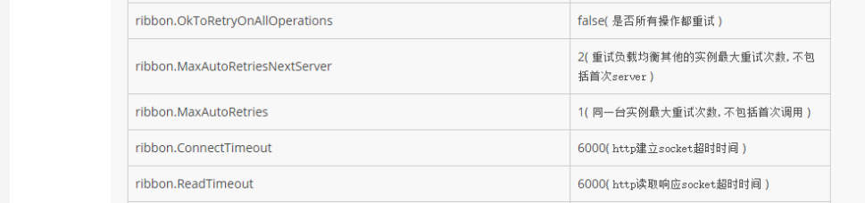

# 一、基本概念

## 1. 概念描述

​	SpringCloud是基于SpringBoot研发出来的分布式框架，他把市面上一些比较好的分布式架构中能用到的组件，都整合到了SpringCloud中做了一次封装供我们使用，所以说他是对分布式架构提供了一站式的解决方案，他使用HTTP REST风格进行服务访问的。

## 2.版本号

​	SpringCloud的版本号分为大版本号和小版本号，大版本号以伦敦地铁站的名称命名，这个命名并没有规律，当有大的功能升级的时候就会发布一个大版本，现在生产环境中最常用的是F(Finchley )版，比较新的稳定版本是G(Greenwich )版，小版本号是在大版本号后面以SR/RC开头后面接序号例如：`Greenwich SR3` ，其中SR3表示的是小版本号，当有小功能升级时后发布一个小版本。

> 需要注意依赖过来的SpringCloud版本与SpringBoot版本关系是不能随意更改的，否则很容易有兼容性问题

## 3.与Dubbo对比

对比两个框架主要从下面四个角度分析

|                | Dubbo                                  | SpringCloud                    |
| -------------- | -------------------------------------- | ------------------------------ |
| 架构完整度     | 只提供了注册中心和服务远程调用         | 微服务需要的组件都有提供       |
| 社区的活跃度   | 2018年才进入Apache孵化器，活跃度低一些 | 更高一些                       |
| 通信协议       | RPC网络通信，效率要高于一些            | HTTP REST 效率没RPC高          |
| 使用与技术升级 | 新项目：难度大，旧项目改造：容易       | 新项目：难度小，旧项目改造：难 |

> 总结就是，如果dubbo内嵌支持的分布式组件较少，在新项目研发时需要自己集成第三方的所以开发难度较大，但如果是老项目升级微服务架构的话，dubbo的改造成本要低，而SpringCloud由于支持分布式组件非常多新项目使用他开发难度低一些，但老项目升级微服务架构使用SpringCloud改造成本会很高。
>

# 二、SpringCloud Eureka

## 1.介绍

​	Eureka是Netflix公司研发的一个服务治理框架，被SpringCloud所集成使用，同类被SpringCloud集成的服务治理组件还有consul、zookeeper等，Eureka2.0已经被弃用，但1.0还一直维护着，现在用的都是1.0版本

## 2.Eureka架构


1.Eureka服务器: 服务器集群会接收到客户端发送过来的注册信息，在本地形成服务注册列表，集群之间也会进行数据同步，但同步过程中可以对客户端提供服务，所以Eureka满足的是是CAP理论中的AP。

2.Eureka客户端：服务提供者和服务消费者对于Eureka来说都是客户端，他们会把自己的服务注册到Eureka服务器，并会每三十秒从服务器获取服务注册表。

## 3.与Zookeeper对比

Eureka：基于AP的，Eureka节点都是平级的只要有一个节点还存在就可以为客户端提供服务，但是在网络分区发生后由于采用自我保护机制有的节点中的服务注册列表并不是最新的，所以满足不了高一致性

Zookeeper：基于CP的，ZooKeeper在选举期间注册服务瘫痪,虽然服务最终会恢复,但是选举期间不可用的，所以保证了数据高一致性，zk采用过半数存活的方式解决网络分区问题

## 4.自我保护机制

​	服务器每30秒发一次心跳，连续三次没收到客户端响应则会认为客户端不可用并从注册表中删除，为了防止由于网络原因而导致的本来健康的客户端被删除的情况，Eueka默认启用了自我保护机制，默认阈值为0.85，服务端会收集最近15分钟收到的平均心跳数S，当最后一分钟内收到的心跳数小于S*0.85则进入自我保护模式不会把客户端从注册表中删除。当网络故障恢复后心跳数大于S阈值时则会退出自我保护模式

## 5.Eureka服务器配置

1. 引入依赖

```xml
<parent>
    <groupId>org.springframework.boot</groupId>
    <artifactId>spring-boot-starter-parent</artifactId>
    <version>2.1.9.RELEASE</version>
    <relativePath/> <!-- lookup parent from repository -->
</parent>
<properties>
    <java.version>1.8</java.version>
    <spring-cloud.version>Greenwich.SR3</spring-cloud.version>
</properties>	

<dependencies>
    <dependency>
        <groupId>org.springframework.cloud</groupId>
        <artifactId>spring-cloud-starter-netflix-eureka-server</artifactId>
    </dependency>
</dependencies>
```

2. 配置文件

```yml
server:
  port: 8001

eureka:
  instance:
    hostname: server3
  client:
    register-with-eureka: false	//不注册自己
    fetch-registry: false	//不获取注册表
    service-url:
      defaultZone: http://192.168.0.106:8000/eureka //集群中其他主机地址用，分割

spring:
  application:
    name: server2	//微服务名称
```

3. 开启Eureka服务

```java
@SpringBootApplication
@EnableEurekaServer
public class DemoEureka02Application {

    public static void main(String[] args) {
        SpringApplication.run(DemoEureka02Application.class, args);
    }
}
```

4. 直接访问项目上下文路径就可以到注册中心页面

## 6.Eureka客户端配置

### 6.1 服务提供者

1. 依赖

```xml
<dependency>
    <groupId>org.springframework.cloud</groupId>
    <artifactId>spring-cloud-starter-netflix-eureka-client</artifactId>
</dependency>
```

> 只要引入客户端依赖，它就会自动到Eureka服务器注册自己

2. 配置

```properties
server.port=8011

spring.application.name=provider
#Eureka服务器集群地址
eureka.client.service-url.defaultZone=http://192.168.0.106:8000/eureka,http://192.168.0.106:8001/eureka
eureka.instance.instance-id=provider-8011
```

3. 提供服务

正常编写RestController就可以

### 6.2 服务消费者

1. 依赖

```xml
<dependency>
    <groupId>org.springframework.cloud</groupId>
    <artifactId>spring-cloud-starter-netflix-eureka-client</artifactId>
</dependency>
```

2. 注入RestTemplate

```java
@Configuration
public class WebConfig {
	
    @Bean
    @LoadBalanced //开启负载均衡，必须开启它才能使用微服务名来访问服务
    public RestTemplate restTemplate() {
        return new RestTemplate();
    }
}
```

3. 服务调用

```java
@RestController
@RequestMapping("/api/consumer")
public class ConsumerResource {

    @Autowired
    private RestTemplate restTemplate;
	//提供者微服务名称
    private static final String SERVER_URL = "http://provider";

    @Autowired
    private UserService userService;

    @GetMapping("/all")
    public List<User> findAll() {
        //使用微服务名访问
        return restTemplate.getForObject(SERVER_URL + "/api/all", List.class);
    }

}
```

4. 配置文件

```properties
server.port=8012

spring.application.name=consumer

eureka.client.service-url.defaultZone=http://192.168.0.106:8000/eureka,http://192.168.0.106:8001/eureka
```


# 三、SpringCloud OpenFeign

## 1. 介绍

​	OpenFeign是对使用RestTemplate请求服务做的封装，它能够让我们像正常依赖service一样来访问服务，内部使用动态代理为其service接口生成实现，并在其中通过反射拿到我们配置的信息来使用RestTemplate访问服务

## 2. 使用

1. 依赖

```xml
<dependency>
    <groupId>org.springframework.cloud</groupId>
    <artifactId>spring-cloud-starter-openfeign</artifactId>
</dependency>
```

2. 开启openfeign

```java
@SpringBootApplication
//可以指定包来扫描接口
@EnableFeignClients(basePackages = "com.lzj.democonsumer01.service")
public class DemoConsumer01Application {

    public static void main(String[] args) {
        SpringApplication.run(DemoConsumer01Application.class, args);
    }
    
}
```

3. 配置文件

```properties
#连接超时时间与读取服务的超时时间
feign.client.config.default.connect-timeout=5000
feign.client.config.default.read-timeout=5000
#开启请求与响应的数据压缩
feign.compression.request.enabled=true
feign.compression.response.enabled=true
#配置压缩文件类型与最小可压缩文件大小
feign.compression.request.mime-types=["text/xml","application/json"]
feign.compression.request.min-request-size=2048
```

4. 编写service接口

```java
//标记这个接口是个Feign客户端，并配置它要请求的微服务名
@FeignClient("provider")
@RequestMapping("/api/user")
public interface UserService {

    @GetMapping("/all")
    List<User> findAll();

    @GetMapping("/{id}")
    User getById(@PathVariable("id") Integer id);

    @PostMapping
    void save(User user);

    @DeleteMapping("/{id}")
    void deleteById(@PathVariable("id") Integer id);

    @PutMapping
    void update(User user);
}
```

> 就像写一个RestController一样，但@PathVariable一定要指定路径参数名字才可以

5. 服务调用

```java
@RestController
@RequestMapping("/api/consumer")
public class ConsumerResource {

    @Autowired
    private UserService userService;

    @GetMapping("/all")
    public List<User> findAll() {
        return userService.findAll();
    }

}

```

> 像正常调用service一样使用

# 四、Ribbon

## 1. 介绍

Ribbon是Netflix公司研发的一个客户端服务均衡器，它SpringCloud公共依赖的一部分不需要单独引入依赖，注入RestTemplate时使用的`@LoadBalanced`就是使用的Ribbon负载均衡器，这个注解标记了一个RestTemplate对象会被配置为LoadBalancerClient。

## 2. LoadBalancerClient

它是一个接口，其中execute方法用来执行负载均衡请求的，跟进这个方法的实现源码

```java
public <T> T execute(String serviceId, LoadBalancerRequest<T> request, Object hint)
    throws IOException {
    ILoadBalancer loadBalancer = getLoadBalancer(serviceId);
    //1.获取服务
    Server server = getServer(loadBalancer, hint);
    ...
}

protected Server getServer(ILoadBalancer loadBalancer, Object hint) {
    if (loadBalancer == null) {
        return null;
    }
    //2.通过负载均衡器选择一个服务
    return loadBalancer.chooseServer(hint != null ? hint : "default");
}

//BaseLoadBalancer 负载均衡器实现类全局属性，默认使用轮询策略RoundRobinRule
private final static IRule DEFAULT_RULE = new RoundRobinRule();
protected IRule rule = DEFAULT_RULE;
public Server chooseServer(Object key) {
    //3.使用不用的策略选择服务
    return rule.choose(key);
}
```

## 3. IRule

它是负载均衡策略接口，可以实现此接口自定义策略

```java
public interface IRule{
	//选择服务的方法
    public Server choose(Object key);
    //注入负载均衡器，lb可以获取所有服务
    public void setLoadBalancer(ILoadBalancer lb);
    
    public ILoadBalancer getLoadBalancer();    
}
```


他默认的策略实现有以下几种

* RoundRobinRule：轮询访问服务，最多重试10次

  ```java
  //获取轮询后得到的服务索引
  private int incrementAndGetModulo(int modulo) {
      for (;;) {
          //nextServerCyclicCounter是一个AtomicInteger
          int current = nextServerCyclicCounter.get();
          int next = (current + 1) % modulo;
          //原子操作，更新下一个服务的索引
          if (nextServerCyclicCounter.compareAndSet(current, next))
              return next;
      }
  }
  ```

* BestAvailableRule：选择并发量最小的服务

  ```java
  for (Server server: serverList) {
      ServerStats serverStats = loadBalancerStats.getSingleServerStat(server);
      //如果此服务没有被熔断则获取一个并发量最小的服务
      if (!serverStats.isCircuitBreakerTripped(currentTime)) {
          int concurrentConnections = serverStats.getActiveRequestsCount(currentTime);
          if (concurrentConnections < minimalConcurrentConnections) {
              minimalConcurrentConnections = concurrentConnections;
              chosen = server;
          }
      }
  }
  ```

* RetryRule：在规定的时间内轮询获取一个服务，默认时间500ms

  ```java
  long maxRetryMillis = 500;
  
  public Server choose(ILoadBalancer lb, Object key) {
      long requestTime = System.currentTimeMillis();
      long deadline = requestTime + maxRetryMillis;
  
      Server answer = null;
  
      answer = subRule.choose(key);
  	//如果第一次没获取到服务
      if (((answer == null) || (!answer.isAlive()))
          && (System.currentTimeMillis() < deadline)) {
  		//开启一个中断任务，到达500ms中断线程
          InterruptTask task = new InterruptTask(deadline
                                                 - System.currentTimeMillis());
  	   //如果没有中断则一直重复获取服务
          while (!Thread.interrupted()) {
              answer = subRule.choose(key);
  
              if (((answer == null) || (!answer.isAlive()))
                  && (System.currentTimeMillis() < deadline)) {
                  //切换到就绪态，让出当前时间片，等待下一次获取到时间片时再执行
                  Thread.yield();
              } else {
                  break;
              }
          }
  
          task.cancel();
      }
  
      if ((answer == null) || (!answer.isAlive())) {
          return null;
      } else {
          return answer;
      }
  }
  ```

* RandomRule：随机获取一个服务

  ```java
  protected int chooseRandomInt(int serverCount) {
      //使用线程本地random随机一个服务索引
      return ThreadLocalRandom.current().nextInt(serverCount);
  }
  ```

* AvailabilityFilteringRule：把被熔断或不能用的服务与连接饱和的服务过滤掉进行轮询获取服务

## 4. 配置轮询策略

1. 使用配置文件修改

```pro
abcmsc-provider-depart:
    ribbon:
        NFLoadBalancerRuleClassName: com.netflix.loadbalancer.RandomRule
```

2. 配置类注入方式

```java
@Bean
public IRule loadBalanceRule() {
    return new RandomRule();
}
```

## 5. Ribbon初始化配置

```yml
# 开启ribbon饥饿加载，防止第一次访问远程服务时因为初始化ribbon组件而导致超时
ribbon:
  eager-load:
    enabled: true  
```



# 五、SpringCloud Hystrix

## 1.介绍

Hystrix是由Netflix开发的一款用于做服务熔断和服务降级的框架。

* 熔断：是用来防止服务雪崩的，为了保护我们的服务当服务的请求数量超过设定阈值时则会返回服务降级结果，当检测到某一服务不可用时则把访问该服务的链路熔断，可以有效的防止请求阻塞。
* 服务降级：是为了可以给用户更好的体验，会预先设置好服务返回的默认内容，当请求到来时返回接口不需要处理逻辑直接返回默认内容。
* 服务雪崩：在微服务架构下，因为tomcat只维护了一个线程池50个线程来接收请求，当某一个服务并发量非常大时整个tomcat的线程都被这一个服务所占用，会导致其他服务不可用的情况，如果某一个服务不能使用的话会间接影响到很多与它关联的服务不可用，这种情况就是服务雪崩，需要使用服务隔离来解决问题。

> 服务熔断与服务降级配合使用，当有被熔断的链路时，如果有请求访问过来则会对其返回服务降级后的结果

## 2.服务降级

### 2.1 方法级别

方法级别的配置时在服务提供者端配置的，当被熔断器包装的方法处理异常或超时或线程池负载了则会返回降级结果

1. 导入依赖

```xml
<dependency>
    <groupId>org.springframework.cloud</groupId>
    <artifactId>spring-cloud-starter-netflix-hystrix</artifactId>
</dependency>
```

2. 绑定降级方法

```java
    //在controller方法上绑定对应的降级方法
    @HystrixCommand(fallbackMethod = "getHystrixHandle")
    @GetMapping("/all")
    public List<User> findAll() {
        return userService.findAll();
    }

    public List<User> getHystrixHandle() {
        User user = new User();
        user.setName("服务降级结果");
        return Arrays.asList(user);
    }
```

3. 开启熔断器

```java
@SpringCloudApplication
//@EnableCircuitBreaker
public class DemoConsumer01Application {

    public static void main(String[] args) {
        SpringApplication.run(DemoConsumer01Application.class, args);
    }

}
```

> @SpringCloudApplication包含了`@EnableCircuitBreaker`,`@EnableDiscoveryClient`,`@SpringBootApplication`

### 2.2 类级别

类级别的处理是服务消费者端在feign中集成配置的，当远程服务调用失败时返回降级结果

#### 2.2.1 FallbackFactory

1. 导入依赖
2. 定义FallbackFactory实现类

```java
@Component
public class UserFallbackFactory implements FallbackFactory<UserService> {

    @Override
    public UserService create(Throwable throwable) {
        return new UserService() {
            @Override
            public List<User> findAll() {
                User user = new User();
                user.setName("服务降级");
                return Arrays.asList(user);
            }

            @Override
            public User getById(Integer id) {
                User user = new User();
                user.setName("服务降级1");
                return user;
            }
		   ...
        };
    }
}
```

> 这个类要加入IOC容器，接口泛型指定的是feign服务接口，实现方法返回的是feign的匿名实现类，提供了服务降级的实现

3. 在feign客户端绑定服务降级实现类

```java
@Service
@FeignClient(value = "provider", fallbackFactory = UserFallbackFactory.class)
@RequestMapping("/api/user")
public interface UserService {

    @GetMapping("/all")
    List<User> findAll();

    @GetMapping("/{id}")
    User getById(@PathVariable("id") Integer id);

    @PostMapping
    void save(User user);

    @DeleteMapping("/{id}")
    void deleteById(@PathVariable("id") Integer id);

    @PutMapping
    void update(User user);
}
```

4.  开启熔断器
5. 开启feign对hystrix的降级支持

```properties
feign.hystrix.enabled=true
```

#### 2.2.2 Fallback

1. 编写服务降级类

```java
@Component
@RequestMapping("/fallback/api/user")
public class UserFallback implements UserService {

    @Override
    public List<User> findAll() {
        return null;
    }

    @Override
    public User getById(Integer id) {
        return null;
    }

    @Override
    public void save(User user) {

    }

    @Override
    public void deleteById(Integer id) {

    }

    @Override
    public void update(User user) {

    }
}
```

> 就是实现了服务接口，并对其@RequestMapping的路径要以fallback前缀

2. feign户端绑定fallback

```java
@Service
@FeignClient(value = "provider", fallback = UserFallback.class)
@RequestMapping("/api/user")
public interface UserService {

    @GetMapping("/all")
    List<User> findAll();

    @GetMapping("/{id}")
    User getById(@PathVariable("id") Integer id);

    @PostMapping
    void save(User user);

    @DeleteMapping("/{id}")
    void deleteById(@PathVariable("id") Integer id);

    @PutMapping
    void update(User user);
}
```

> 使用fallback属性绑定降级实现类，其他的步骤跟上面FallbackFactory一样

## 3.Hystrix配置

### 3.1 服务隔离策略

用于防止并发量过高而导致tomcat自带线程池中的线程被某一个服务全部占用，隔离有两种类型，一种是线程执行隔离，一种是信号量执行隔离，分别用线程数与分配的信号量数量限制最高可服务的数量。默认使用的是线程执行隔离，他的效率高一些。隔离会为每个服务都单独维护一些线程提供请求的接收，这样服务之间就不存在雪崩问题

```properties
#更改策略类型
hystrix.command.default.execution.isolation.strategy=thread
hystrix.command.default.execution.isolation.strategy=semaphore
#执行超时时间,默认1000毫秒，默认开启true
hystrix.command.default.execution.timout.enabled=true
#超时中断，当线程超时是否中断线程的执行,默认false
hystrix.command.default.execution.isolation.thread.interruptOnTimeout=false
#取消中断，当请求取消后是否中断线程,默认false
hystrix.command.default.execution.isolation.thread.interruptOnCancel=false
```

```java
@RestController
public class IsolationService {

    @GetMapping("/iso")
    @HystrixCommand(fallbackMethod = "isoMethod",
            threadPoolKey = "licenseByOrgThreadPool",
            threadPoolProperties = {
                    @HystrixProperty(name = "coreSize", value = "1"),
                    @HystrixProperty(name = "maxQueueSize", value = "10")
            })
    public String iso() {
        System.out.println(Thread.currentThread().getName());
        try {
            Thread.sleep(900);
        } catch (InterruptedException e) {
            e.printStackTrace();
        }
        return Thread.currentThread().getName();
    }

    public String isoMethod() {
        return "服务繁忙，请稍后再试";
    }
}
```

> 默认情况下只要配置了服务降级的接口Hystrix就会默认为该服务维护一个单独的线程池做线程隔离,默认线程池名字为controller的类名字，我们可以通过注解或者配置文件中指定名字，并配置线程池的一些属性，默认线程数量为10个，当请求时10个线程全部被占用时回把请求放到等待队列中，如果没配置等待队列则直接返回服务降级结果。

## 4.Dashboard监控

用来监控接口的请求，有多少成功失败或者熔断的服务等

1. 导入依赖

```xml
<dependency>
    <groupId>org.springframework.cloud</groupId>
    <artifactId>spring-cloud-starter-netflix-hystrix-dashboard</artifactId>
</dependency>
<dependency>
    <groupId>org.springframework.boot</groupId>
    <artifactId>spring-boot-starter-actuator</artifactId>
</dependency>
```

> 仪表盘需要actuator的支持才能显示

2. 开启Dashboard

```java
@SpringCloudApplication
@EnableHystrixDashboard
public class DemoConsumer01Application {

    public static void main(String[] args) {
        SpringApplication.run(DemoConsumer01Application.class, args);
    }

}
```

3. 配置文件 

```properties
#开启actuator所有监控页面
management.endpoints.web.exposure.include=*
```

4. 在浏览器输入本工程URL后面加/hystrix会访问到主页，主页上有提示三种访问方式的连接提示，可以使用第三个单机的地址，在文本框中输入示例URL并把服务地址换成当前自己的项目地址就可以 

# 六、SpringCloud Zuul

## 1. 介绍

​	zuul是Netflix公司研发的一个组件，用来做服务网关，在浏览器与web服务之间通信的入口，可以用来做路由和请求过滤。

## 2.服务路由

1. 引入依赖

```xml
<dependency>
    <groupId>org.springframework.cloud</groupId>
    <artifactId>spring-cloud-starter-netflix-eureka-client</artifactId>
</dependency>
<dependency>
    <groupId>org.springframework.cloud</groupId>
    <artifactId>spring-cloud-starter-netflix-zuul</artifactId>
</dependency>
```

2. 配置文件

```yml
#常规的一些配置
server:
  port: 8013
eureka:
  client:
    service-url:
      defaultZone: http://192.168.18.1:8001/eureka,http://192.168.18.1:8000/eureka
spring:
  application:
    name: demo-zuul
#zuul路由策略，service1自己定义，path代表要拦截路径，serviceId要路由到的微服务名
zuul:
  routes:
    service1:
      path: /**
      serviceId: consumer
```

3. 开启zuul代理

```java
@EnableZuulProxy
@SpringBootApplication
public class DemoZuulApplication {
    
    public static void main(String[] args) {
        SpringApplication.run(DemoZuulApplication.class, args);
    }
    
}
```

> zuul.routes下面可以配置多个服务模块，每个服务模块都可以配置不同的path与路由的服务名，zuul的服务路由默认是轮询负载策略，如果想要指定其他负载均衡策略可以使用ribbon，同一微服务名下可以有多个主机注册到eureka

> 注意：zuul的拦截路径匹配后，会把拦截路径之前前的内容映射成微服务地址去访问，例如：拦截路径为/weixin，那么当你访问zuul时http://ip/weixin/getApp，这个地址会被映射成http://微服务地址/getApp

## 3.基于Ribbon的负载均衡路由

1. 依赖跟上面一样，只需要去修改一下配置文件

```yml
zuul:
  routes:
    service1:
      path: /**
      serviceId: ribbon-route #指向的是ribbon路由策略名字
      
#这个ribbon路由的名字是自己定义的      
ribbon-route:
  ribbon:
  	#指定负载均衡策略
    NFLoadBalancerRuleClassName: com.netflix.loadbalancer.RandomRule
    #指定要负载的服务器列表来自配置文件，这个在G版中式默认值不用配置
    NIWSServiceListClassName: com.netflix.loadbalancer.ConfigurationBasedSeerverList
    #要负载的服务器列表，输入的是真实url，不是微服务名
    listOfServers: localhost:8012, localhost:8014

#禁止ribbon使用eureka，防止路由时把url当作微服务名
ribbon:
  eureka:
    enabled: false
```

## 4.路由的其他配置

### 4.1 url路由

```yml
zuul:
  routes:
    service1:
      path: /**
      url: http://www.baidu.com #可以把请求路由到任意的互联网地址
```

### 4.2 路由通配符

* /**：表示匹配任意多级路径，例如 /api/consumer/page
* /*：表示匹配一级路径, 例如/api/consumer
* /?：表示匹配一级路径并只能有一个字符，例如/api/c

### 4.3 路由前缀

```yml
#为所有的路由路径加前缀
zuul:
  prefix: /api
```

### 4.4 服务名屏蔽

```yml
#屏蔽所有微服务名
zuul:
  ignored-services: "*"
  #屏蔽指定路径
  ignored-patterns: /**/provider/**
```

> 默认zuul路由可以使用微服务名来进行访问，例如之前正常访问：http://localhost:8015/api/page,他也可以用微服务名来直接访问:http://localhost:8015/consumer/api/page

## 5.路由过滤

我们可以继承ZuulFilter类来实现路由过滤的功能

```java
@Component
public class CustomZuulFilter extends ZuulFilter {

    //指定过滤器类型，pre是前置过滤，在请求还没有访问到网关后端服务时过滤
    @Override
    public String filterType() {
        return "pre";
    }
	//多个过滤器之间的排序号
    @Override
    public int filterOrder() {
        return 0;
    }
	//用来控制针对什么样的请求来过滤
    @Override
    public boolean shouldFilter() {
        //这里可以使用zuul里面提供的RequestContext获取request做处理，返回false则不对这个请求过滤
        RequestContext requestContext = RequestContext.getCurrentContext();
        String path =  requestContext.getRequest().getServletPath();
        System.out.println("path:" + path);
        return true;
    }
	//进行过滤的方法
    @Override
    public Object run() throws ZuulException {
        RequestContext requestContext = RequestContext.getCurrentContext();
        HttpServletRequest request = requestContext.getRequest();
        String user = request.getParameter("user");
        if(StringUtils.isEmpty(user)) {
            //把这个属性设置为false表示过滤请求
            requestContext.setSendZuulResponse(false);
            requestContext.setResponseStatusCode(401);
        }
        return null;
    }
}
```

> 这个类要加入到IOC容器

## 6.请求限流

1. 引入依赖

```xml
需要单独引入这个依赖，支持限流
<dependency>
    <groupId>com.marcosbarbero.cloud</groupId>
    <artifactId>spring-cloud-zuul-ratelimit</artifactId>
    <version>2.0.5.RELEASE</version>
</dependency>
```

2. 配置文件

```yml
zuul:
  ratelimit:
    enabled: true   # 开启限流
    default-policy: # 设置限流策略
      refresh-interval: 3  # 限流单位时间窗口
      limit: 3      # 在指定的单位时间窗口内启动限流的限定值
      quota: 1      # 指定限流的时间窗口数量
      type:         # 指定限流查验对象类型
        - user
        - origin
        - url
```

* url类型的限流就是通过请求路径区分

* origin是通过客户端IP地址区分

* user是通过登录用户名进行区分，也包括匿名用户

> 上面的例子就是说，三秒内最多能请求3次，被限流后会返回429状态码，我们可以在SpringBoot工程的resource.public.error下为429异常配置一个错误提示页面

## 7.基于eureka实例元信息，做指定路由

1. 引入依赖

```xml
<!--需要额外引入此依赖做基于标记的路由-->
<dependency>
    <groupId>io.jmnarloch</groupId>
    <artifactId>ribbon-discovery-filter-spring-cloud-starter</artifactId>
    <version>2.1.0</version>
</dependency>
```

2. 过滤器实现

```java
@Component
public class CustomZuulFilter extends ZuulFilter {

    @Override
    public String filterType() {
        return "pre";
    }

    @Override
    public int filterOrder() {
        return 0;
    }

    @Override
    public boolean shouldFilter() {
        RequestContext requestContext = RequestContext.getCurrentContext();
        String path =  requestContext.getRequest().getServletPath();
        System.out.println("path:" + path);
        return true;
    }

    @Override
    public Object run() throws ZuulException {
        RequestContext requestContext = RequestContext.getCurrentContext();
        HttpServletRequest request = requestContext.getRequest();
        String user = request.getParameter("user");
        if(StringUtils.isEmpty(user)) {
            //向RibbonFilterContext中添加元信息，他就会把请求路由到有这个key value的服务上
            RibbonFilterContextHolder.getCurrentContext().add("host-mark", "c1");
            return null;
        }
        RibbonFilterContextHolder.getCurrentContext().add("host-mark", "c2");

        return null;
    }
}
```

3. consumer服务的配置上要添加标记

```properties
#在eureka源信息中添加这对key value，用来被指定路由，host-mark自己定义
eureka.instance.metadata-map.host-mark=c1
```

## 8.zuul高可用

可以在zuul集群前端使用nginx做负载均衡

## 9.网关面试题

1. 有了ngnix为什么还用网关，网关负责做什么?

   网关主要功能时做请求路由，它与ngnix相比最大的好处就是可以去注册中心获取服务地址，这样我们做路由的微服务地址就不用写死了直接写微服务名就可以，他还可以负责统一授权认证，限流，安全控制，风控等。

2. 怎么实现的灰度发布

   （1）首先在配置中心更改配置，把对应路径的请求灰度发布属性修改成启动。

   （2）然后网关接收到请求后根据请求的路径来判断是否启动了灰度发布

   （3）检测到启动灰度发布后就会进入灰度发布路由的处理逻辑，他会根据eureka的元信息把一小部分的流量导入到标记为new的新服务中，然后把大部分流量还是路由到标记为current的服务，使用1-100的随机数进行判断如果<10则把请求转发到eureka的元信息为new的服务中，这样就做到了10%的流量导入到新部署的服务

# 七、SpringCloud Config

​	配置中心，用来集中管理微服务集群中的配置文件，他的实现需要基于Git远程库，通常把配置文件集中存放在Git远程库中，当有客户端来向配置中心请求配置文件时，配置中心就会向Git远程库拉取配置信息并根据需求组装后把配置文件给客户端，注意：配置文件可以放在磁盘本地也可以使用其他版本控制工具，不过一般使用Git的比较多。

.jpg)

## 1. 配置中心搭建

1. 引入依赖

```xml
<dependency>
    <groupId>org.springframework.cloud</groupId>
    <artifactId>spring-cloud-config-server</artifactId>
</dependency>
```

2. 在GitHub中准备一个库存放配置文件

.jpg)

application.properties主配置文件，指定激活的环境

```properties
spring.profiles.active=prod
```

consumer-config.properties，消费者使用的配置文件

```properties
spring.profiles=dev
server.port=8012
....

---
spring.profiles=prod
server.port=8012
....

```

> 这个配置文件中使用---来分割两个环境的配置

3. 配置文件

```yml
server:
  port: 8015

spring:
  cloud:
    config:
       server:
         git:
           uri: https://github.com/lzj123456/github.git #指定git库的http地址
           default-label: master	#指定使用的分支
           username: 546128288@qq.com	#指定github用户名密码
           password: 521Baobei~!
```

4. 测试获取配置信息

在浏览器输入配置中心地址+/要获取的配置文件名/环境，例如：

http://localhost:8015/consumer-config/prod

> 如果主配置文件指定激活的环境的prod，才能获取prod的配置信息，否则获取不到配置信息

## 2.客户端配置更新

### 2.1 介绍

客户端自动更新配置信息有两种实现方式，一种是始终github的钩子，一种是使用SpringCloud BUS消息总线做事件广播，下面就基于SpringCloud BUS的方式来实现，SpringCloud BUS是基于MQ来做消息推送的。

.jpg)

### 2.2 使用

1. 引入依赖

```xml
<dependency>
    <groupId>org.springframework.cloud</groupId>
    <artifactId>spring-cloud-starter-config</artifactId>
</dependency>

<dependency>
    <groupId>org.springframework.boot</groupId>
    <artifactId>spring-boot-starter-actuator</artifactId>
</dependency>

<dependency>
    <groupId>org.springframework.cloud</groupId>
    <artifactId>spring-cloud-starter-bus-kafka</artifactId>
</dependency>
```

2. bootstrap.yml 项目启动时加载的引导文件

```yml
spring:
  cloud:
    config:
      uri: http://localhost:8015 #配置中心的地址
      label: master		#分支
      name: consumer-config #要获取的配置文件名字
      profile: prod #环境
  kafka:
    bootstrap-servers: 192.168.18.135:9092
#开启消息总线刷新的监听
management:
  endpoints:
    web:
      exposure:
        include: bus-refresh
```

3. 在加载配置文件的bean上使用`@RefreshScope`配置文件更新时刷新bean

```java
@Component
@RefreshScope
@RequestMapping("/fallback/api/user")
public class UserFallback implements UserService {

    @Value(value = "${tt}")
    public String tt;

    @Override
    public List<User> findAll() {
        User user = new User();
        user.setName("服务降级A:"+ tt);
        return Arrays.asList(user);
    }
}
```

4. 触发配置更新

发送post请求给任意一个配置中心客户端，就可以刷新git上最新的配置信息，在服务器地址后面加/actuator/bus-refresh触发更新配置，例如：http://localhost:8012/actuator/bus-refresh

# 八、SpringCloud sleuth+zipkin

## 1. 介绍

sleuth是用来做链路跟踪的，zipkin是twitter研发的一款APM(应用性能监控工具)，为我们提供链路跟踪的GUI视图，sleuth会在请求所经过的每个服务上打印日志来做链路跟踪，我们就能通过这些日志来分析那些服务之间的调用时间过长有问题，sleuth依赖只要加入到项目中就可以自动打印日志。zipkin与sleuth之间的日志采集有两种方式，一种的http，一种的MQ

1. 引入依赖

```xml
<dependency>
    <groupId>org.springframework.cloud</groupId>
    <artifactId>spring-cloud-starter-sleuth</artifactId>
</dependency>

<dependency>
    <groupId>org.springframework.cloud</groupId>
    <artifactId>spring-cloud-starter-zipkin</artifactId>
</dependency>

<dependency>
    <groupId>org.springframework.kafka</groupId>
    <artifactId>spring-kafka</artifactId>
</dependency>
```

2. 配置文件

```properties
#指定zipkin服务器地址
spring.zipkin.base-url=http://localhost:9411
#使用kafka方式收集日志
#spring.zipkin.sender.type=kafka
#spring.kafka.bootstrap-servers=192.168.0.101:9092
#设置采样率，默认0.1
spring.sleuth.sampler.probability=1.0
```

3. 下载zipkin服务器

```shell
curl -ssl https://zipkin.io/quickstart.sh | bash -s
#下载完成后启动服务器，默认端口9411
java -jar zipkin.jar
#启动时指定kafka
#java -DKAFKA_BOOTSTRAP_SERVERS=192.168.0.101:9092 -jar zipkin.jar
```

浏览器输入 http://localhost:9411/zipkin 

.jpg)

> 一个span就是一个服务的请求，能够查看到这个服务调用链路的每个环节锁花费的时间

# 九、SpringCloud Stream

它是用来整合MQ的，使用起来会更方便，它使用绑定器让Spring程序与MQ之间做绑定，使用channel进行接收和发送消息。SpringCloud官方只提供了对kafka与rabbitmq的支持，其他的MQ也有其他第三方组织有提供支持

.jpg)

## 1.消息生产者

1. 导入依赖

```xml
<dependency>
    <groupId>org.springframework.cloud</groupId>
    <artifactId>spring-cloud-stream-binder-kafka</artifactId>
</dependency>
```

2. 创建发送消息的类

```java
@Component
//这个通道可以绑定多个，每个对应一个主题，Source是自带的通道，多通道需要自己创建
@EnableBinding({Source.class, ConsumerChannel.class})
public class MessageSend {

    //使用指定名字的方式来注入channel
    @Autowired
    @Qualifier(Source.OUTPUT)
    private MessageChannel channel;

    @Autowired
    @Qualifier(ConsumerChannel.CHANNEL_NAME)
    private MessageChannel consumerChannel;

    public void sendMsg(String msg) {
        System.out.println(msg);
        channel.send(MessageBuilder.withPayload(msg).build());
        consumerChannel.send(MessageBuilder.withPayload(msg).build());
    }
}
```

3. 自定义通道接口

```java
public interface ConsumerChannel {
    String CHANNEL_NAME = "xxx";

    @Output(ConsumerChannel.CHANNEL_NAME)
    MessageChannel output();
}
```

4. 配置文件

```properties
#指定kafka地址
spring.cloud.stream.kafka.binder.brokers=192.168.0.133:9092
#自动创建主题
spring.cloud.stream.kafka.binder.auto-create-topics=true
#output通道发送的主题topic1，与文件类型
spring.cloud.stream.bindings.output.destination=topic1
spring.cloud.stream.bindings.output.content-type=text/plain
#xxx为自己定义的通道名
spring.cloud.stream.bindings.xxx.destination=topic2
spring.cloud.stream.bindings.xxx.content-type=text/plain
```

5. 发送消息

```java
@Autowired
private MessageSend messageSend;

@GetMapping("/send")
public void send(String msg) {
    messageSend.sendMsg(msg);
}
```

## 2.消息消费者

消息接收有三种方式，@PostConstruct、@ServiceActivator、@StreamListener

1. 导入依赖

```xml
<dependency>
    <groupId>org.springframework.cloud</groupId>
    <artifactId>spring-cloud-stream-binder-kafka</artifactId>
</dependency>
```

2. 创建消费类

```java
@Component
@EnableBinding({Sink.class, ConsumeerChannel.class})
public class MsgConsumer {

    @Autowired
    @Qualifier(Sink.INPUT)
    private SubscribableChannel channel;

    @Autowired
    @Qualifier(ConsumeerChannel.CHANNEL_NAME)
    private SubscribableChannel consumerChannel;
    
    //1.@PostConstruct方式
    //当有消息过来时自动执行此方法
    @PostConstruct
    public void prinMsg() {
        //使用管道订阅消息
        channel.subscribe(new MessageHandler() {
            @Override
            public void handleMessage(Message<?> message) throws MessagingException {
                System.out.println("aaa");
                System.out.println(message.getHeaders());
                //获取消息
                System.out.println("A:"+message.getPayload());
            }
        });

        consumerChannel.subscribe(new MessageHandler() {
            @Override
            public void handleMessage(Message<?> message) throws MessagingException {
                System.out.println(message.getHeaders());
                System.out.println("B:"+message.getPayload());
            }
        });
    }
    
    //2.@ServiceActivator，直接绑定管道获取消息，不需要注入管道bean
    @ServiceActivator(inputChannel = Sink.INPUT)
    public void printMsg(Object msg) {
        System.out.println(msg);
    }
    
    //3.@StreamListener方式，也不需要注入管道bean
    @StreamListener(Sink.INPUT)
    public void printMsg(Object msg) {
        System.out.println(msg);
    }
}
```

3. 自定义输入管道

```java
public interface ConsumeerChannel {
    String CHANNEL_NAME = "xxx";

    @Input(ConsumeerChannel.CHANNEL_NAME)
    SubscribableChannel input();
}
```

4. 配置文件

```properties
#指定kafka集群，绑定管道有与主题
spring.cloud.stream.kafka.binder.brokers=192.168.0.133:9092
spring.cloud.stream.bindings.input.destination=topic1
spring.cloud.stream.bindings.xxx.destination=topic2
```

