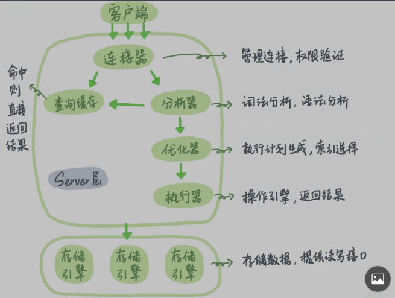

# 一、MySQL安装配置

## 1.下载安装

1. mysql官网的文档进行了详细的安装说明，可以先到官网下载页面，然后进入社区版页面进行观看。


查看安装指南


这里面描述了，基于更重操作系统安装的指南，我们选择基于linux的


这里面有提供了很多种安装方式，我们选择其中一个就可以，一般第一个就是最方便最常用了。


2. 这里面进行了具体步骤的描述：

第一步：添加mysql的yum仓库

到他提供的这个网址下载(https://dev.mysql.com/downloads/repo/yum/)，基于不同操作系统下载不同的rpm包。centos7源于Red Hat Enterprise7 所以选择第一个。


第二步：把下载后的rpm包copy到服务器上，并安装rpm包

```shell
sudo yum localinstall fileName.rpm
```

第三步：选择要安装的mysql版本，默认是最新版本8.0，rpm里面包含有多种版本。进入下面的配置文件，其中enabled=1为启用，enabled=0为禁用，默认只有mysql8是启用，如果想要用mysql57就把8禁掉在启用57，如果有多个版本同时启用会选择最高版本的。

```shell
vi /etc/yum.repos.d/mysql-community.repo

[mysql57-community]
name=MySQL 5.7 Community Server
baseurl=http://repo.mysql.com/yum/mysql-5.7-community/el/6/$basearch/
enabled=0
gpgcheck=1
gpgkey=file:///etc/pki/rpm-gpg/RPM-GPG-KEY-mysql

# Enable to use MySQL 8.0
[mysql80-community]
name=MySQL 8.0 Community Server
baseurl=http://repo.mysql.com/yum/mysql-8.0-community/el/6/$basearch/
enabled=1
gpgcheck=1
gpgkey=file:///etc/pki/rpm-gpg/RPM-GPG-KEY-mysql
```

第四步：安装mysql与启动mysql服务

```shell
sudo yum install mysql-community-server
sudo service mysqld start
sudo service mysqld status
```

第五步：初始化mysql用户并设置权限

```shell
#查看mysql初始密码
sudo grep 'temporary password' /var/log/mysqld.log
#使用初始密码登录
mysql -uroot -p
#创建远程用户，密码强度要有大小写数字，@后面代表的访问地址localhost代表只能本地使用这个用户，%代表任意地址
ALTER USER 'root'@'localhost' IDENTIFIED BY 'MyNewPass4!'
#为用户授权，默认权限特别低不能创建数据库，all privileges所有权限，*.*所有库所有表
grant all privileges on *.* to 'test1'@'localhost' with grant option;
#刷新用户权限，权限改变后客户端要重新建立连接才生效，mysql会缓存当前连接的信息包括权限信息，所以服务端权限变更后客户端需要重新连接才能获取最新的权限信息。
flush privileges;
#MySQL8需要修改客户端的认证方式，否则客户端连接时没有最新的认证插件后失败。
alter user 'root'@'%' identified with mysql_native_password by 'MyNewPass4'; 
```

# 二、创建合理表结构

## 1.设计表结构

### 1.1 范式化

范式化设计就是遵守三范式进行设计表结构。

（1）第一范式：

含义：列是原子不可再分的，意思是数据列在设计时要保证这个列代表的数据是一种而不是多种不确定的数值。

例子：用户表的设计，字段如下(用户名、联系方式、身份证...)，其中联系方式要么一直代表电话号，要么一直代表邮箱，如果两者都有，就需要把这个字段分成两个字段来设计而不能用一个字段来代表。

（2）第二范式：

含义：表中必须有主键，并且所有非主键列都要依赖于主键。

例子：课程表的设计，字段如下(课程名称、讲师名称、讲师描述...)，其中讲师的描述跟课程的主键没有太直接的依赖关系，所以要满足范式的话应该吧讲师的信息拆分到讲师表，课程表中只保留讲师主键就可以。

（3）第三范式：

含义：表中所有非主键列之间不能相互依赖。

例子：课程表的设计，字段如下(课程名称、讲师名称、讲师描述...)，其中讲师名称与讲师描述字段，存在相互依赖的关系，证明表中有冗余，应把讲师信息单独提到讲师表中。

### 1.2反范式化设计

含义：不按照三范式的规定进行设计表结构。

例子：课程表的设计，字段如下(课程名称、讲师名称、讲师描述、讲师年龄....)，这里直接把表设计成这样就可以。

### 1.3 范式与反范式结合设计

含义：在工作中，并不会完全按照范式化或反范式化设计，通常都会两者结合进行设计。

范式化缺点：过度按照范式进行设计，会产生大量表关联，影响查询效率。

反范式化缺点：过度反范式设计，会造成表数据的大量冗余。

> 所以通常我们都根据业务需求来结合两者来进行表设计

例子：就拿买课网站为例，通常课程介绍页面都包含了讲师的姓名和描述，如果这两个字段在业务上基本不会发生变化的时候，我们可以直接把表字段设计成(课程名称、讲师名称、讲师描述...)，这样减少了为此查询的表关联。

## 2.选择存储引擎

### 2.1 InnoDB

这个是mysql5.5以后作为默认存储引擎。他支持事务、行锁、索引使用到的是B+TREE，因此所有数据行都在叶子节点，并且主键索引与数据行聚集在一起，其他非主键索引存储的是主键。这也是为什么使用InnoDB时喜欢给表加一个整形的自增主键原因，可以减少非主键的体积。支持MVCC(多版本并发控制)来支持事务。在对并发量大时或者对数据一致性有要求是使用这种索引。

索引的实现使用B+Tree，叶子节点存储的数据是数据行，主键索引和数据时存储在一个文件中的，所以InnoDB的表插入数据时必须有主键，如果没有主键也会自动创建一个自增长的主键，因为没有主键索引就没法生成数据文件，又因为B+Tree中存的数据时有序的索引主键一般推荐用自增的整数类型，因为方便再B+Tree中插入数据，如果主键是随机出来的就会可能造成很多的数据节点分叉和磁盘碎片。普通索引的数据存储的是主键值，所以普通索引命中后还需要回表去主键索引中查询数据行。

### 2.2 MyISAM

这个是mysql5.5以前的默认存储引擎，他不支持事务、表锁、索引使用的是B-TREE，因此数据行与索引分开存储。索引和数据的存储时分离的，会有一个索引文件和数据文件。

索引的实现使用的B+Tree，但是叶子节点存储的数据是数据行的内存地址。

### 3.3 MOMERY

内存存储，速度快，数据容易丢失。

## 3.选择数据类型

### 3.1 整数型

| 名字      | 存储空间 |
| --------- | -------- |
| tinyInt   | 1字节    |
| smallint  | 2字节    |
| mediumint | 3字节    |
| int       | 4字节    |
| longint   | 8字节    |

这里使用int(M),M代表的是宽度，并不能限制字段占用的空间大小，如果想要使用小空间就选择tinyint的数据类型

无符号关键字unsigned，使用他可以让数据类型存储正整数的范围扩大一倍，因为吧负数的存储空间拿来存正数

补零关键字zerofill ，他与int(M)配置使用，例如M是4，值不够4位的话前面补零，课程章节序号可以使用它。

### 3.2 实数型

| 名字    | 存储空间       |
| ------- | -------------- |
| float   | 4 字节         |
| double  | 8 字节         |
| DECIMAL | 依赖于M和D的值 |

float与double被称为浮点型，说明他们小数点后面的计算结果会有浮动不准确。

decimal被称为定点型，他参数小数计算结果是正确的不会有误差，所以财务相关的使用这种类型。

decimal(M,D),m带表总长度，D带表小数后几位，例如decimal(5,2) 实际能存储的值是 111.22

### 3.3 时间类型

| 名字      | 存储空间 | 值类型         |
| --------- | -------- | -------------- |
| year      | 1字节    | 2019           |
| date      | 3字节    | 2019-01-01     |
| time      | 3字节    | 838:09:30      |
| datetime  | 8字节    | 1000年到9999年 |
| timestemp | 4字节    | 1970年到2038年 |

### 3.4字符型

| 名字       | 存储空间            |
| ---------- | ------------------- |
| char       | 255字符             |
| varchar    | 65535字符           |
| tinytext   | 255字符             |
| text       | 65535字符           |
| mediumtext | 0-16 777 215字符    |
| longtext   | 0-4 294 967 295字符 |

char：定长字符，char(M) 指定存储字符的长度，不满足长度后面补空格。浪费空间，但是对于存储长度固定的需求可以使用此类型，列入MD5加密后的字符串可以使用char(32)

varchar：可变长字符，根据实际存储的值来占用空间大小，一般都使用这种数据类型。

text系列：都是大文本类型，一般这种类型性能较差，不能有默认值，索引必须指点前缀不能全文加入索引，虚拟表不支持此类型，所以一般能用varchar就不用text系列的，只有文本特别大时才用他，而且使用这个类型时一般要拆到另外一个表来单独存储来提升原表的性能。

> 选择数据类型的原则：在满足需求的情况下选择尽量小的数据类型。例如存储ip，可以使用函数INET_NTOA(ip)和INET_ATON('192.168.1.212')来转换成数字存储，因为数字占用空间字符串小。

## 4.命名

mysql命名：小写加_，见名知意。

oracle命名：大写加_，见名知意，oracle不识别小写。

## 5.创建索引

为经常充当查询条件或连接条件的字段创建索引，唯一键和主键默认会创建好索引，我们只需要手动管理普通索引。也可以把经常要查询的字段与条件创建联合索引，这样可以索引覆盖减少回表提高效率。这个通常要根据业务场景来权衡利弊。

# 三、索引

MySQL的数据存储方式是由存储引擎决定的，索引也是由存储引擎来实现，这里说的都是以InnoDB为基础。

### 1.主键索引

主键索引不需要我们手动创建，只有有主键字段他就会自动创建索引，主键索引与数据行是存在一起的，所以也叫聚簇索引，由于索引使用的数据结构是B+树，所以索引是按顺序排列的，并且所有数据行都存放在最后一层的叶子节点中。

### 2.唯一键索引

唯一键索引也不需要我们创建，他与主键索引的区别是，他不与数据行存放在一起，这个索引中存放的是主键值，所以使用这个索引有两个特点，一个是需要回表才能找到数据行，第二个是要判断新增或修改时的值是否唯一，所以普通索引要比唯一索引在插入修改时效率要高。

```mysql
create unique index index_name on table_name (column_name);
```


### 3.普通索引

普通索引需要我们手动创建维护，通常也叫二级索引，普通索引中存储的是主键，需要回表寻找数据行。如果要对字符列创建索引的话可以使用指定长度的前缀充当索引。

```mysql
#两种方式都能创建索引
create index index_name on table_name(column_name);
alter table table_name add index index_name(column_name);
#字符串前缀索引
create index index_name on table_name(column_name(n));
#删除索引两种方式
alter table table_name drop index index_name;
drop index index_name on table_name;
```


### 4.联合索引

是由多个字段组成的索引，特点是可以进行索引覆盖，就是说要查询的所有列的值都是在这个索引的组合项，那就可以不用回表就可以查询到数据，还有一个特点是最左前缀匹配原则，查询条件只会匹配最左面的索引列查找到数据范围后再根据后面的索引列条件来判断是否是满足条件的索引然后再回表查询，之所以会遵循最左前缀原则是因为构建索引时是根据最左索引列的值来进行优先排序的，所以我们查询时只能通过最左列来匹配出索引范围。通常有了索引(A,B)，就不需要索引(A)了。建立索引时的顺序选择一般根据字段大小来衡量，如果A数据类型比B类型大，那么一般都会把A数据列放在联合索引前面，因为这样我们就不许要为A建立单独索引了，相比A单独为B建立一个索引结构效果要好很多节省空间了。

```mysql
create index index_name on table_name(column_name1,column_name2);
```

### 5.索引使用的数据结构

创建索引的时候可以选择实现方式，有两个选择，一个是hash一个是B-tree，一般索引使用的都是B+树。

**红黑树**： 相对于红黑树这样的平衡二叉树，数据量稍微大一些的话树的高度比较高，红黑树由于高度很高我们要去匹配一个索引(节点)需要经过很多次随机磁盘IO(需要遍历一遍树的高度)才能够匹配到我们要找的索引，这样的话红黑树的效率就要低于B树。

**HASH**：使用hash我们能够通过条件值计算出hash结果并快速定位出数据位置，但是不能保证数据的顺序存储，对于排序或区间查询来说并不能提供太多帮助。

**B-Tree**：他是一种多叉树，其中主要的特性是每个节点能存储的数据量都有一个度，超过度之后就会分叉成两个节点，节点直接存储的数据也跟二分搜索树差不多有序的，每个节点中都有key对应的data，由于每个节点里都能存储多个数据树的每一层存储的数据多了所以整颗树的高度也就降低了，高度低了也就意味着我们去匹配一个索引时需要遍历的节点数变少了磁盘随机IO的次数也就少了效率要提高很多，节点度的大小设置也是有讲究的，如果度特别大的话我们一次IO读取不完就会增加IO次数，所以一般度的设置都会与操作系统一次IO能够读取的数据页的大小相匹配。

**B+Tree**：他与B-Tree最大的区别就是非叶子节点不存储data只存储对应的key，这样树的每一层能够存储的key的值就会变多也就变相的增大了节点的度，这样的好处就是降低了树的高度也就减少了一次匹配索引需要的IO次数，是对B-Tree的一种优化，又因为B+Tree中所有数据都是存储在叶子节点上的，这样也有助于我们做范围查询

### 6. 优化器如果选择索引

#### 6.1 选择索引

优化器选择索引的因素主要包含，使用不同索引需要扫描的行数、排序、二级索引的回表消耗、是否使用临时表等因素来判断具体使用那个索引。

扫描行数：MySQL采用的是抽样统计，InnoDB 默认会选择 N 个数据页，统计这些页面上的不同值，得到一个 

平均值，然后乘以这个索引的页面数，就得到了这个索引的基数。通过计算出来的索引区分度就能预估出扫描行数

#### 6.2 选错索引案例

1. 场景如下

   .png)

这个时候事务B查看执行集合得到的扫描行数会不准确，因为事务A还没有提交所以事务B删除的数据并不会真正删除所以导致扫描行数预算的并不准确，而不准确的预算直接影响到了索引的选择，如果表t数据量是10W的话，选择索引a预算的行数是37000多行那把他回表需要的消耗算进去优化器就会选择不适用索引a而是直接进行全表扫描，因为他认为全表扫描要比使用索引a然后再回表效率高。解决这种问题使用 analyze table t命令手动让其重新分析，或者手动指定使用那个索引来矫正`select * from t force index(a) where a between 10000 and 20000;` 

2. 场景如下：

 explain select * from t where (a between 1 and 1000) and (b between 50000 and 100000) order by b limit 1

这个sql中a，b字段都有索引，我们会发现优化器会选择使用索引b，但是明明使用索引a只需扫描1000行数据然后再判断这1000行数据里面是否满足b字段条件就可以，使用索引a效果会更好，为什么选择使用索引b呢，是因为后面的order by b，优化器认为直接使用索引b就不许要再排序了，这时我们解决方案有三种：1.删除索引b，2.排序字段加上a，这样不管使用a还是b索引都需要对结果进行重新排序，3.强制指定使用索引a `force index(a)`

### 6.3 选择了索引但还是全表扫描

1. 场景如下：

   ```mysql
   #要查询每一年七月份的数据
   select count(*) from tradelog where month(t_modified)=7;
   ```

   原因：这里因为让索引列加入了函数运算，导致索引值发生改变，如果拿着发生改变后的索引值去索引数中做搜索那肯定是有问题的，所以优化器决定索引列参加运算或函数运算后不会再使用树搜索，而是用全表扫描的方式寻找数据行，而我们用explain查看时他的确选择了索引`t_modified`，这是因为二级索引树比聚簇索引树小遍历起来性能更好所以选择遍历二级索引树只不过再搜索的时候没有使用树搜索。

   解决：方案就是用其他SQL替换如下，原则就是不去对索引列做运算

   ```mysql
   mysql> select count(*) from tradelog where 
   -> (t_modified >= '2016-7-1' and t_modified<'2016-8-1') or 
   -> (t_modified >= '2017-7-1' and t_modified<'2017-8-1') or 
   -> (t_modified >= '2018-7-1' and t_modified<'2018-8-1');
   ```

2. 场景如下：

   ```mysql
   #隐式类型转换问题，tradeid是varchar的
   select * from tradelog where tradeid=110717
   ```

   原因：varchar字段如果与int字段做比较，mysql会把varchar隐式转换成int，实际上对索引列tradeid进行了函数运算。

   解决：使用其他sql替换如下

   ```mysql
   select * from tradelog where tradeid='110717'
   ```

3. 场景如下：

   ```mysql
   #隐式字符编码转换,l表与d表使用的不同字符集，一个是 utf8，一个是 utf8mb4
   mysql> select d.* from tradelog l, trade_detail d where d.tradeid=l.tradeid and l.id=2;
   ```

   原因：utf8mb4 是 utf8 的超集，在做表关联查询时d表字段需要转成utf8mb4字符集，实际上索引列还是参与了函数运算，这就导致在进行表关联时d表进行了全表扫描。

   解决：

   ```mysql
   #第一种就是修改表字符集
   alter table trade_detail modify tradeid varchar(32) CHARACTER SET utf8mb4 default null;
   #第二种改变等号右边字段的字符集
   mysql> select d.* from tradelog l , trade_detail d where d.tradeid=CONVERT(l.tradeid USING utf8) and l.id=2; 
   ```

   

# 四、sql优化

## 1.慢查询日志

```mysql
#查看是否开启了慢日志
show variables like 'slow_query%';
+---------------------+-----------------------------------+
| Variable_name       | Value                             |
+---------------------+-----------------------------------+
| slow_query_log      | OFF                               |
| slow_query_log_file | /var/lib/mysql/localhost-slow.log |
+---------------------+-----------------------------------+
2 rows in set (0.01 sec)

#查看慢日志时间阈值，默认为10秒，一般需要修改为1秒
show variables like 'long%';
+-----------------+-----------+
| Variable_name   | Value     |
+-----------------+-----------+
| long_query_time | 10.000000 |
+-----------------+-----------+
1 row in set (0.00 sec)

#开启慢日志功能，并修改时间阈值，修改后要重新连接才能看到修改结果
#---临时生效，服务重启后无效
set global slow_query_log=1;
set global long_query_time=1;
#---永久生效，修改配置文件
#查找配置文件位置，一般都在/etc/my.cnf
find / -type f -name "my.cnf"
#在配置文件中的[mysql]下添加如下配置,日志文件使用默认mysql创建的，自己创建的使用不了
slow_query_log=1
#slow_query_log_file=/var/lib/mysql/localhost-slow.log
long_query_time=1
#重启mysql服务，然后重新查看慢查询配置
service mysqld restart

#查看慢日志，可以直接用vi查看，线上需要使用percona工具来帮助分析日志
回家看视频补上
```

## 2.查看执行过程

根据慢日志分析出执行时间过长的SQL后，就需要分析下这个SQL慢的原因，可以使用explain查看他的执行计划

```mysql
 #SQL前面加explain就可以查看执行计划，最后\G为格式化输出内容
 explain select * from t where c=1\G
 *************************** 1. row ***************************
           id: 1
  select_type: SIMPLE
        table: t
   partitions: NULL
         type: const
possible_keys: test,c
          key: test
      key_len: 2
          ref: const
         rows: 1
     filtered: 100.00
        Extra: NULL
1 row in set, 1 warning (0.00 sec)
```

解析执行计划

1. id：sql语句执行顺序，为1是先执行

2. select_type: 查询类型

| 值                 | 说明                    |
| ------------------ | ----------------------- |
| SIMPLE             | 不包括子查询与union操作 |
| primary            | 包含子查询              |
| subquery           | select列表中的子查询    |
| dependent subquery | 依赖外部结果的子查询    |

3. table: 查询的表
4. partitions:分区表的ID
5. type：SQL的执行情况


6. possible_keys: 显示查询所涉及到的索引，只会在其中选出最优的时候，这里只是显示全部能用到的索引但不一定都使用。
7. key：当前使用的索引
8. key_len：索引长度
9. ref：回家看视频补上
10. rows：扫描的行数
11. filtered：表示返回结果的行数与扫描行数的百分比，为100时表示直接就查询到了没有扫描多余的行
12. Extra：


## 3.优化sql

sql优化的常见方式就两种，建立合适的索引或者重写SQL让其命中索引减少扫描的行数。

### 3.1 InnoDB索引特性

1. 有聚簇索引的概念，主键索引与数据行存在一起。其他二级索引存储的是主键，使用二级索引在没有发生索引覆盖的情况下，会进行回表查询。
2. 索引的存储排列是顺序存储，所以order by也能使用索引，范围查询也能使用索引。

### 3.2 创建高性能的索引

1. 前缀索引：创建前缀索引时要根据选择性来指定前缀的长度，选择性就是指用这个索引匹配到的行数，选择性越低越好。索引我们要知道前缀为多长时合适，例如 11101,11102,11103，对于这三个来说前缀为3就好，如果是区域编码那种，前缀很长一段都是一样的，这种情况可以吧值反转后进行前缀索引。
2. 聚合索引：创建聚合索引时，要根据每个列的选择性进行排序，选择性最小的列应当放在最左边。
3. 主键索引：主键索引尽量要小。
4. 使用索引扫描排序：如果要查询的列都包含在索引中的话，order by 索引字段 就可以进行索引扫描排序，这比全表扫描排序要快。

### 3.3 避免索引失效

1. like 后不要以"%开头"，因为这破坏了索引的最左前缀原则索引不能使用索引将会全表扫描。

2. 不要使用select *，每次只查询必要的字段，减少数据查询的开销，而且select *也讲无法使用索引覆盖。
3. 不要再字段上进行null值判断，null值会使索引失效。
4.  不要对where后字段参与运算和函数运算，这会导致索引失效
5.  对于多个字段索引or，优化器会对他们优化成union操作，所以直接写成union all语句有一定的优化。但是对于同一个字段使用or，优化器就相当于直接进行了两个行的查询不需要优化。

### 3.4 count()语句优化

1. count()在MyISAM引擎中有每个表的计数器，直接取值就可以，不需要扫描全表速度快，但加了where后就没用了。

2. 在InnoDB中count()语句只能一行一行取数据做累计，之所以不能直接记录值是因为MVCC的缘故，就算同一时刻多个事务多同样的查询也有可能统计的数据行不同，InnoDB只能把每一行获取到在判断这行数据是否对当前事务可见来做统计，没办法优化只能有用业务方案替代，自己实现计数器记录这个表的总数最好基于MySQL一个新的表来计数这样能基于事务保证一致性。

3. count(*)>count(1)>count(column_name)

   count(*)在mysql里会把他做特殊处理，它不会判断某字段是否未为null而是直接统计数字。

   count(1)它不会去引擎中获取字段值，而是为每个记录插入一个1然后判断是否为null，效率略微差与count( *)但差距不大

   count(column_name)会把列统计出来然后判断是否为空，效率最差。

### 3.5 避免null值

1. null会占用额外的一个字节空间，使用这个字节来判断是否为null
2. null参与函数运算的结果不正确，oracle中null参与函数运算结果也是null，mysql中会忽略null比如count()得到的值就会把null的条目过滤掉
3. null在where条件判断时需要用is null 或者 is not null 会使索引失效

## 4. show profile

profile语句是mysql提供的一个性能分析功能，可以分析sql语句在执行的每个解决所消耗的性能，可以展示响应时间、CPU消耗等，默认这个功能是关闭的。

### 4.1 查看profile状态

```mysql
show variables like '%profil%';
+------------------------+-------+
| Variable_name          | Value |
+------------------------+-------+
| have_profiling         | YES   |
| profiling              | OFF   |
| profiling_history_size | 15    |
+------------------------+-------+
```

### 4.2 开启profile功能

```mysql
set profiling=1;
```

### 4.3 使用profile分析sql

```mysql
#查看SQL语句执行的记录列表，默认记录15条
show profiles;
+----------+------------+--------------------------------+
| Query_ID | Duration   | Query                          |
+----------+------------+--------------------------------+
|        1 | 0.00262450 | show variables like '%profil%' |
|        2 | 0.00292125 | SELECT DATABASE()              |
|        3 | 0.00026875 | SELECT DATABASE()              |
|        4 | 0.00936600 | show databases                 |
|        5 | 0.00549225 | show tables                    |
|        6 | 0.00065975 | select * from t                |
+----------+------------+--------------------------------+

#查看最近一条的详细信息
show profile;
+--------------------------------+----------+
| Status                         | Duration |
+--------------------------------+----------+
| starting                       | 0.000066 |
| Executing hook on transaction  | 0.000009 |
| starting                       | 0.000012 |
| checking permissions           | 0.000012 |
| Opening tables                 | 0.000042 |
| init                           | 0.000012 |
| System lock                    | 0.000032 |
| optimizing                     | 0.000019 |
| statistics                     | 0.000026 |
| preparing                      | 0.000022 |
| executing                      | 0.000007 |
| Sending data                   | 0.000317 |
| end                            | 0.000012 |
| query end                      | 0.000009 |
| waiting for handler commit     | 0.000020 |
| closing tables                 | 0.000010 |
| freeing items                  | 0.000014 |
| cleaning up                    | 0.000021 |
+--------------------------------+----------+
#根据query ID查看详情
show profile for query 6;
#显示一些额外的信息，如CPU的使用情况，上下文切换情况
show profile cpu,swaps for query 6;
```


# 五、事务原理

## 1.MVCC

多版本并发控制，他是乐观锁的一种实现方式，可以在不使用序列化的情况下解决不可重复读与幻读问题，它的思想是每一条记录都有多个版本每个事务都对应一个数据版本，通过对多个版本的控制就可以做到事务之间操作的隔离

### 1. InnoDB中实现

MVCC的具体实现是通过`undo log+read view`来实现的，其中undo log负责存储数据行的历史版本，其中没个数据行都与隐藏列，里面存储的主要数据内容包括，db_row_id他是隐藏的自增ID如果没有指定主键会默认使用这个隐藏列作为主键，db_trx_id最后操作这个数据行的事务ID，db_roll_id回滚指针之前undo log中的上一个数据版本位置。read view则是用来控制数据可见性的，当一个事务去读取一个数据行时，会先读取read view，read view中包含有当前所有活跃的事务(未提交的事务)ID集合，我们可以根据当前数据行中的事务id A 去这个集合中做判断，判断会出现以下三种情况：

A <活跃事务集合中的最小事务id,这说明此事务在这个时间点之前就以提交索引当前事务可以读取这条记录。

A >活跃事务集合中的最大事务ID，这说明此数据时在这个时间点之后新的事务操作过的，那么这条记录不能被读取到,因为事务ID决定了事务发生的时间节点顺序，那我们这条数据时在我们这个事务执行之后才出现的就不能读取。

A 在事务集合ID范围之内，这时需要去遍历集合ID判断是否有ID A，如果有证明事务没提交则不能读取，没有说明事务提交了可以读取这个数据。

### 2. MVCC在读已提交级别下的操作

他会在事务中，每次select时都会读取一次read view，如果有两次select就会读取两次read view，两次读取到的read view不同就会导致能读取都的数据不同，所以他会产生不可重复读和幻读问题

### 3. MVCC在可重复读级别下的操作

在一个事务中，中会在第一次select时读取read view，之后每次select使用的都是共享使用之前的read view，所以他解决了不可重复读问题和快照读下的幻读问题，但是并没有解决当前读下的幻读问题，例子：我们先执行了一个select 查询ID=1的记录，由于每次使用的都是同一个read view他能查询到结果都是一样的，但是当我们在select之后insert一条id=1的记录时可能会报错说主键已存在，这就产生了当前读下的幻读问题。

### 4. MVCC+NEXT KEY解决幻读

MVCC在可重复读级别下产生的幻读问题实际上就是没有把这段范围内的数据加锁导致的，我们只需要配合上NEXT KEY锁把当前记录和索引范围内的间隙都加锁，不让其他事务对其在数据范围内做增加操作就可以解决幻读问题。

## 2.事务隔离级别

| 隔离级别 | 三读问题                              |
| -------- | ------------------------------------- |
| 读未提交 | 会产生(脏读，幻读，不可重复度)        |
| 读已提交 | 解决了脏读 oracle默认级别             |
| 可重复读 | 解决了脏读、不可重复读，mysql默认级别 |
| 序列化   | 问题全部解决                          |

1.脏读：一个事务可以读取到其他事务未提交的数据

2.不可重复读：一个事务中两次读取到的数据内容不一样，在两次读取之间有其他事务提交并对读取的数据做过修改就会发生两次读取的数据内容不同的问题。

3.幻读：一个事务中两次范围读取到的数据行数不同，在两次读之间有其他事务提交，并新增了范围查询内的数据行就会产生幻读。

4.序列化，在事务执行期间读取到数据并为每个数据行都加锁，但是并不能阻止其他事务插入数据，所以还需要加入间隙锁，是没有被插入新数据的可能。

## 3.锁

1. 全局锁

   全局锁会锁住整个库，一般只有在进行备份数据库的时候才会使用。

2. 表级锁

   MyISAM引擎使用的是表锁，所以他的并发性能不好，表级锁有两种，一个是业务上的还有一个是MDL锁，这个MDL锁在InnoDB和oracle中也存在，在修改表结构时为DDL语句持有写锁，DML语句持有读锁，

   实例：在一次开发中，调试接口时在SQL语句后设置了断点，当分析玩SQL查询结构后忘记对断点放行了直接去库中修改表结构，发现修改失败提示表已经被锁住了。

   上面的例子中有涉及到了二阶段锁的概念，当前SQL语句已经执行完毕为什么还会锁住表呢，原因是二阶段锁协议规定 只有提交了事务后锁才会释放。那么我们平时写SQL时应当把容易发生并发冲突的语句放到离事务提交最近的地方，这样能提高程序的并发性能。

3. 行级锁

   InnoDB使用的是行锁，并发性能较高。由于二阶段锁规定只有提交事务后才会释放事务中占用的所有行锁，所以有可能产生死锁，例如下图：

   .jpg)

   事务A、B都在等待对方释放锁，MySQL解决死锁有俩个方式，第一个是锁超时，默认超时时间50S但这种方式不可取，第二种是死锁检测，默认死锁检测功能是开启的，他会在有事务被阻塞时进行检测，如果发现有死锁出现将会回滚一个事务让另外一个事务顺利执行。但是死锁检测在行并发量高时会影响效率占用大量CPU资源来检测死锁，一般解决思路有三个，第一种不采用死锁检测但要保证业务中不会出现死锁，第二种限制数据行记录的访问量，第三种对原先的数据行进行拆分来分化并发量。

4. 间隙锁：锁住索引之间的间隙不让其有这个范围内的新的内容插入，但并不包含范围两端的行记录，间隙锁和间隙锁之间是不会互斥的，也就是两个事务可以同时获得同一范围内的间隙锁

5. next-key：锁住两个索引之间的范围并包含两端的索引内容，就是行锁+间隙锁的效果，他在加锁的时候是先加的间隙锁，然后再加的具体行锁是分两步进行的。

   ```mysql
   sessionA       					sessionB
   select id from t id <= 5;        
   								insert into t values(4);#blocked
   insert into t values(3);#blocked								
   ```

   上面就是next-key锁产生的死锁现象，因为A事务先对id<=5范围加了next-key锁，然后事务B想去插入一条id=4的记录时被阻塞了，但是由于next-key加锁的机制，他一开始添加的间隙锁是成功的只是在获取行锁的时候失败了，接下来事务A想插入id=3的记录时发现这段间隙被B锁住了接下来就进入了互相阻塞的死锁状态。

## 4.加锁规则

1. next-key锁的范围是开闭区间(1-2]

2. 查找过程中访问到的对象才会加锁

   ```mysql
   select id,c from t where c=5
   #c上建立了索引，由于这条sql能利用覆盖索引，所以在搜索时并不会回表查询，所以主键索引上并不会给c=5这条记录加锁。
   ```

   

3. 索引上的等值查询，给唯一索引加锁的时候，next-key lock 退化为行锁。

4. 索引上的等值查询，向右遍历时且最后一个值不满足等值条件的时候，next-key lock 退化为间隙锁。

5. 一个 bug：唯一索引上的范围查询会访问到不满足条件的第一个值为止。

   ```mysql
   1 5 10 15 20
   #执行下面的sql，按照第五条说明，他锁住的范围是(1-10],这里会访问到第一个不满足条件的记录10，然后把锁范围扩大到这里。本来从语义上来讲我们只需要锁住(1-5]就可以，但是他却向后扫描到第一个不满足条件记录后才停下。
   select id from t where id>1 and id<=5
   ```

   

## 5.快照读与当前读

1. 快照读：普通的select操作就是快照读，只能读取到某个时刻的快照内容，并不能读取到实时的数据内容
2. 当前读：DML语句和加锁后的select就是当前读，他会读取到当前时刻的数据内容。举个例子如果我们执行了一个insert语句，一开始在insert之前执行select时还没有这个数据，但是在insert时有可能会报错提示主键已存在，这就是DML语句的当前读。

# 六、高可用架构

## 1.主从配置

### 1.1主库配置

1. 配置master

```properties
#进入my.cnf配置binlog前缀，和服务ID(唯一)，修改完配置文件要重启mysql服务
log-bin=mysql-bin
server-id=130
```

2. 在master创建同步用户

```mysql
#注意要配置一下认证方式为本密码认证
create user 'slave1'@'%' identified with mysql_native_password by '521Baobei~!';
#授权此用户为slave库同步用户
grant replication slave on *.* to 'slave1'@'%';
flush privileges;
#查看master信息，记录日志位置和文件名
show master status;
+------------------+----------+--------------+------------------+-------------------+
| File             | Position | Binlog_Do_DB | Binlog_Ignore_DB | Executed_Gtid_Set |
+------------------+----------+--------------+------------------+-------------------+
| mysql-bin.000001 |     3254 |              |                  |                   |
+------------------+----------+--------------+------------------+-------------------+
```

### 1.2从库配置

1. 配置服务id

```properties
#my.cnf中
server-id=131
```

2. 配置master信息

```mysql
#配置master信息
change master to
    master_host='192.168.18.130',
    master_user='slave1',
    master_password='521Baobei~!',
    master_log_file='mysql-bin.000001',
    master_log_pos=3254;
#启动slave，前面如果是stop是停止
start slave
#查看slave状态,IO与SQL线程为yes则配置成功
show slave status\G;
*************************** 1. row **************************
             Slave_IO_Running: Yes
            Slave_SQL_Running: Yes

```

> 如果是克隆的机器则MySQL UUID会一直，解决方法删除/var/lib/mysql/auto.cnf文件，重新启动服务

### 1.3主从原理

主库在写删改等修改数据的操作时不仅向数据库中写入了数据并还把这些操作记录到了binlog日志中，主库与从库之间有一个IO线程来负责读取主库的binlog日志并记录到从库的relay-log中继日志中，从库使用一个sql线程读取relay-log中的数据操作来把数据同步到从库。

### 1.4主从延迟

由于主库在写入数据的时候时多线程并发写入的，而从库读取到binlog是使用sql线程来同步数据是单线程同步操作的，所以在主库写操作并发量大的时候从库的数据延迟也会变大，主库写并发量越大从库的延迟可能就会越大，在mysql5.6版本以后从库可以开启并发复制功能来提高从库的同步能力。

.jpg)

上面的图是从库并发复制的基本架构图，不管是什么版本的并发复制都是基于这个架构工作的，基本思想就是coordinate线程负责读取中继日志中同步过来的数据，然后根据分发策略进行任务分发，把不同的数据操作分配到不同的worker中进行并发写入到数据库。

5.6版本分发策略：按库进行分发，如果relay log读取到的事务是操作同一个库的视作冲突，他会根据库名做hash来分配到对应worker上进行同步。

5.7版本分发策略：思路是让从库模拟主库的并发操作，如果主库上的多个事务在同一个时间点commit或者prepare的证明这些事务是可以并发执行的则可以把relay log中commitID一样的事务分发到不同的worker线程进行并发处理，这种并发复制策略粒度更小并发性能提升比按库分发好很多。

5.7.22版本分发策略：在5.7版本的基础上添加了按行分发的策略，他会根据数据行的主键、唯一键索引、库名、表名来进行hash，这样可以把操作同一行的日志分发到同一个worker中来保证这部分数据的顺序一致性避免数据错乱。

```mysql
#查看当前使用的并发复制策略
show global variables like '%slave_parallel_type%';
#按库分发(默认配置)
slave_parallel_type=DATABASE
#按组分发，也就是根据commit_id分发，如果想要提高从库同步的并发性能可以更改策略为LOGICAL_CLOCK
slave_parallel_type=LOGICAL_CLOCK
```


解决方案：

1.在写代码逻辑的时候如果数据库使用了主从就需要注意，有可能刚写入的数据是查询不到的这一点来避免一部分逻辑的产生来避免问题的出现

2.配置从库sql线程为多线程的开启并发复制，如果是按库并行的用处不大，配合分库分表可以效果更好

3.进行分库，把原先的单个库拆分成多个库，这样单个库的写并发就会降低同时从库的延迟也会跟着降低。

4.强制走主库，把请求分为两类，把每次请求要获取最新数据的请求走主库

5.sleep方案，在请求时延迟一段时间请求，比如用户新增商品信息，我们可以前端不读库直接展示，然后查询详情时在去查库经过这段时间主从一般就数据同步完了

6.等待主从同步方案，通过show slave status我们能够查看到主从延迟时间，当延迟时间为0时就可以读取数据了，我们也可以判断Master_Log_File 和 Read_Master_Log_Pos，表示的是读到的主库的最新位点；Relay_Master_Log_File 和 Exec_Master_Log_Pos，表示的是备库执行的最新位点。这两组信息一致时再读取

7.使用semi-sync，保证有从库接收到数据后才给客户端返回响应，他配置第6个方案使用，防止有的binlog还没来得及传给从库时而导致的数据过期读。

### 1.5主从数据丢失

主库在接收到数据的时候如果还没来得及同步给从库就挂掉了这时就会产省数据丢失，解决方案就是开启半同步复制配置`semi-sync`，这样在主库收到数据后必须至少有一个从库同步到数据后才会返回这条数据插入成功，否则如果还没同步成功主库挂掉的话也是会返回插入数据失败的，插入数据失败我们的程序就会感知到就会根据逻辑进行数据的重新插入，等再次插入数据时就会插入到切换过来的新master上这样就保证了数据不丢失。

### 1.6 bin log日志模式

bin log日志有三种模式，分别如下

1. statement：老版本默认是这种模式，他记录的是SQL语句，优点是节省空间因为只需要记录一条SQL语句，缺点就是可能使用这条SQL语句做数据同步时产生数据丢失，因为SQL语句在不同的环境下的执行效果会不一样，有可能在主库中优化器选择A索引定位数据做删除，而在从库中选择B索引定位数据。
2. row：8.0新版本默认是这种模式，他记录的是具体操作的数据，比如我们执行一条delete语句，他会把delete掉的数据行全部记录下来，好处是可以恢复误操作的数据，缺点是占用空间大。
3. mixed：上面两种模式各有优点，混合模式就是采用上面两种方式的优点来工作，如果MySQL觉得当前执行的SQL不会产生数据同步不一致问题就会采用statement模式记录数据，反之使用row模式记录。

> show global variables like "%binlog_format%"; 查看bin log日志模式

## 2.mysql-proxy读写分离

### 2.1 架构配置

一台服务器安装mysql-proxy做代理，另外两台按照上面的配置做主从复制。

### 2.2 安装配置

1. 去官网下载mysql-proxy，然后把压缩包在linux上解压。
2. 在解压后的bin下创建mysql-proxy.cnf文件，复制以下配置信息

```properties
[ysql-proxy]
user=root
#主从服务器共有的用户密码
admin-username=root
admin-password=521Baobei~!
#代理服务器地址，端口默认4040
proxy-address=192.168.0.133:4040
#下面为主从服务器地址，1-从，2-主
proxy-read-only-backend-addresses=192.168.0.132
proxy-backend-addresses=192.168.0.131
#更改为当前mysql-proxy的安装位置，这个文件在/share/doc/下
proxy-lua-script=/opt/mysql/mysql-proxy/mysql-proxy-0.8.5-linux-el6-x86-64bit/share/doc/mysql-proxy/rw-splitting.lua
#日志文件位置自己指定
log-file=/opt/mysql/mysql-proxy/mysql-proxy-0.8.5-linux-el6-x86-64bit/bin/mysql-proxy.log
log-level=info
daemon=true
keepalive=true
```

> ll查看mysql-proxy.cnf权限，要用户组也有读写权限才可，chmod g+w,o-r 更改，g是用户组+w是给写权限O是其他用户

3. 修改rw-splitting.lua配置

```
找到这段配置
--- config
--
-- connection pool
if not proxy.global.config.rwsplit then
        proxy.global.config.rwsplit = {
                min_idle_connections = 1,//修改读写分离的策略，当最小活跃连接数为1时使用读写分离
                max_idle_connections = 2,

                is_debug = false
        }
end
```

4. 启动代理

```shell
 ./mysql-proxy --defaults-file=mysql-proxy.cnf 指定配置文件启动
```

5. 测试

```shell
#在客户端连接mysql-proxy,能连接成功就没问题
mysql -h192.168.0.133 -P4040 -uroot -p
```

## 3. MyCat

### 3.1 简介

MyCat是基于阿里的Cobar研发出来的一个分库分表中间件，在分布式数据库技术中属于重量级的，需要单独部署MyCat的服务统一管理下面的物理数据库，不过对于业务开发人员来说这是透明的。另一个比较火的Sharding-JDBC则是轻量级的是一个jar包，需要在应用层就行编码实现。

### 3.2 分布式数据库优缺点

#### 3.2.1 优点

1. 可以解决大数据存储问题，把数据量分散到不同的数据库中存储。
2. 提升大数据量执行SQL的性能，由于把数据进行了分散存储所以查询可以并行进行所以性能提高了。
3. 可以解决单点故障问题‘

#### 3.2.2 缺点

1. 面临分布式主键的问题，由于数据存储在不同节点中，所以单表的主键自增不能满足分布式存储需求，解决方案(雪花算法，redis incr()，MyCat提供的全局序列)
2. 分布式事务，MyCat目前没有完整的支持分布式事务，MyCat的事务支持基于XA协议，他能够在事务执行阶段保证一致性但是不能保证commit阶段能全部完成事务，如果一台机器在commit时出现问题那么其他节点commit后的内容无法回滚，所以MyCat支持的是弱事务。解决方案(如果对分布式事务依赖严重的系统应该使用其他方案进行分布式数据库管理)
3. 跨库join问题，MyCat最多支持跨库两个表join操作而且性能无法保证，解决方案(ER-分片，冗余，)，下面是对每个方案的介绍，不管哪种方案一般都是来避免跨库join的出现，ER-分片是指将有关系的表分到一个库中存储，冗余是指把想关联的字段冗余到一个表中，一般数据字典表会冗余到每个库一张。

### 3.3 使用场景分析

1. 在数据量规模达到足够庞大的时候迫不得已才会对数据库进行分库分表，一般上亿级别的数据量。

### 3.4 分库分表-拆分类别

数据库拆分有三类：

1. 垂直拆分：把不同的表存放在不同的节点中，表还是完整的但是不同的表可能会存储在不同的节点中。
2. 水平拆分：把表中的数据根据某个字段的规则拆分到不同的节点中，列如根据时间段来拆分或者根据ID的范围
3. 混合拆分：把以上两种混合使用，先垂直把表拆到不同的库，在把表进行水平拆。

### 3.5 MyCat专业术语

1. 逻辑库：MyCat把物理数据库集群进行了整合，对于开发人员来说就可以把他当做是一个数据库(scheme)
2. 逻辑表：与逻辑库一样只不过说的是表。(table)
3. 数据节点：对应MySQL中的数据库(dataNode)
4. 数据主机：对应物理数据库(dataHost),其中多个dataNode可以在一个dataHost中，也可以分散在多个上

### 3.6 安装使用

1. 由于MyCat的研发跟不上MySQL的速度，现在主流使用的MyCat1.6版本默认使用的数据库连接驱动连接不上MySQL8.0，需要我们对源码进行简单修改才能打包使用。

   到github拉MyCat源码在IDEA中修改POM.xml引用的依赖

```xml
<dependency>
    <groupId>mysql</groupId>
    <artifactId>mysql-connector-java</artifactId>
    <version>8.0.16</version>
</dependency>
```

​	修改配置类中常量配置io.mycat.config.model.SystemConfig

```java
//添加8.0
public static final String[] MySQLVersions = { "5.5", "5.6", "5.7", "8.0"};
//修改为1，兼容高版本驱动
private int useHandshakeV10 = 1;
```

​	使用maven进行打包(跳过测试)，会得到linux下的压缩包

```shell
mvn install -DskipTests
```

2. 安装

   上传到linux后对其解压即可

3. 配置server.xml

```xml
<!--修改用户名密码以及权限，这个是连接MyCat时用的，schemas指定的是逻辑库要与schemas.xml中的名字匹配->
<user name="root" defaultAccount="true">
    <property name="password">123456</property>
    <property name="schemas">TESTDB</property>
</user>
```

4. 配置schemas.xml

```xml
<!--
	配置逻辑库下的 逻辑表存储在哪些节点中，如果是多个节点代表要分片存储到不同的节点上，
	checkSQLschema=true表示检查SQL并把逻辑库的名字从SQL中去掉
	rule指定分片规则，每个规则都有对应的算法与对应配置，在rule.xml中
-->
<schema name="TESTDB" checkSQLschema="true" sqlMaxLimit="100">
    <table name="travelrecord" dataNode="dn1,dn2" rule="mod-long" />
</schema>

<!--配置节点对应的主机，以及主机上的数据库-->
<dataNode name="dn1" dataHost="localhost1" database="db1" />
<dataNode name="dn2" dataHost="localhost1" database="db2" />

<!--
	配置物理主机，dbDriver改为jdbc，<heartbeat>心跳测试使用的sql
	writeHost中嵌入readHost代表读写分离，也可以不需要嵌入
	writeHost中配置的用户名密码是连接mysql的
	url要变成jdbc:mysql://192.168.5.182:3307?useSSL=FALSE&amp;serverTimezone=GMT
-->
<dataHost name="localhost1" maxCon="1000" minCon="10" balance="0"
     writeType="0" dbType="mysql" dbDriver="jdbc" switchType="1"  slaveThreshold="100">
    <heartbeat>select user()</heartbeat>

    <writeHost host="hostM1" url="localhost:3306" user="root"
               password="123456">

        <readHost host="hostS2" url="192.168.1.200:3306" user="root" password="xxx" />
    </writeHost>

</dataHost>

```

5. 修改rule.xml

```xml
<!--要把使用的切片方法需要的参数，修改为与使用的节点数相同，因为他是根据使用的节点数来取模的-->
<function name="mod-long" class="io.mycat.route.function.PartitionByMod">
    <!-- how many data nodes -->
    <property name="count">2</property>
</function>
```

6. 启动MyCat

```shell
#bin下,默认端口8066，启动完就可以像连接mysql一样连接他，会看到逻辑库和逻辑表，对逻辑表进行操作会把数据分#片到刚才配置的多个节点中
./mycat
```

> 在mycat启动中会遇到问题，查看logs下的日志很有用，其次大部分问题都在mycat连接mysql上，常遇到的问题就是mycat使用配置好的用户名密码连接mysql失败，需要在MySQL中flush hosts就可以了。

# 七、MySQL架构



## 1. SQL查询过程

1. 通过连接器与server建立连接，连接器会校验用户名密码并获取用户的权限，当前会话后面的所有操作都基于此次获取的权限做校验，就算有管理员更改了该用户权限也只有在重新建立连接后生效。
2. 先根据SQL语句去缓存中查询有没有对应的结果，有就直接返回结果，在对表做DML时都会情况对应表的缓存所以缓存的命中率对于活跃的表来说很低，只有对于那种字典表有效果，在MySQL8中将会删除此组件。
3. 分析器会解析我们的SQL，把对应的字符识别成关键字，如识别出SQL中的表名字段名等，如果SQL语法错误也还会在解析时报错给出提示。
4. SQL到优化器这里，它会对这个SQL进行优化调整，选择合适的索引等。
5. SQL到执行器里，会去调用存储引擎的接口获取数据，并拿到最终的结果集返回给客户端。

## 2. SQL更新过程

1. 也是通过连接器建立会话，并做密码校验和权限的获取。
2. 如果缓存中有更新表的缓存则清空
3. 分析器解析SQL语句
4. 优化器去选择索引
5. 执行器去调用存储引擎接口做数据的更新。
6. 更新的过程中MySQL并不会立即把新数据更新到磁盘中，而是先把数据存入内存一份，同是再存入redo log一份防止数据丢失，在去把数据写入到bin log中，当redo log和bin log都写入成功后才会提交事务，这里利用了两阶段提交来保证bin log和redo log的数据一致性。

> bin log是数据server层的所有存储引擎都共用一个，redo log是InnoDB独有的，使用redo log主要是为了完成缓冲的功能提高MySQL写的性能，而bin log 是为了备份数据，redo log存储的是物理页的数据操作，bin log是存储的具体的操作记录类似于记录了SQL。redo log有固定大小，当redo log满了或者MySQL空闲时会把redo log内的数据刷新到磁盘中并清空同步完的redo log数据，通过bin log可以恢复数据和做数据备份

## 3. change buff

### 3.1 介绍

当修改id=1的数据时，如果包含这个记录的数据页已在内存中则直接修改内存中的数据页内容，如果这个记录所在数据页不在内存中则可以把这个更新操作记录在change buff中，当下次查询id=1记录时把对应数据页加载到内存后在去通过change buff中记录的操作更改内存中的数据页这个过程叫merge，除了上面的情况会发生merge外MySQL后台线程还会定时做merge并且在数据库正常关闭时也会做merge，使用了change buff就不需要每次更新时都去把要更新的数据读取到buff pool内存中再更新了，这样就减少了一次随机IO读并也能够提高内存命中率，因为buff pool内存中的数据都时为查询准备的更新时不会再去特意加载数据到内存。

### 3.2 什么情况下会使用change buff

1. 唯一索引：唯一索引由于再执行更新操作时需要判断这个值是否已存在，所以必须要把例如id=1的记录加载到内存中做判断，所以他在做更新操作时并不会利用change buff而是直接更新内存中的值。
2. 普通索引：普通索引才会利用change buff，如果更新的数据没在内存中他就会把这次更新操作记录在change buff中，然后等待merge。所以当业务上已经保证了这个列的唯一性我们一般建立索引选择使用普通索引，这样能够利用change buff提高性能
3. 如果业务场景是更新数据后要立即查询的话这时change buff就不合适了我们需要关闭change buff，其他场景下都可以利用change buff提高性能
4. 如果发现数据库内存命中率变低了，而且最近有更改过索引类型的话，很有可能是因为把普通索引改成唯一索引造成的，因为改成唯一索引后不会利用change buff内存中很多数据可能都是做更新操作时加载进来的并不能为查询命中给出帮助。

## 4. flush

### 4.1 介绍

在执行DML语句的时候数据是存入到内存和redo log中的，等到MySQL空闲、关闭数据库、redo log满了、内存满了的时候就会把数据刷新到磁盘中，这个动作就叫flush，由于flush的操作存在有的时候我们在执行select或者DML语句时偶尔要比正常的执行速度慢，那是因为后台正在做flush操作而产生的抖动，例如当我们select时内存满了就必须要flush清理出内存后才能把查询到的结果存入内存并返回响应，DML语句也一样redo log满了就要等待flush后才能执行成功返回响应。

### 4.2 相关参数

1.innodb_io_capacity

决定flush速度的是这个参数，这个参数告诉MySQL当前机器的磁盘IOPS性能，然后MySQL会根据指定的参数决定flush操作的速度，如果这个参数值设置的比较小的话flush速度就会慢影响到MySQL的性能。通过这条命令查看参数值`show global variables like '%capacity%';`

2.innodb_flush_neighbors

flush的连坐机制，如果值为1在flush时如果相邻的数据页也是脏页的话则会一起执行flush，这个参数在MySQL8.0默认为0不启动，一般只有在IOPS比较低的机械硬盘中使用这个参数提高随机IO性能。像SSD这种IOPS比较高的设备就不许要启动这个连坐机制。

## 5. DELETE过程

假如要执行删除id=5的语句，他会根据索引id到B+树中层层遍历定位到具体的id=5的位置并把这条记录标记删除标记为可覆盖，当下一次insert的记录id在5这个位置的时候再复用，所以执行完delete语句后并不会减少表空间大小，同时还会产生空洞，因为如果以后都不插入id=5的记录那这个位置就一直被占用着。

如果想要释放掉这些空洞从而减少表空间就需要重新建表，通过alter table A engine=InnoDB重建表，这个语句再5.5版本的时候会导致数据丢失，因为重建表需要把旧表的数据copy到新表中，然后再用新表替换旧表的方式完成的，所以再copy的时候如果旧表依然接收新的增删改请求就会导致copy过程中的数据丢失，不过再5.6版本中通过引入了row log日志来解决这个问题，他会再copy过程中把接收到的请求记录到row log中当copy完成后再通过row log恢复来完成Onlie DDL，随然这样可以在线上环境做表重建但是在copy时还是会占用大量CPU IO资源建议在晚上低峰时进行操作。

## 6. ORDER BY过程

如果order by的字段没有建立索引，那么就会把需要select返回的字段存入order buff中用来排序，排序的方式取决于存入order buff中字段的大小，如果字段值加起来大过sort_buffer_size阈值则采用排序字段+主键字段排序，否则采用全字段排序。

全字段排序：把select需要的字段都放入order buff排序，排序后直接返回结果，如果order buf中存储不下时就会借助外部临时文件采用归并排序的方式来完成排序。

部分字段排序：它只会把需要排序的字段和主键字段放入order buff中排序，排序后还需要回表拿到select需要的所有字段后才能返回。

## 7. 显示随机记录

我们可以通过这条语句获取3条随机记录`select word from words order by rand() limit 3;`但是他的性能却并不好，我们下面来看一下它的执行过程。

1. 首先他会建立一张内存临时表，并会遍历words 表中的每一条记录，并生成一个新的随机数字段插入记录中，然后再把记录写入临时表，这一步进行了全表扫描，假设表中有10000条记录，那他扫描了10000行
2. 然后他会把临时表中的所有记录随机数字段和主键rowid放入order buff中做排序又是一次全表扫描，排序后进行回表出去前三条记录返回，总共扫描了20003行。

所以做随机记录展示时我们需要在业务层来实现，例如我们获取表中记录数，然后在1-count之间取随机数R，然后通过这个随机数R来定位到具体的记录这样效率才会提高。在这个例子里我们可以取3次随机数，然后获取三次前R的记录。类似这样

```shell
#分别丢掉前Y个数，获取我们想要随机数
select * from t limit @Y1，1； 
select * from t limit @Y2，1；
select * from t limit @Y3，1；
```

