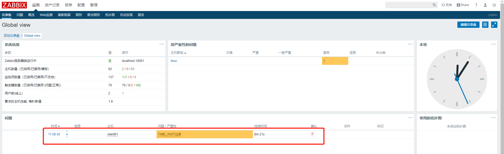
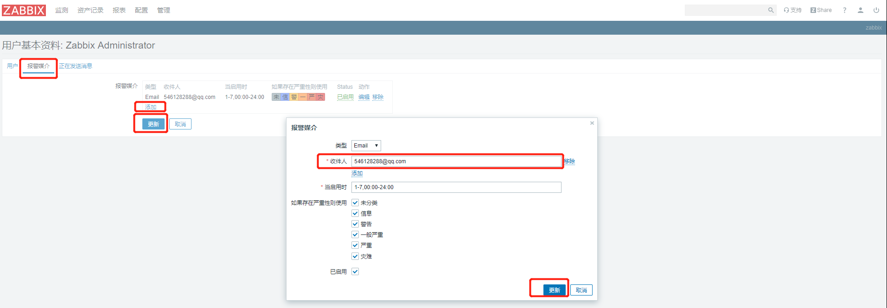
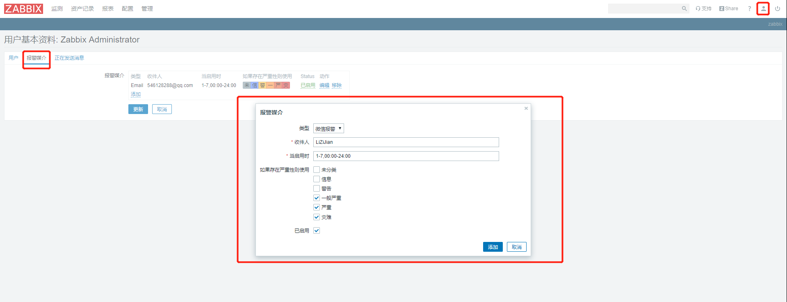
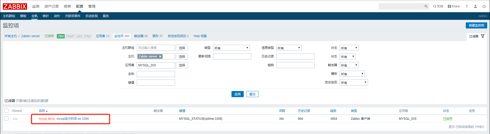

# 一、安装部署

## 1. zabbix服务端配置

1. 到`清华源`找国内的zabbix rpm镜像

```shell
# 替换镜像位置，让yum install时到国内镜像库下载zabbix
rpm -ivh https://mirrors.tuna.tsinghua.edu.cn/zabbix/zabbix/4.0/rhel/7/x86_64/zabbix-release-4.0-1.el7.noarch.rpm
```

2. 安装zabbix与mysql

```shell
# mariadb-server是mysql服务，通常监控系统与业务系统分开单独使用一个库
yum install -y zabbix-server-mysql zabbix-web-mysql zabbix-agent mariadb-server
```

3. 配置数据库

```shell
systemctl start mariadb.service
systemctl enable mariadb.service
# 初始化root密码
mysqladmin password 123456
# 进入数据库创建zabbix库 和zabbix用户账号

# 把zabbix需要用到的数据库表导入到mysql中，最后一个zabbix代表向zabbix库中导入表
zcat /usr/share/doc/zabbix-server-mysql-4.0.21/create.sql.gz | mysql -uzabbix -pzabbix zabbix
```

4. 启动zabbix_server

```shell
# 修改配置文件，主要配置数据库地址，用户名密码等信息
vim /etc/zabbix/zabbix_server.conf
DBpassword=zabbix

# 启动服务
systemctl start zabbix-server.service
# 如果启动失败可以查看日志定位问题
vi /var/log/zabbix/zabbix_server.log
# 常遇到的启动失败问题就是SElinux没关，他是一个安全内核，需要关闭他有些zabbix服务才能启动成功
vim /etc/sysconfig/selinux
SELINUX=enforcing 改为 SELINUX=disabled,然后重新服务器就可以
sestatus指令可以查看selinux是否启动
```

5. 启动zabbix_web

```shell
# 修改配置文件中的时区为国内的才能正常启动
vi /etc/httpd/conf.d/zabbix.conf
# 时区配置中的最后一行的内容修改为这个
php_value date.timezone Asia/Shanghai
# 启动服务
systemctl start httpd

# 启动http服务后就可以去浏览器访问监控页面 ip/zabbix/setup.php，经过初始化配置后登陆的用户名密码是Admin/zabbix
```

6. 启动agent

```shell
systemctl start zabbix-agent.service
```

7. 调整监控页面中文乱码问题

```shell
# 问题原因是没有对应的中文字体，我们在服务器上下载中文字体后替换zabbix的字体就可以了
yum install wqy-microhei-fonts -y
cp /usr/share/fonts/wqy-microhei/wqy-microhei.ttc /usr/share/zabbix/assets/fonts/graphfont.ttf
# 然后监控页面的中文乱码问题就解决了
```

## 2.zabbix客户端配置

1. 安装zabbix-agent

```shell
# 更新镜像源
rpm -ivh https://mirrors.tuna.tsinghua.edu.cn/zabbix/zabbix/4.0/rhel/7/x86_64/zabbix-agent-4.0.11-1.el7.x86_64.rpm
# 安装agent
yum install zabbix-agent -y
```

2. 更改配置信息

```shell
vi /etc/zabbix/zabbix_agentd.conf
# vi编辑模式下.,$d清空原有配置，只需要配置下面几项就可以
PidFile=/var/run/zabbix/zabbix_agentd.pid
LogFile=/var/log/zabbix/zabbix_agentd.log
LogFileSize=0
Server=192.168.18.134 #服务端地址
ServerActive=192.168.18.134
Hostname=client01
Include=/etc/zabbix/zabbix_agentd.d/*.conf
```

3. 启动服务

```shell
systemctl start zabbix-agent
```

4. 在服务端安装测试工具

```shell
yum install zabbix-get -y
# 获取客户端的某个监控项信息，能获取到就证明服务端和客户端之间通信没问题
zabbix_get -s 192.168.18.136 -k agent.hostname
```

5. 把这个客户端添加到服务端的监控页面中

添加一个主机

.jpg)

然后为主机配置监控项模板，选择好监控后点击蓝色的添加完成主机新增


添加完主机后，可以在主机列表当中查看到，可用性ZBX是绿色证明没问题

.jpg)

# 二、 自定义监控项

1. 配置监控项的配置文件

```shell
# 到这个路径下创建一个.conf文件，配置下面的监控项信息
/etc/zabbix/zabbix_agentd.d
# ,前面的时key监控项名字，后面时value，监控指标
UserParameter=TIME_WAIT,netstat -antp|awk 'NR>2{print $6}'|grep "TIME_WAIT"|wc -l
UserParameter=LISTEN,netstat -antp|awk 'NR>2{print $6}'|grep "LISTEN"|wc -l
UserParameter=ESTABLISHED,netstat -antp|awk 'NR>2{print $6}'|grep "ESTABLISHED"|wc -l
# 配置完成后重启一下agent
systemctl restart zabbix-agent
# 到服务端使用测试工具测试，能获取到我们刚才定义key的监控信息就没问题
 zabbix_get -s 192.168.18.136 -k TIME_WAIT
```

2. 到服务端页面为该主机添加监控项

配置-主机列表-点击我们要添加监控项的主机的监控项连接进入到配置页面，按下图配置后点击添加

.jpg)

添加完成一个监控项后，就可以在监控项列表中查看到，然后点进去进行克隆把其他的监控项也创建出来


到监控页面查看最新数据，能获取到监控项的数据就证明没问题

.jpg)

# 三、定义监控报警触发器

配置-主机-主机列表选择一个主机的触发器，进入触发器配置界面

.jpg)

在触发器界面选择新建触发器,创建一个表达式，

.jpg)

然后选择表达式构造器进行测试表达式是否正确

.jpg)

触发器添加完成后，如果触发器列表已经有它并显示已启用，就可以等到下次刷新监控信息时查看是否有报警信息，如果有报警信息就会在监控页面显示出来，直到解决后才会消失



# 四、定义图形

根据监控的值按照时间绘制的图形，还是找到主机列表点击图形-创建图形

.jpg)

创建好图形后就可以到监控页面查看

.jpg)

# 五、聚合图形

聚合图形就是整合多个图形到一个页面上展示，在监控-聚合图形页面下添加

.jpg)

添加图形界面

.jpg)

添加完成后，这个聚合图形面板就会出现在聚合图形列表中，我们点击这个聚合图形名称进入聚合图形编辑页面

.jpg)

这些加号和减号对应的是 加一列和减一列，如果只删除一个可以点击遍历 然后在编辑页删除

.jpg)

# 六、定义模板

模板就是把主机的配置抽象出来，新增主机时只需要关联模板就可以继承使用模板中定义好的监控项、触发器、图形等信息，创建模板也是在配置-主机-模板页 选择创建模板，然后给创建好的模板添加监控项等信息

# 七、配置邮件报警

1. 创建发件邮箱信息，在管理中创建一个报警媒介,这里的密码时邮件客户端授权码

.jpg)

2. 创建收件人信息，点击zabbix页面的小人头(用户头像)-报警媒介-添加



3. 创建动作

监控器触发报警的时候就会执行这个动作

.jpg)

配置发送邮件的信息模板


```shell
# 标题
故障{TRIGGER.STATUS},服务器:{HOSTNAME1}发生: {TRIGGER.NAME}故障
# 内容
告警主机: {HOSTNAME1}
告警时间: {EVENT.DATE} {EVENT.TIME}
告警等级: {TRIGGER.SEVERITY}
告警信息: {TRIGGER.NAME}
告警项目: {TRIGGER.KEY1}
问题详情: {ITEM.NAME}:{ITEM.VALUE}
当前状态:{TRIGGER.STATUS}:{ITEM.VALUE1}
事件ID：{EVENT.ID}
```


配置报警解决时发送的消息模板

.jpg)

```shell
# 标题
恢复{TRIGGER.STATUS},服务器:{HOSTNAME1}发生: {TRIGGER.NAME}已恢复
# 内容
告警主机: {HOSTNAME1}
告警时间: {EVENT.DATE} {EVENT.TIME}
告警等级: {TRIGGER.SEVERITY}
告警信息: {TRIGGER.NAME}
告警项目: {TRIGGER.KEY1}
问题详情: {ITEM.NAME}:{ITEM.VALUE}
当前状态:{TRIGGER.STATUS}:{ITEM.VALUE1}
事件ID：{EVENT.ID}
```

# 八、微信报警

1.微信报警是属于zabbix报警媒介中的脚本报警，我们要自己写脚本让zabbix执行，脚本的位置在配置文件中指定

```shell
# /etc/zabbix/zabbix_server.conf 
AlertScripts=/usr/lib/zabbix/alertscripts
```

我们在这个位置创建与微信通信用的脚本,weixin.py，脚本中需要填写微信企业号corpid，应用的Secret以及应用的id，这些信息需要自己注册企业微信账号，然后到账号中创建应用就可以获取应用ID和Secret，企业ID在我的企业中查看，脚本中还定义了日志文件为/tmp/weixin.log

```python
#!/usr/bin/env python

#-*- coding: utf-8 -*-

import requests

import sys

import os

import json

import logging

 

logging.basicConfig(level = logging.DEBUG, format = '%(asctime)s, %(filename)s, %(levelname)s, %(message)s',

datefmt = '%a, %d %b %Y %H:%M:%S',

filename = os.path.join('/tmp','weixin.log'),

filemode = 'a')

 

corpid='微信企业号corpid'

appsecret='应用的Secret'

agentid=应用的id

#获取accesstoken

token_url='https://qyapi.weixin.qq.com/cgi-bin/gettoken?corpid=' + corpid + '&corpsecret=' + appsecret

req=requests.get(token_url)

accesstoken=req.json()['access_token']

 

#发送消息

msgsend_url='https://qyapi.weixin.qq.com/cgi-bin/message/send?access_token=' + accesstoken

 

touser=sys.argv[1]

subject=sys.argv[2]

#toparty='3|4|5|6'

message=sys.argv[2] + "\n\n" +sys.argv[3]

 

params={

"touser": touser,

# "toparty": toparty,

"msgtype": "text",

"agentid": agentid,

"text": {

"content": message

},

"safe":0

}

 

req=requests.post(msgsend_url, data=json.dumps(params))

 

logging.info('sendto:' + touser + ';;subject:' + subject + ';;message:' + message)
```

脚本编写完成之后需要为脚本添加执行权限

```shell
chmod +x weixin.py
```

2.在使用这个脚本之前需要安装python环境

```shell
# 安装python环境
yum install python-pip

# 如果上面安装失败提示没有解析到这个源的话我们需要添加源
rpm -ivh http://dl.fedoraproject.org/pub/epel/6/i386/epel-release-6-8.noarch.rpm
# 如果上面更改yum源不成功试一下这个
yum install -y epel-release

# 添加源之后有可能epel源是处于禁用状态，通过下面指令查询是否epel处于禁用状态
yum repolist disabled | grep epel
# 启动epel源，把配置文件中 第一个和第三个enabled值设置为1，然后就可以在去安装python-pip了
vim /etc/yum.repos.d/epel.repo 

-----------------------------------------------------------------------------------------

# python-pip安装成功后，安装request模块
pip install requests
```

3. 使用脚本发送测试信息

```shell
# 参数1：企业微信账号，后两个参数见名知意，企业微信账号可以在企业后台中找到组成员列表，把列表导出就会在文件# 中显示每个组成员对应的企业微信账号
./weixin.py LiZiJian '报警标题' '报警内容'
# 发送消息后我们就可以在企业微信客户端中看到消息，如果想要普通微信也能看到消息就需要到企业微信手机客户端中
# 配置微信连通，工作台-管理企业-与微信消息互通，但是必须要做企业认证才能让企业账号与普通微信号联通

# 上面测试中只向一个用户发送的消息，如果我们想要向多个用户发信息就自己定义脚本
# 1.配置用户账户信息
vi names.txt
LiZiJian
luyao
# 2.配置sh脚本
vi weixin.sh
#!/bin/bash

for i in $(cat names.txt)
do
  ./weixin.py ${i} ${1} ${2}
done
# 3.测试
./wexin.sh '报警标题' '报警消息'
```

4. 报警脚本配置完成后可以在zabbix上配置报警媒介了，三个参数代表，发给谁，标题，消息

.jpg)

5. 配置报警媒介被发送人信息，点zabbix小人头(用户头像)-报警媒介



6. 由于之前邮件报警中配置的动作是对所有媒介生效的所以这里就不用在配置动作了，直接报警结果

# 九、grafana绘图

1. 安装

```shell
# grafana可以支持对各种数据源在展示，包括ES、MYSQL等
# grafana在线下载地址在国外网速比较慢难以下载，我们用网上找到的rpm包进行本地安装
yum localinstall grafana-6.3.3-1.x86_64.rpm -y
# 启动服务
systemctl start grafana-server
# 安装zabbix插件，就可以从zabbix获取数据，安装插件后需要重启grafana服务
grafana-cli plugins install alexanderzobnin-zabbix-app
```

2. 访问grafana页面

http://ip:3000/login 默认用户名密码 admin admin，第一次输入默认密码登录后需要进行修改新密码

3. 配置插件

   点进zabbix插件，有一个enable按钮点击开启插件

.jpg)

到主页添加数据源,他会展示数据源列表，我们选择zabbix

.jpg)

我们配置zabbix连接信息

.jpg)

上面配置信息保存后，点击Dashboards

.jpg)

导入一些仪表盘信息


然后我们就可以去首页查看图形了 ，点击home后就会有一个监控的图形列表选一个就可以查看图形详情页面了

.jpg)

.jpg)

# 十、percona监控MySQL

1. 安装PHP环境

```shell
 # 因为这个工具使用php获取mysql信息的
 yum install php php-mysql -y
```

2. 安装percona 监控模板

```shell
rpm -ivh https://www.percona.com/downloads/percona-monitoring-plugins/percona-monitoring-plugins-1.1.8/binary/redhat/7/x86_64/percona-zabbix-templates-1.1.8-1.noarch.rpm

# 安装后会告诉我们脚本和监控模板的位置
Scripts are installed to /var/lib/zabbix/percona/scripts
Templates are installed to /var/lib/zabbix/percona/templates
# 我们到脚本目录下去修改两个脚本文件用到的数据库用户名密码
# get_mysql_stats_wrapper.sh
 RES=`HOME=~zabbix mysql -uroot -p123456 -e 'SHOW SLAVE STATUS\G' | egrep '(Slave_IO_Running|Slave_SQL_Running):' | awk -F: '{print $2}' | tr '\n' ','`
# ss_get_mysql_stats.php
$mysql_user = 'root';
$mysql_pass = '123456';

# 修改完脚本后就把模板cp到agent的配置文件加载目录
cp userparameter_percona_mysql.conf /etc/zabbix/zabbix_agentd.d/
# 然后测试这个模板里的监控项是否能获取数据，这里的IP要注意，如果是agent调用自己本地机器上的key要回环地址
zabbix_get -s 127.0.0.1 -k MySQL.Sort-scan
# zabbix里导入模板，这个rpm包中带的模板是2.0版本的对于高版本zabbix导入会失败，去网上下载别人改好的模板  # xml文件使用就可以
```

导入模板

.jpg)

.jpg)

导入完成后应该能看到mysql监控的模板了

.jpg)

# 十一、自动注册

如果集群中的主机非常多那我们手动一个个添加主机工作量会很大，自动注册就可以简化我们创建主机的工作，大致就是配置一个自动注册的动作，当发现主机满足了定义的自动注册规则就会把这个主机添加。

配置自动注册动作

.jpg)

.jpg)

.jpg)

> 配置中的主机名包含client的agent客户端就会被自动添加主机，并执行关联模板等一些列动作，主机名就是agent配置文件中配置的Hostname，配置完这个动作就可以等着那个主机被注册进来了

# 十二、主动模式与被动模式

指的是监控项的模式，我们创建监控项时可以选择类型，默认选项是被动模式，我们可以选择主动模式，他们的区别是，主动模式是自动由客户端上报监控信息到zabbix服务端，而被动模式是需要服务端向客户端发送查看监控信息的请求后客户端返回请求响应，被动模式的性能较差因为服务端一次只向客户端获取一项监控项的信息，如果由100个监控项就会发送一百次请求

更改主机使用的模板监控类型为主动模式

.jpg)

点触发器

.jpg)

全选监控项进行批量更新类型

.jpg)

.jpg)

怎么看主动模式是否生效，找到监控-最新数据，查看最新数据的监控时间，如果主动模式监控时间应该大多都是一样的，因为是一个时间把所有监控信息一起上报过来，而被动模式是一次只查一个监控项，监控时间应该是递增的

.jpg)

# 十三、自动发现

自动发现是指，自动发现一些监控项，只要满足我们定义脚本的规则的实例出现就会把这个实例自动创建一个监控项出来，比如我们监控多个mysql实例，只需要检测到mysql实例的端口就可以用端口号作为K建立一个监控项，他必须要把检测到的mysql端口序列化成json格式才能让zabbix自动发现监控项，需要试下面的脚本，这是个python脚本

```python
#!/usr/bin/env python
# -*- coding: utf-8 -*-
try:
  import json
except:
  import simplejson as json
import commands

(status, output) = commands.getstatusoutput(""" netstat -lntp|awk -F"[: \t]+" '/mysqld/{print $5}'""")
outputs = output.split('\n')
result = []
for one in  outputs:
  result.append( {'{#MYSQLPORT}': one} )
print( json.dumps({'data':result},sort_keys=True,indent=4) )
```

1. 编写自动发现的监控项配置

```shell
# /etc/zabbix/zabbix_agentd.d目录下创建自动发现监控项配置
# key随意，value就是执行我们的python脚本获取json
UserParameter=MYSQL_DISCOVERY,python /etc/zabbix/mysql_discovery.py
# 重启一下zabbix-agent服务，测试一下能不能获取key的值
zabbix_get -s 127.0.0.1 -k MYSQL_DISCOVERY

# 然后在去添加一个监控项，这个监控项是根据传过来的监控值，与mysql实例端口进行具体指标监控的
UserParameter=MYSQL_STATUS[*],echo "show global status where Variable_name='$1';" | HOME=/var/lib/zabbix mysql -uroot -p123456 -P $2 -N | awk '{print $$2}'
# 然后重启agent服务，获取一下这个key的值测试一下
zabbix_get -s 127.0.0.1 -k MYSQL_STATUS[Uptime,3306]
```

2. web页面配置自动发现mysql实例的规则,找到要做自动发现的主机，进行创建自动发现

.jpg)

这里的键值就是我们配置的用来发现mysql实例脚本的key,过滤器可以用正则表达式过滤掉一部分不想被发现的实例

.jpg)

2. 为每个自动发现的实例添加监控项原型,进去列表页点击创建监控项原型

.jpg)

这里可以用我们之前自动发现mysql实例的key获取到的端口变量为监控项命名并当作参数传给监控项脚本执行

.jpg)

然后就可以去主机的监控项里去看是否有自动发现的监控项在里面了



